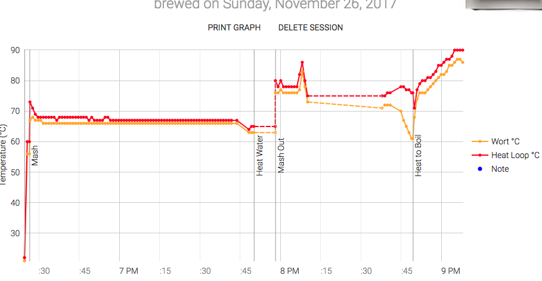
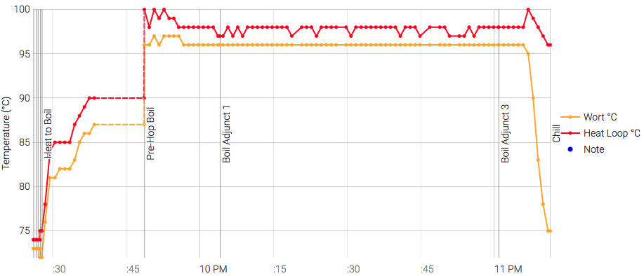
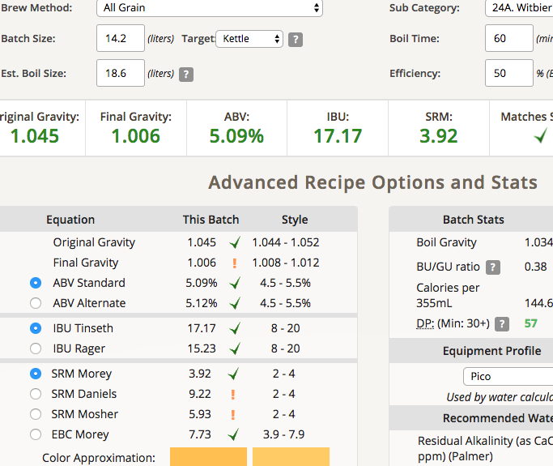

# 171127-ethen-BW_Witbier

小麥酵母測試：使用WB-06

**設備**

Pico

**麥**

(Kronenbourg Blanc clone法國可倫堡白啤，改編自 <http://goods.ruten.com.tw/item/show?21621761803917>)

* Pils 2100g
* Wheat malt 1500g
* Wheat 450g
* 67度80min
* 77度20min

total 4.05kg

e04激歡樂，這次啤酒王的麥有夠碎，白頭堵好堵滿，醣化Mash out前堵一次停機清理，煮沸又堵一次，煮到溢出來灑了滿地都是，暫停麥汁抽完再清，然後就因為heat loop溫差超過50F噴了Fatal error 1，釀酒流程被Can掉，重開pass回boil。最後完成後冷卻時又清一次....ＷＴＦ

不過這個堵塞會不會是我拍打麥渣槽試圖增加溶解度/排除氣泡的結果呢？可能要多做幾次測試。
另一方面，目前依然會產生糊化但沒有釋放的黏稠狀物，不過有可能是生小麥的緣故？

**酒花**

* 總煮沸75min
* Mt Hood 4.8% 10g 60min
* Mt Hood 4.8% 10g 15min
* Mt Hood 4.8% 12g 5min
* Coriander 芫荽子 20g 5min （酒瓶碾碎）
* Oranger Peel 甜橙果皮 56g 5min

**酵母**
 
* WB-06 11/7擴培(冷藏20日)

約24度投入，發酵溫度18

**流程**

最終產量 12L 糖化效率50%... （堵塞溢流這麼多的水量，竟然還可以有這樣的糖化效率...?）補礦泉水2.243L

OG1.045 FG1.006 ABV5.09 IBU17.17 SRM3.92 

麥汁苦味有點重，穀類的味道沒有很令人愉悅...大概是放久了的關係？一點飼料感

