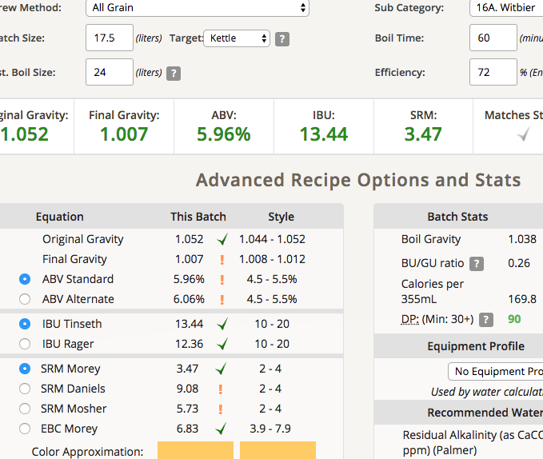

# 171127-ethen-GF-BW_Witbier

前一天的對照組，然後前面兩個我時間設定錯了Orz

**設備**

GrainFather

**麥**

(Kronenbourg Blanc clone法國可倫堡白啤，改編自 <http://goods.ruten.com.tw/item/show?21621761803917>)

* Pils 2100g
* Wheat malt 1500g
* Wheat 450g
* 64度60min
* 73度15min

total 4.05kg

諸事不順，開到boil結果溫度一開始就衝了72度，底下應該有沸騰Orzzz

停下來溫度降到64度一小時，然後拉到73度15min

啤酒王這次的麥在上層積了一層白色粉狀物，但不是澱粉（碘液不反應）

有點堵，但不嚴重

**酒花**

* 總煮沸75min
* Mt Hood 4.8% 10g 60min
* Mt Hood 4.8% 10g 15min
* Mt Hood 4.8% 12g 5min
* Coriander 芫荽子 20g 5min （酒瓶碾碎）
* Oranger Peel 甜橙果皮 56g 5min

感覺應該多準備一個豆漿袋，丟下去方便

**酵母**
 
* WB-06 11/9二度擴培（19天），味道沒有酸味感覺成功

約18度投入，發酵溫度18

**流程**

最終產量 17.5L 糖化效率74%還不錯，有加入之前的舊麥汁

OG1.052 FG1.007 ABV5.96 IBU13.44 SRM3.47 

## 171204 測試

底泥有夠多，看起來需要冷降才有辦法測試了。取一點先去冷降看看

會想了一下，應該是鹿角菜膠那一片錠的效果，來看看冷降之後會如何，如果很難降以後就別用了，浪費酒...

然後竟然聞起來有水蜜桃味，這啥狀況....