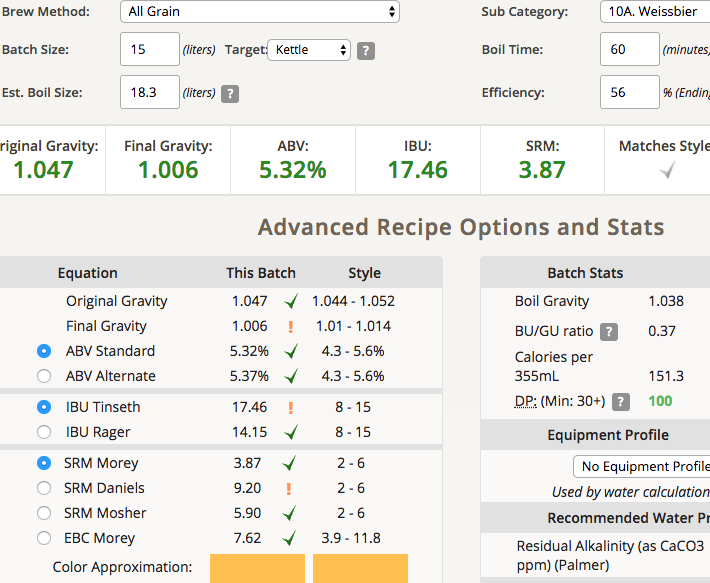
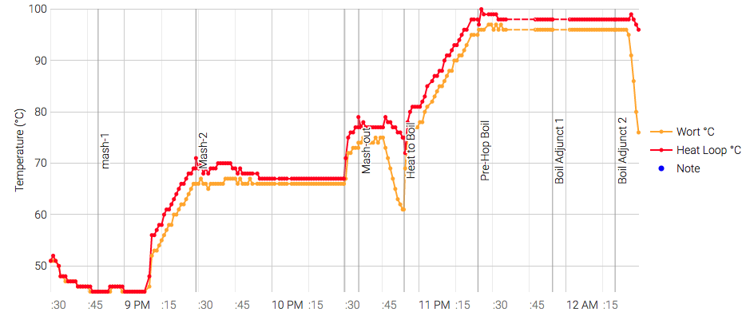

# 171127-Ethen-wheat

測試小麥酵母1433，<s>測試阿魏酸休止的果香</s> 

**設備**

Pico 

**麥**

釀酒人樂園Fox配方包改

* 小麥 2kg
* pils 2kg

諸事不順，明明設定了多階段醣化忘記，結果一開始水溫就是67度Orzzz

跑了10min然後強制停止後投入冰塊開風扇降溫

45度20min 67度60min 75度10min

之後都還算順，除了完成後還是清了一次白頭

**酒花**

* Saaz 3.7% 12g 30min
* Hallertau 3.2% 12g 30min 
* Saaz 3.7% 12g 5min
* Hallertau 3.2% 12g 5min 

**酵母**

* Y-1433 礦泉水復水喚醒

**流程**

產量15L 糖化效率56，目前以來最高的效率！！

OG1.047 FG1.006 ABV5.32 IBU17.46 SRM3.87

苦味有點過度銳利強大，些微穀物飼料味，有pico味但不明顯

