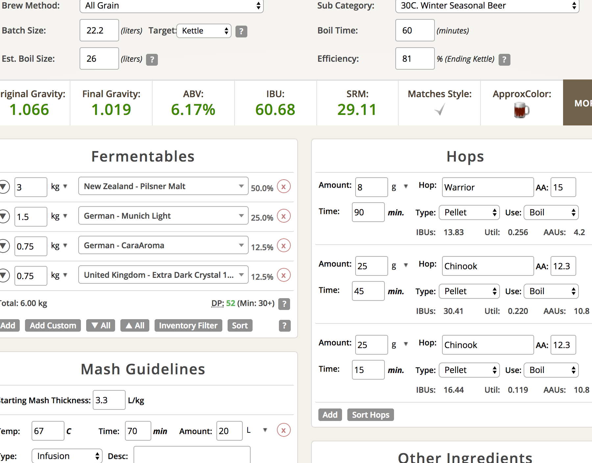

# 171230-Ethen-Christmas

新的電動碾麥上線啦～但似乎跟Pico向性很差....

自製的木製底座很穩，新的電鑽的驅動力也夠強，碾麥效率大幅提升。不過高速碾磨的時候讓麥芽變得比較碎了，Pico的黏土層再現，但GF的糖化效率大幅提升。

**設備**

GrainFather 

**麥**

麥還是找啤酒王配，畢竟本來是他的譜

* Pils 3000g
* Munich 1500g
* Caramel Aroma 750g
* Extra Dark 750g

糖化效率大爆表... 洗糖洗出大量的糖，糖化效率從之前的47%直衝81%，估計是碾麥系統的增強導致。

**酒花**

缺Hallertau酒花，改老Warrior

* Warrior 15% 8g 60+30min 13.83IBU
* Chinook 12.3% 25g 15+30min 30.41IBU
* Chinook 12.3% 25g 15min 16.44IBU

糖化效率爆表，導致整個酒花量不足，緊急延長30min的煮沸並且增加一階段Chinook煮香

**酵母**

* T-58擴培 11/9 (兩個月) 21度室溫發酵

**流程**

產量22.2 糖化效率81%，希望以後都能夠有這樣高的糖化效率

OG1.066 FG1.019 ABV6.17 IBU60.68 SRM29.11 

大體上來說跟上次接近，苦度提升一些，色度下降一半。有點猶豫要不要加糖提高酒精度但.. 先這樣吧

分裝兩桶12.7L / 9.5L, 是說後面那桶倒出一堆渣是哪招...

## 