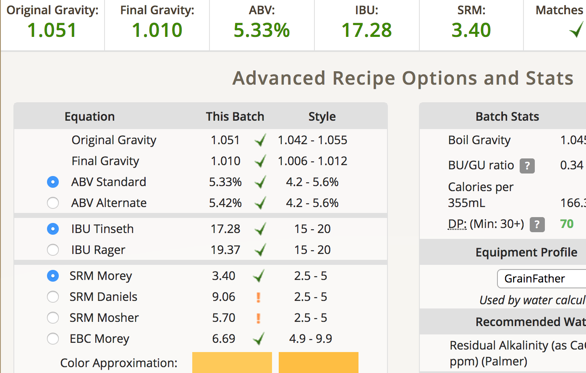
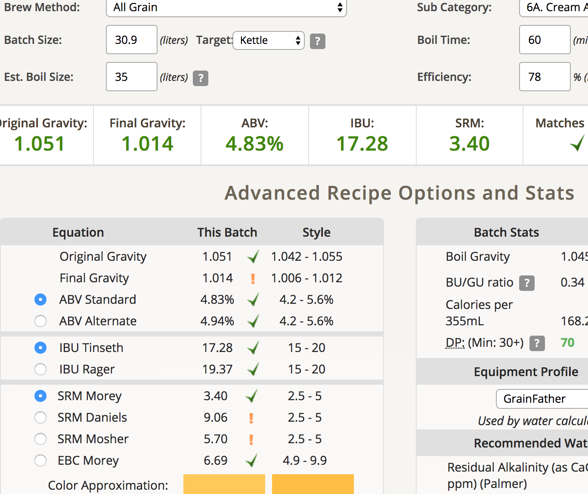

# 171230-Ethen-GF-CreamAle

新的電動碾麥上線啦～但似乎跟Pico向性很差....

自製的木製底座很穩，新的電鑽的驅動力也夠強，碾麥效率大幅提升。不過高速碾磨的時候讓麥芽變得比較碎了，Pico的黏土層再現，但GF的糖化效率大幅提升。

本次測試：加糖（清爽測試）、一次Mash兩桶、WhiteLab WLP002 English ale

**設備**

GrainFather 

**麥**

* Best pale ale 5000g
* American White Wheat 435g
* Cane Sugar 500g (後放)

糖化溫度64度，測試乾爽版，也瞭解一下“英式殘糖”是怎麼回事

糖化效率78%，估計是碾麥系統的增強導致。洗槽洗到31L煮鍋幾乎全滿，有點拼...以後還想這樣玩會需要更大的煮鍋

感覺我會需要一個洗槽系統，自己煮水＋倒入...

**酒花**

缺Hallertau酒花，改老Warrior

* Warrior 15% 11g 60min 15.18IBU
* Cascade 6% 34.4g 5min 3.3IBU (一次放完，爽)

煮花階段熱渣大爆發...撈個沒完撈個沒完

**酵母**

* S-04擴培 11/7 (兩個月) 21度室溫發酵
* WhiteLab WLP002 English ale擴培 12/2 (一個月) 21度室溫發酵(理想溫度18-20...回去試著降溫看看)

**流程**

產量28.9 糖化效率78%。因為醣化效率比預期高，加水2L

S-04(WLP002)  
醣化結束 OG1.048 FG1.011(1.015) ABV4.82(4.29%) IBU19.41 SRM3.56  
加糖 OG1.054 FG1.011(1.015) ABV5.7(5.16%) IBU18.48 SRM3.56  
加水加糖 OG1.051 FG1.01(1.014) ABV5.33(4.83%) IBU17.28 SRM3.4  

## 