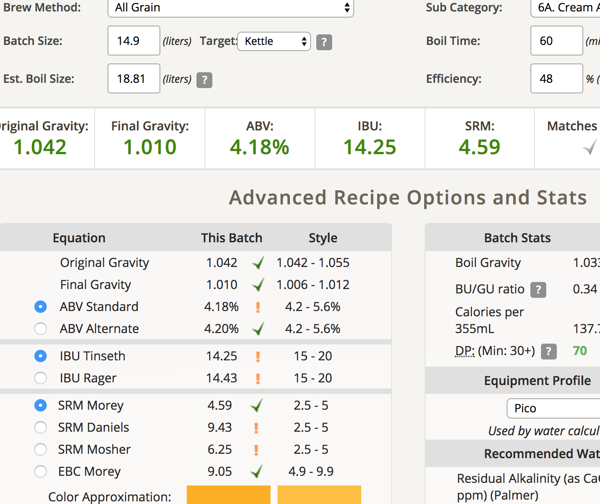
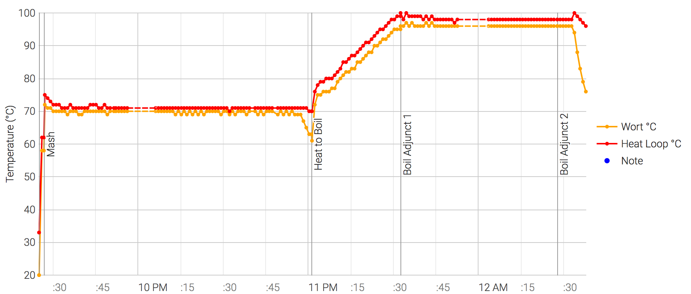
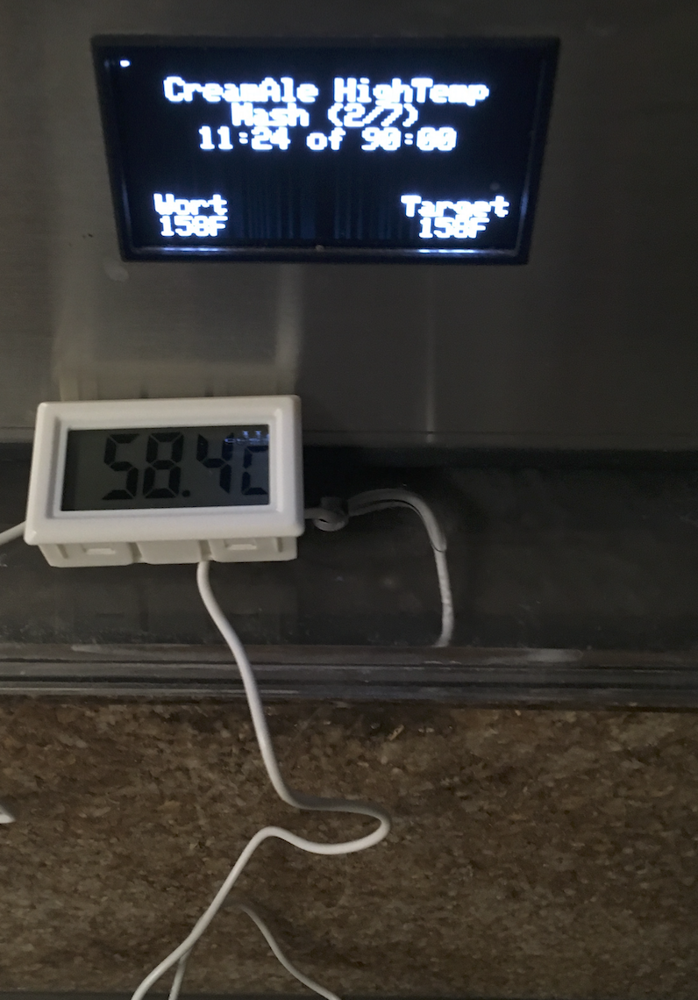
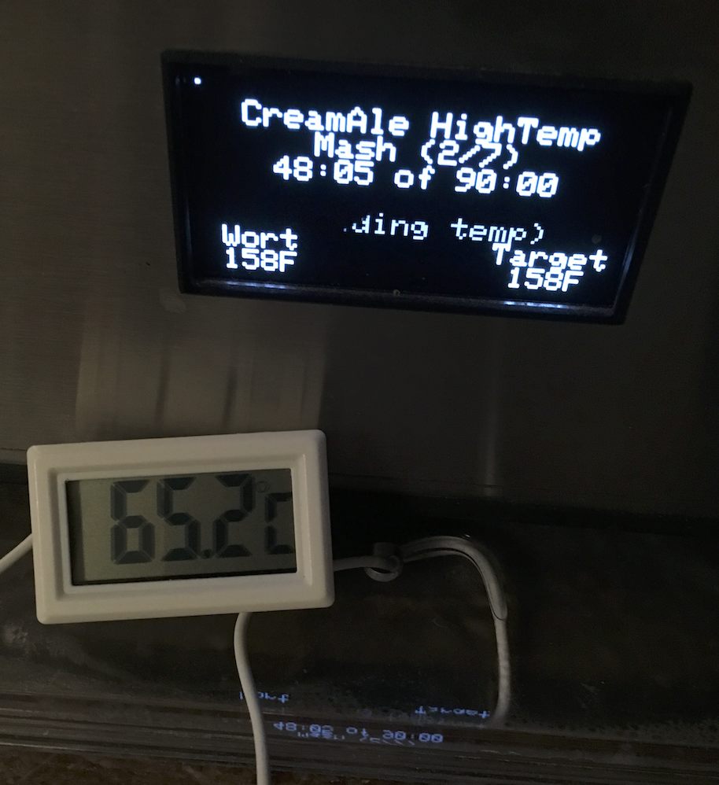
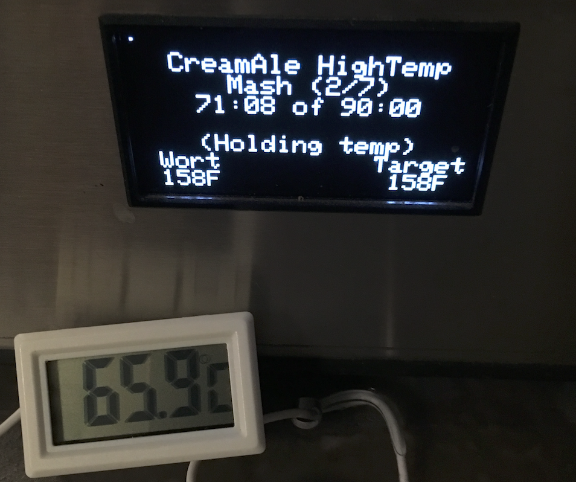
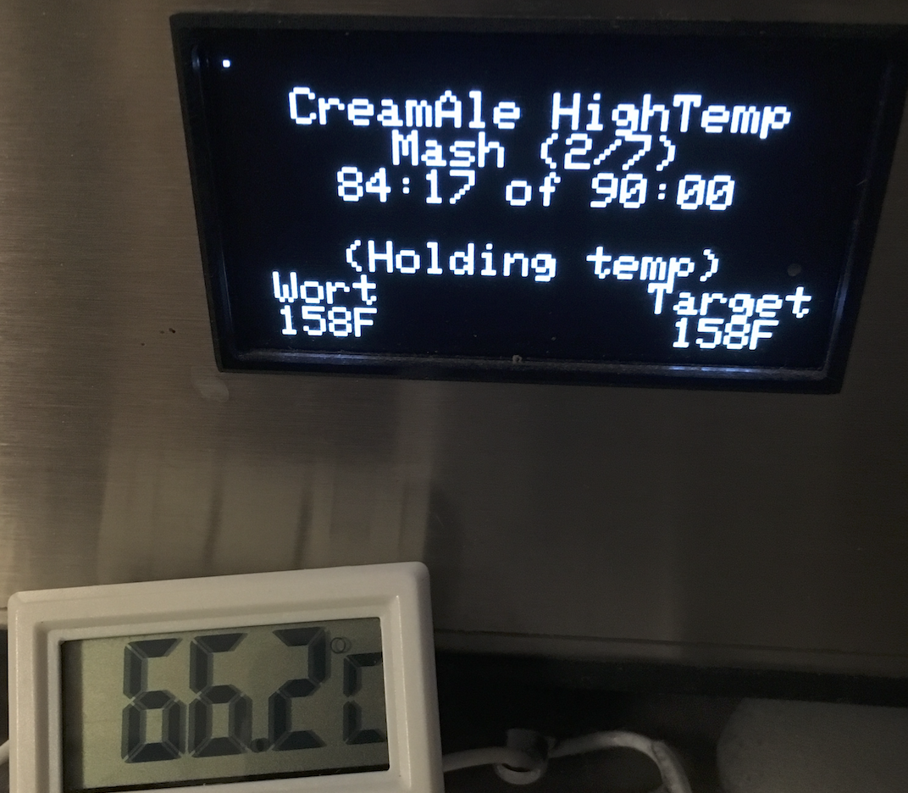

# 171230-Ethen-Pico-CreamAle

新的電動碾麥上線啦～但似乎跟Pico向性很差....

自製的木製底座很穩，新的電鑽的驅動力也夠強，碾麥效率大幅提升。不過高速碾磨的時候讓麥芽變得比較碎了，Pico的黏土層再現，但GF的糖化效率大幅提升。

本次測試：Pico Mash時的溫度、酒花減量

結論：Pico的溫度設定與實際接觸的溫度還是有巨大落差，溫差約5度甚至更多（這代表預設酒譜的67度實際上是以60-62度運行），只能擴散的傳導方式也讓麥槽的溫度是階梯式上升 - 別搞多階段醣化了，他已經是了Orz

補充：該溫度計經過矯正發現比室溫高出兩度，所以實際測試結果應該比預期更低

**設備**

Pico Zymatic

**麥**

* Best pale ale 4000g

最後這批碾麥出現空轉現象，高轉速有機會發生，應對方式是倒轉，然後緩慢正轉。
前面幾款沒有應該是綜合麥芽的關係比較不會一起跳開

木製底座的問題在於碎麥芽會噴濺，灰塵黏在木頭上，而有些渣會卡在固定的金屬區..怎麼改進比較好還要考慮一下

糖化效率突破新低48%, 同時有大量的黏土層，甚至有完全沒浸泡到水的麥粉存在，但麥粒看起來還好啊？果然還是得要兩階段/濕式碾麥了？

感測點：埋於麥芽槽熱水注入口斜下方約2cm位置，與壁面保持3cm的距離

* 設定溫度：70
* 11.5min: 58.4
* 48  min: 65.2
* 71  min: 65.9
* 84.3min: 66.2

可能誤差：過低的滲透率應該有影響到溫度傳導，需要再次測試

補充：該溫度計經過矯正發現比室溫高出兩度，所以實際測試結果應該比預期更低

**酒花**

缺Hallertau酒花，Cascade連發並調降酒花量

* Cascade 6% 10g 60min 12.3IBU
* Cascade 6% 10g 5min 2.45IBU

熱渣很多，是這次Best pale的問題嗎？

**酵母**

* S-04乾酵母 7g 21度室溫發酵

**流程**

產量14.9 糖化效率48%

OG1.042 FG1.01 ABV4.18 IBU14.25 SRM4.59 

溫度測試

## 180112換桶

Pico CreamAle high 9+4.43L FG1.014 ABV3.68 色澤較淡 較清澈 氣味：一點接近動物味的刺激性感，部分來自pico味的酒花刺激感 口感：沒什麼甜味，有點太dry了...是不是感染了啊....