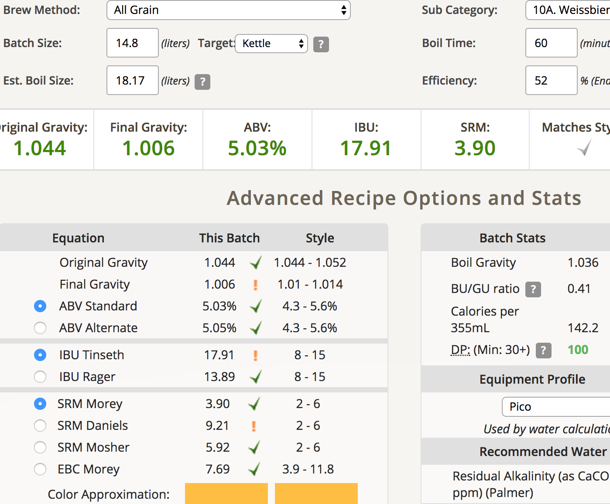
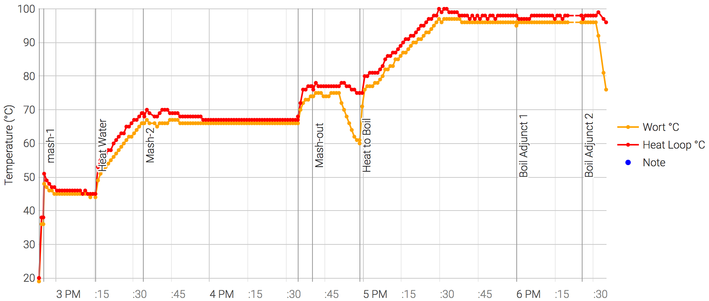

# 171230-Ethen-pico-wheat

新的電動碾麥上線啦～但似乎跟Pico向性很差....

自製的木製底座很穩，新的電鑽的驅動力也夠強，碾麥效率大幅提升。不過高速碾磨的時候讓麥芽變得比較碎了，Pico的黏土層再現，但GF的糖化效率大幅提升。

**設備**

Pico 

**麥**

* 小麥 2kg
* pils 2kg

這次終於記得多階段醣化了，45度

然後清黑白頭好像快變成定番了...

黏著層又出現了...

**酒花**

因為Saaz缺貨，改用chinook添加苦味..

* chinook 11.6% 10g 30min 19.27IBU
* Hallertau 1.4% 10g 5min 0.6IBU

**酵母**

* WB-06擴培 11/7 (兩個月) 21度室溫發酵

**流程**

產量22.2 補水1L 糖化效率52%

OG1.044 FG1.006 ABV5.03 IBU17.91 SRM3.9

## 