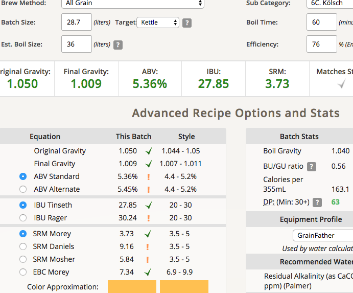
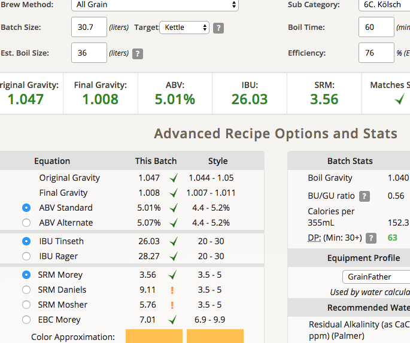

# 180114-Ethen-Kolsch

碾麥打滑到天怒人怨，大致上抓到原因了：麥芽掉進對棍邊緣的縫卡住導致對棍不會跟著碾麥過程一起轉。也許做個擋板？也許直接買三棍？

寒流的關係連續很多天冷到爆炸，藉此試試看室溫科隆，過兩天回溫給他上壓力發酵試試

**設備**

GF

**麥**

* BEST pale 5.2kg
* American Wheat malt 0.61kg

碾麥過程打翻了麥芽損失約數十克

糖化溫度67, 這次只攪拌一次之後都循環，結果出現了小規模的黏著層，果然還是應該攪拌兩次不能省

**酒花**

因為Hallertau AA太低所以調整

* Magnum 11.8% 23g 60min 26.3IBU
* Hallertau 1.4% 15g 15min 1.01IBU
* Hallertau 1.4% 20g 5min 0.54IBU

starsan消毒keg, 因為前面有渣會影響發酵的經驗所以這次試著對輸出時過濾，延長了熱的時間約10-15min

該買更多酒花袋了，以及更大的鍋子

**酵母**

* US-05 2g+600cc兩份 擴培一天，不過溫度好像太低了讓擴培速度有點慢，沒有到最佳狀況...如果時間這麼短應該加倍酵母量的

**流程**

產量28.7 補水2L 糖化效率76% 分兩桶15.8L + 12.9L, 補水得按比例分成 1.1L/0.9L....

OG1.05 FG1.009 ABV5.36 IBU27.85 SRM3.73

補水

OG1.047 FG1.008 ABV5.01 IBU26.03 SRM3.56

雖然應該在15度發酵，但因為TMD的氣溫從原本預定的15度上下突然變成21度，所以在投酵母一天後啟用壓力發酵系統，兩桶分別配置於20psi / 10psi，發酵一週試試

## 180125 換桶

忘記補水Orz

15.8L->14.9L 狀況：酵母沒有沈降，全部都是混濁的Orz 明後天冷降試試

12.9L->13L FG1.01 ABV5.25 狀況看起來很正常 味道還算乾淨，可能酵母有點多，明後天冷降裝瓶看看
