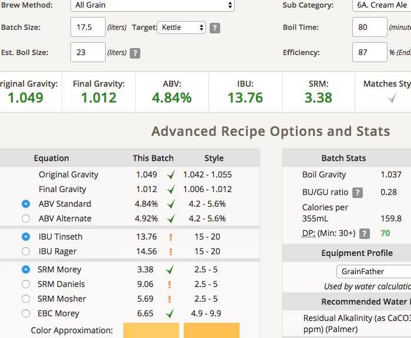

# 180202-Ethen-CreamAle

因為Irish Red Ale堵塞大失敗，所以重新調整碾麥測試，試著第二棍條鬆一點讓麥破而不碎... 

失敗，麥心還是需要碎，不然滲透不夠。不要看糖化效率87好像很高，是因為吃了不少前面Irish的麥汁...

**設備**

GF 批量17.5L

**麥**

* Pale Ale 3kg

糖化溫度64, 麥水比3.3, 10L, 太少了不好運轉，只好多加一些前面的洗糖水，味道應該會受到些影響

顯然地磨得太粗了，水過的速度超級快

這次的渣也多到爆炸，懷疑是被Irish牽連的

**酒花**

因為不想開Cascade的真空，所以乾脆直接下warrior不做香

* 舊warrior AA16 5g 80min

結果麥汁的量高於預期，IBU不夠了ＱＱ

**酵母**

* S-04一包 

室溫發酵（寒流16度）

**流程**

產量17.5L 糖化效率87%

OG1.049 FG1.012 ABV4.84 IBU13.67 SRM3.38 IBU too low

## 180216 冷降