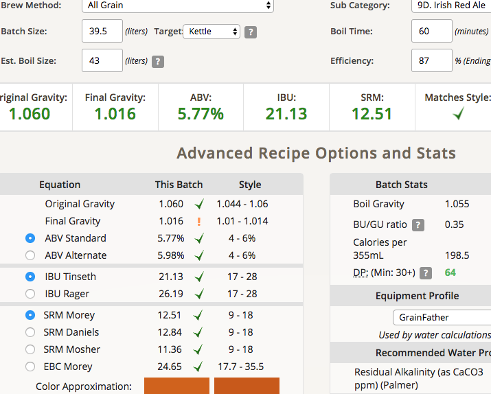
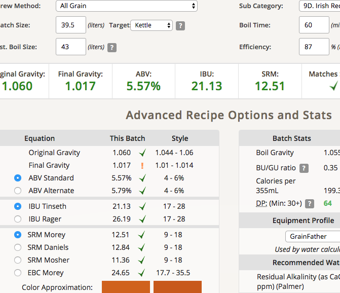

# 180202-Ethen-IrishRedAle

本次測試Rad Ale yeast WLP-004 v.s. Nottingham v.s. wyeast 1968，同時測試渣的影響

很開心地換了電動三棍碾麥機，42L的大鍋也到了，打算直上Irish Red Ale兩批次，然後ＧＧ了Orz

不確定是因為碾麥的關係，還是8.6kg真的超過GF的上限，總歸麥槽的水漏不下去，這不太常見.. 要重新調整了

有人建議過篩，粗粒放下面細粉放上面，聽起來值得一試

**設備**

GF 批量40L

**麥**

* Pale Ale 6.07kg
* Rex X malt 1.76kg
* Melanodin 0.52kg
* Roasted Barley 0.19kg

麥水比3.3, 30L, 基本上已經到了GF的極限（會從提把的洞漏出去）

糖化溫度66, 實際運作時水漏不下去，最後只好通通撈出來放到大鍋去做類似BIAB的模式（巫婆湯，沒有套豆漿袋），一勺一勺用濾網手動過率Orz

洗糖還是放到GF的內鍋去做，不知道為什麼這樣就沒問題了....

不能理解為什麼產生了大量的熱渣，可以通過濾網的那種，導致比重量測遇到很大的問題，最後是把麥汁丟到冰箱冷降之後用滴管取上清液來量

**酒花**

缺EKG, 改US Golding加量

* US Golding 80g AA4.3 60min 20.62IBU

該買更多酒花袋了，80g的份量太多，酒花無法舒展，下次應該用酒花簍

為此煮沸時間略有延長

**酵母**

* Whitelab WLP-004 Irish ale 擴培
* Danstar Nottingham 擴培
* wyeast 1968 擴培

前兩者各一桶，室溫發酵（寒流16度）

後面多的又再度分成兩桶，測試有渣無渣的差別。這次的渣多到爆，到底是哪來的... 如果這真的有影響，以後要做過濾了

**流程**

產量39.5L 糖化效率87%, 有紀錄以來最高

17.9L Nottingham OG1.06 FG1.013 ABV6.2 IBU21.13 SRM12.51 ABV too high

17.9L WLP-004 OG1.06 FG1.016 ABV5.77 IBU21.13 SRM12.51 match

2L 無渣 wyeast 1968 OG1.06 FG1.017 ABV5.57 match

1.8L 一半的渣 wyeast 1968 ..

 

## 180216 冷降

## 180228 換桶裝瓶

Nottingham

產量14.8L FG1.011 ABV6.43% 

WLP-004

產量14.8L FG1.011 ABV6.43% 

碳酸化Vol2.0=>74.1g白砂

## 180326 品嚐瓶裝

比較Irish Red Ale酵母Nottinham v.s. Whitelab WLP004, 

Nottinham氣味醬香較強，WLP004較香甜清爽

色澤相同、澄清度差不多

Nottinham口感略微刺激，WLP004則比較甜/順一點

相對比較，WLP004略勝一籌

這次的麥汁做得不好...喝起來不順口

高級醇略多，苦味也有點明顯，放久一點看看會不會改善

QAQ