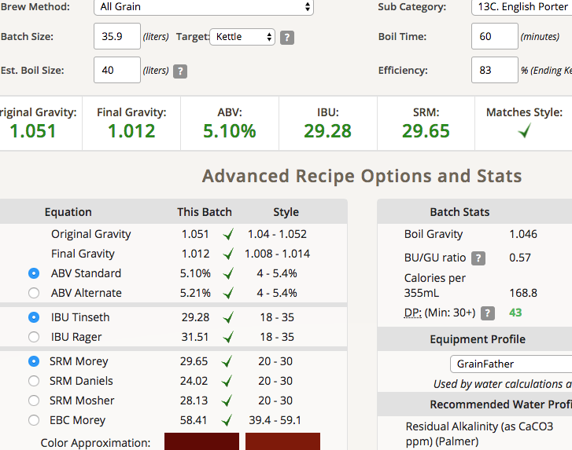
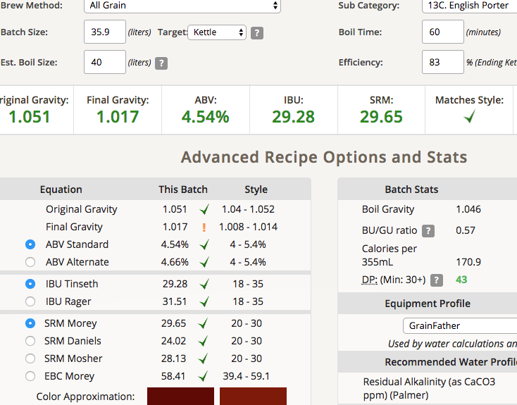

# 180217-Ethen-EnglishPorter

趕比賽急急忙忙做了，接下來天氣要回溫，有點囧...

測試碾麥與上次堵塞是怎麼回事，初步排解了但是一頭霧水

該買推車了

配方是雷大的酒譜，調整糖化效率至80與批量至36L

**設備**

GF 批量36L

**麥**

* MO 5.06kg(新鮮麥芽)
* UK Brown 1kg(原譜自製)
* UK Caramel 60L 0.7kg(原譜為40L, 買不到)
* Chocolate 0.6kg(這次用一半比利時一半德國)

糖化溫度67, 麥水比3.3, 24.3L

碾麥時覺得碾得不夠細，再調整了一次，這次麥碎應該有點接近上次堵塞的情況。

這次的流量感覺就很正常，啊奇怪咧

**酒花**

試著做標準，所以EKG全下了

* EKG AA5 54.2g 60min
* Golding AA4.3 11g 60min 
* EKG AA5.6 40g 10min

酒花量有點多，這次使用酒花桶。

應該在酒花桶上綁繩子，不然他老是沉下去，溫度基本上是高到手很難碰的

**酵母**

* WhiteLab WLP-002 (18-20)
* S-04 (15-20)

室溫發酵（室溫19度，投入溫度27）

**流程**

產量32.9L 糖化效率83%，各補水1.5L

16.3L WLP002 OG1.051 FG1.017 ABV4.54 IBU29.28 SRM29.65 ok

16.6L S-04   OG1.051 FG1.012 ABV5.1  IBU29.28 SRM29.65 ok

這次做的很標準，又是新鮮麥芽，應該可以期待

