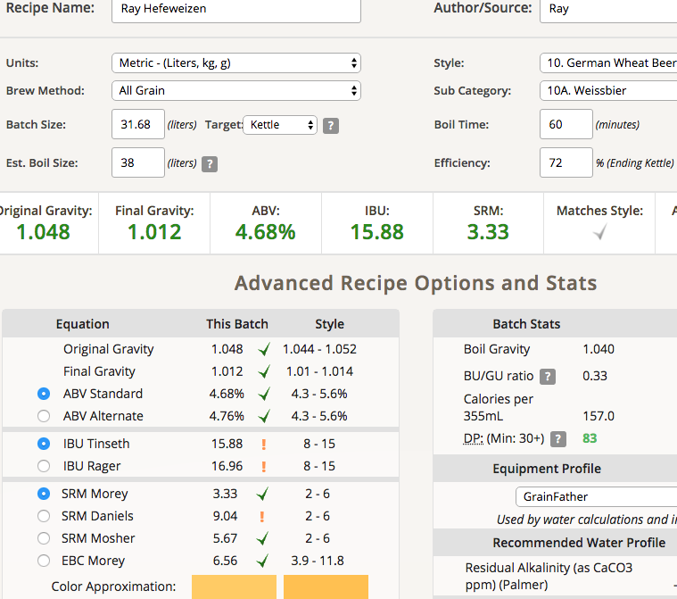

# 180413-Ethen-RayHefeweizen

本次測試小麥酵母WLP-300 v.s. 3068 v.s. WB-06

為了下個月初的比賽，希望來得及

這次刻意拉長時間做的精確，結果九個半小時就不見了QQ

**設備**

GF 批量35L

**麥**

* G麥Pale Ale 3.22kg
* 天鵝白小麥 3.22kg

麥水比3.3, 21.5L

多階段醣化46度20min, 67度60min

電動三棍碾麥機果然還是需要每次使用前調整，又空轉了。這次發現下棍可以調得更緊不會掉渣了，上棍的尺寸也恰到好處，脫殼效果絕佳，又細又順暢，感覺阿斯（？

測量了下鍋後的pH, 5.7左右，加入一點檸檬汁/白醋調整到5.22，要加的比例意外的很多啊，多到感覺有一點酸味了...

醣化時感覺很好，但最終結束糖化效率不如預期，同時麥渣碘液測試陽性反應，Orz

**酒花**

Hallertau AA過低，拉了Warrior來補苦味。由於都已經放了一段時間，AA下修

http://brewerslog.appspot.com/HopAlphaCalc

* Warrior 18g AA15->7.4 60min 20.62IBU
* Hallertau 27.63g AA1.4->1 60min 2.11IBU
* Hallertau 27.63g AA1.4->1 15min 1.05IBU

**酵母**

* WB-06 一包
* Whitelab WLP-300 保菌管擴培
* wyeast 3068 保菌管擴培

擴培的部分都趁高泡下，大概是擴培第三天的時候

各一桶，下酵母的溫度15度，發酵18-17度

有趣的事三份酵母下去都非常有活力立刻就動水封了，不知道是溫度氣體膨脹的關係還是怎樣

**流程**

麥汁氣息麥香不錯，口感微甜帶酸微苦，果然醋加太多了。由於這個酸味是以前沒有的，不知道對酒體會帶來什麼樣的改變

pH5.41 OG1.048 12.3+12.1+7.28L=31.68L 

糖化效率72%比預期低啊...苦味有點高於預期了

IBU15.88(原訂13.4too high), SRM3.33

12.3L 3068 FG1.011 ABV4.75

12.1L WLP-300 FG1.012 ABV4.68

7.28L 有渣 WB-06一包 FG1.006 ABV5.42

## 180418 S-04換桶

因為水封已經停了兩天就先換桶了，冷降測FG1.011。嚐起來有香蕉酯味（第一次！），口感一點甜而厚實（取樣桶底酵母多的關係？），小麥酵母味略強有一點比利時感

4/19 3068水封也停止活動了，打算明天一起換桶

## 180421 換桶

剩下兩桶也換了，同時加糖碳酸化。由於發酵可能還沒完全結束，繼續控溫17~18一週後降溫再量一次FG

* 3068 10.6L 74.4g FG1.013 香蕉糖般的氣息，香蕉味也沒有很明顯，苦味還是有點太鮮明
* WLP300 10.4L 72.8g FG1.016 一點植物的氣味，感覺不是很妙...
* WB-06 6.5L 45.5g FG1.011

## 180505 橘蘋巢自釀聚會

雖然小麥按照慣例都喝ㄎㄧㄤ了，不過這次似乎是眾人公認表現得比較好的一批，有把香蕉跟丁香味表現出來，由於這次的3068與300幾乎所有人都是跟林大拿的凍菌管，酵母的照顧與發酵的控制似乎真的有差，小麥意外的是一隻需要好好控制的酒。幸好這次亂加的白醋也沒有出現在最終酒體中。

另一方面，相對比較起來，大家的偏好是 300 > 3068 > WB-06，香蕉味似乎是滿重要的評斷點

** 抱歉修正，那天應該是3068>300>WB-06 **

不過究竟這次是擴培階段新鮮投入的酵母帶來的成果，還是麥汁與溫控良好帶來的成果呢？可能還需要進一步測試