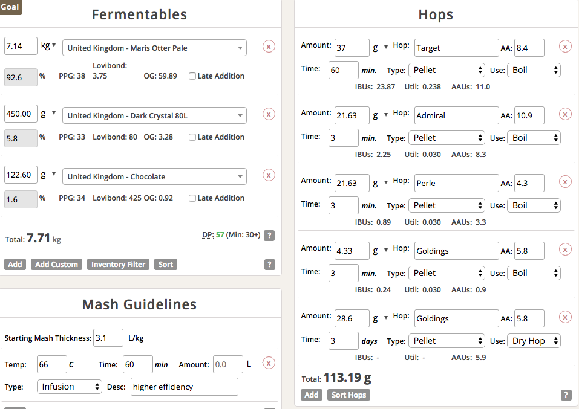

# 180506-Ethen-FullersESBClone

本次...好啦我承認我只是想消耗ESB酵母

**設備**

GF 批量30L

**麥**

* MO 7.14kg
* UK Dark crystal 80L 450g
* UK Chocolate 122.6g

麥水比3.1, 23.9L, 66度60min

電動三棍碾麥機果然還是需要每次使用前調整，這次碾麥似乎有點太粗，留下的澱粉有點多，但意外的糖化效率還行

麥汁出來顏色有點過深，看來該考慮把巧克力分開來泡了

**酒花**

煮沸90min

Challenger -> Admiral

Northdown -> Parle

* Target 37g AA8.4 60min 25.52IBU
* Admiral 21.63g AA10.9 3min 
* perle 21.63g AA4.3 3min
* EKG 4.33g AA5.8 3min
* EKG 28.6g AA5.8 Dry hopping 3days

由於取到麥汁29L, IBU29.13

**酵母**

* 1968 x3 兩份（全白版） 放在大桶
* 1768 x3 一份（林大） 放在小桶

果然放久了還是應該要先擴培，搖勻的動作發現整個結塊了，雖然顏色沒改變不過酵母應該也是不ok了，是不是該把剩下的酵母全下，還是乖乖回去擴培呢？

第二天一早看到水封沒反應，想說這下慘了ＸＤ，趕忙把所有的液態酵母抓出來清點一下，能丟全丟ＸＤ 

第一桶下了1968x3三份，1768x3一份

第二桶下了1768x3三份

還是有留一份1968跟1768, 有空來玩菌種計數與擴培

原本那些酵母的菌數是0.48, 2/2到現在衰退剩34%, 總共下了第一桶6份(0.98M) 第二桶4份(0.81M)的酵母，應該是滿足條件了

**流程**

產量29L 糖化效率82%

OG1.069 FG1.02 ABV6.38 IBU29.13 SRM16.44 

加水2L

OG1.064 FG1.019 ABV5.97 IBU27.25 SRM15.71
 
忘了量重量...應該要先算比例的，目測估計16L v.s. 13L

## 