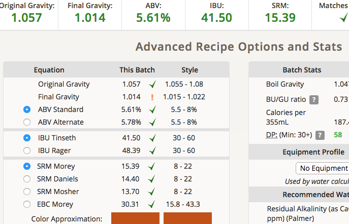
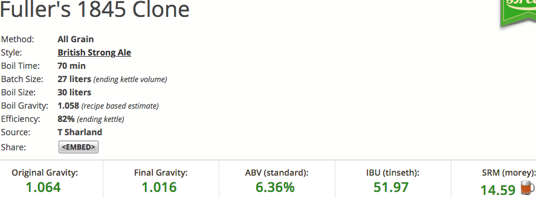

# 180601-Ethen-Fullers1845Clone

參考Recipe: <https://www.brewersfriend.com/homebrew/recipe/view/436460/fuller-s-1845-clone>

沒有調整水質

碾麥爆炸所以有點偏離，苦度過低

**設備**

GF 批量27L

**麥**

* UK Golden Promise 5.5kg 78%
* UK Amber 1.34kg 19%(以Aroma+brown 1:1取代)
* UK Crystal 60L 141g 2%
* UK Chocolate 71g 1%

麥水比3, 23L, 65度60min, 75度15min, 洗槽大概洗了10L

電動三棍碾麥機果然還是需要每次使用前調整，上次太粗這次也....Orz

糖化效率67%

**酒花**

煮沸60min，應該多煮一點的。消耗老酒花

* US Golding 47.3g AA4.3 60min 21.16IBU
* Fuggles 18g AA6.1 60min(原本糖化效率應該要下50g, 緊急拿掉32g) 
* EKG 8.8g AA5.8 60min
* EKG 33g AA5.8 5min

由於蒸發量不夠，取到麥汁25L, IBU41.5, 遠低於預期...如果蒸發量夠了就完美了說

**酵母**

* 1968 600ccX3, pitch rate 1.0，有冷降但算新鮮，使用滅菌釜消毒

發酵溫度20(上下一度)

**流程**

產量25L 糖化效率67%

OG1.057 FG1.014 ABV5.61 IBU41.5 SRM15.39(17 Strong British Ale合規)

但原本的目標是

OG1.064 FG1.016 ABV6.36 IBU51.97 SRM14.59 ....Orz

發酵桶分成 15.6L+9.3L兩桶