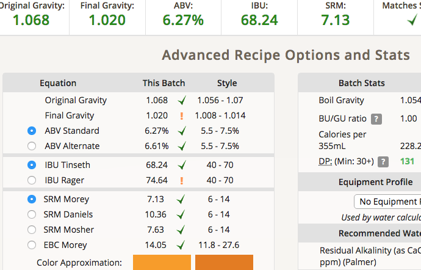

# 180605-Ethen-SpaceDustClone

參考Recipe: <https://www.brewersfriend.com/homebrew/recipe/view/398644/elysian-space-dust-ipa-clone-rye>

<https://www.ratebeer.com/beer/elysian-space-dust-ipa/173579/>

人生第一次做IPA，沒想到竟然就是Imperial IPA(double IPA)，希望順利

沒有調整水質，洗槽倒是有加點乳酸

**設備**

GF 批量30L

**麥**

* G pale ale 7.1kg 87%
* UK Ray 0.74kg 9.1%
* UK Crystal 60L 320g 3.9%

麥子這次細碎而不卡，這麼多的量還可以這麼好，爽。不過畢竟已經頂到GF的頂了，下次還是再少一點吧

麥水比3.1, 25L, 67度60min, 洗槽洗了15L

洗槽有加乳酸，還真是一點就降到pH4去了

糖化效率80%

**酒花**

煮沸60min

* Chinook 47.9g AA12.3 60min 52.65IBU
* Amarillo 30.65g AA8.2 10min
* Citra 30.65g AA12.5 10min
* Amarillo 20.41g AA8.2 0min
* Citra 20.41g AA12.5 0min

* Amarillo 35g AA8.2 7days
* Citra 35g AA12.5 7days

基於酒花量越加越多，我覺得我需要更多的酒花簍...

蒸發過頭了，發酵後補水2L

**酵母**

* 1332 600ccX3, pitch rate 1.0，有冷降但算新鮮，使用滅菌釜消毒

據說是類似US-05的味道清爽的酵母

發酵溫度21-19(21)

更新：我發現我的pitch rate事實上只有0.61.... 難怪發這麼久

**流程**

產量27.5L 糖化效率80%

OG1.073 FG1.022 ABV6.73 IBU73.21 SRM7.48

調整水量+2L

OG1.068 FG1.02 ABV6.27 IBU68.24 SRM7.3

考慮到原版高達73IBU跟8.2%ABV, 先用這個配置試試好了

發酵桶分成 13.2L+14.3L兩桶

## 180622 冷降

## 180626 換桶冷泡

正好清空酒花，多丟了一點

* Amarillo 35g AA8.2 7days
* Citra 35g AA12.5 7days

換桶後兩桶分別為 老桶17L(酒花袋) / 德國桶17.9L(酒花簍，但是蓋子掉了全散了出來Orz)，接下來換桶要傷腦筋了....

FG1.016 ABV7.48

## 180703 冷降

## 180705 換桶碳酸化

酒花袋的換桶很順利，德國桶那個打翻的酒花一如預期管子堵了。用虹吸管解決。

碳酸化順便加水

底渣意外地滿多酵母的感覺...?

FG1.015 ABV6.96% 

很香，獲得了百香果汁的評語

## 180714 試飲

FG略為下降 1.012 ABV7.35%

百香果的濃郁香氣已經消失了Orz 雖然還是香不過可惜了。另外口中有一點微妙的氣味...等待大家的評價
