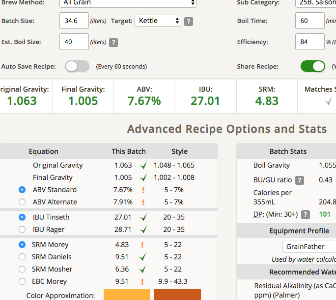
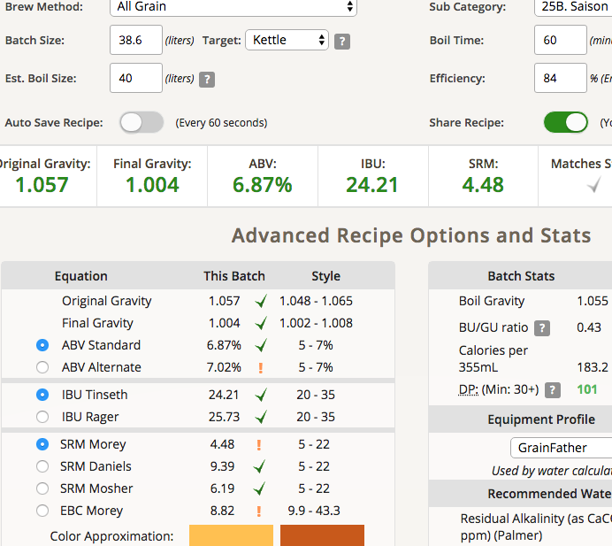

# 180623-Ethen-RaySaison

參考Recipe: <https://www.brewersfriend.com/homebrew/recipe/view/568663/ray-saison>

**設備**

GF 批量35L

**麥**

* Best plisner 6.9kg 83.4%
* Munich 680g 8.2%
* Wheat malt 690g 8.3%

麥水比3.3, 30L, 64度60min, 洗槽洗了15L，頂到底了

洗槽有加乳酸，糖化效率84%

**酒花**

煮沸90min以上

原譜的EKG沒了，所以用草本與貴族系酒花替代，順便清酒花

* Mount Hood 22g AA5.6 60min 8.65IBU
* Magnum 8.3g AA11.8 60min 6.88IBU
* UK Fuggles 29g AA6.1 15min 6.16IBU
* Target 20.2g AA8.4 5min
* Mount Hood 19.9g AA5.6 5min
* Admiral 6.4g AA10.9 5min 1IBU
* Perle 6.8g AA4.3 5min 0.41IBU

**酵母**

* Safale BE-134一包喚醒

先降溫到18度再投入發酵

發酵溫度 18 v.s 室溫27

**流程**

產量34.6L 糖化效率84%

OG1.063 FG1.005 ABV7.67 IBU27.01 SRM4.83

補水+4L

OG1.057 FG1.004 ABV6.87 IBU24.21 SRM4.48

發酵桶分成 17.28L、17.32L 兩桶，分別於不同溫度發酵
