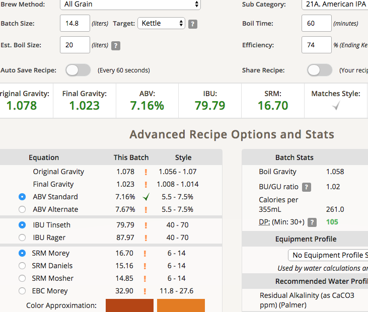
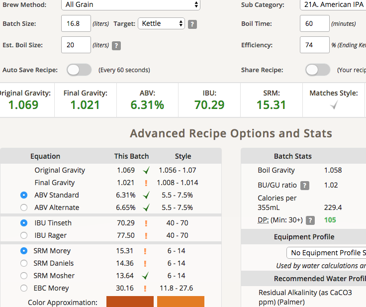
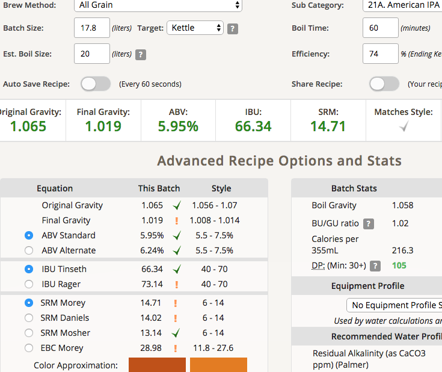
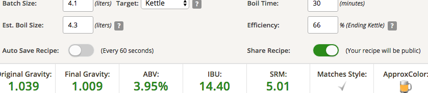

# 180626-Ethen-FoundersCentennialIPAClone

參考Recipe: <https://www.brewersfriend.com/homebrew/recipe/view/374873/mac-s-founders-centennial-ipa-clone>

<https://www.ratebeer.com/beer/founders-centennial-ipa/3168/>

clone: OG1.068, 7.39%, 68.7IBU

原譜: OG1.068, 7.2%, 65IBU, 98分

directly from the head brewer at Founders:

* 10% Carapils, 5% Munich, 5% crystal 60, 2.5% caramunich
* 16.5 Plato (1.068 SG)
* 65 IBU
* Massive flavor strike and dry hopping (obviously Centennial)

**設備**

GF 批量17L

**麥**

* G Pale malt 3.5kg 68.5%
* MO 740g 14.5%
* Flaked Oats 0g 0% 本來用來取代糊精麥，考慮到1332的超高FG決定整個pass
* Crystal 60L 370g 7.2%
* Munich 370g 7.2%
* CaraMunich II 130g 2.5%

5.11kg

麥水比3.3, 17L, 67度60min, 

洗槽洗了11L, 加乳酸(最後那次漏了)

糖化效率...本來應該要是很完美的78%, 結果因為一些意外掉成了74% Orz

主要發生在煮沸階段，本來期待20L煮完差不多是17L所以就放給他去，結果煮完剩15L, 加上這次酒花沒套袋直接投，上次有結成很明顯的塊狀很好處理，但這次不知道為什麼全都散的（酒花特性？麥芽特性？上一次的Pils大量蛋白質應該是關鍵），導致過濾大卡關，噴了一些出來，又有500cc最終沒有到主發酵桶，拿去合併到次發酵桶了，導致糖化效率下降（只計算主發酵桶跟500cc）

**酒花**

嘗試Single hops

* Centennial 38g AA9 60min 47.32IBU
* Centennial 25g AA9 15min 15.45IBU
* Centennial 25g AA9  5min 6.21IBU
* Centennial 90g AA9 dry hop 5days

共投入178g

由於原本預計糖化效率會高於75%所以多加了點苦花，這下慘了Orz

**酵母**

* Wyeast 1332 1.8L 298Bcells 1.0pitch rate

降溫到18.6度投入發酵

發酵溫度18

**流程**

產量14.3L 糖化效率74%

OG1.078 FG1.023 ABV7.16 IBU79.79 SRM16.7

補水+2L

OG1.069 FG1.021 ABV6.31 IBU70.29 SRM15.31

補水+3L

OG1.065 FG1.019 ABV5.95 IBU66.34 SRM14.71

原目標 OG1.068 AVB7.6% IBU65

該補2L還是3L呢....

次發酵桶: 收集了最後一次洗槽3.5L 1.0351+500cc的過濾後1.078的麥汁，最終得到4.1L 1.039（推估），直接裝入前一批AppleCider的桶內使用其舊的Nottinham酵母。這批打算隨便做隨便喝

OG1.039 FG1.009 ABV3.95% IBU14.4 SRM16.7

