# 180708-Ethen-偽清酒

嘗試啤酒製法來做清酒，先用甘酒的方式醣化之後，使用純粹菌種發酵

## 材料

### 米

採用蔡老師的配方，日本算法是以容積比，你用電鍋杯子量體積。

1. 米麴12杯=1.8kg（購自益良食品行）
2. 米32杯=4.8kg（《中興米》頂級壽司米(12kg)）
3. 煮飯水5.5公升
4. 糖化水9公升

米一杯約為150克

不必加稻殼，糖化混合麴與飯跟水時要均勻，糖化中不用攪。

拌過濾糖水時比較容易，米用壽司米即可，台灣你買不到“酒米”，過濾糖水用豆漿袋滴濾糖水會比較清澈，糖水濾好後建議要煮沸殺菌後急速降溫後投酵母。

### 酵母

來自台南優勢菌種，一包來自500cc擴培，協會5,6,7,9，這次使用協會七號

預估4.5L OG1.083 8.18%，建議投個2L的量

## 流程

* 米飯煮熟
* 米麴、米飯1:7，醣化溫度65度12hr（甘酒）
* 煮沸、分成4瓶3.5L
* 降溫到8度，投入菌種（目前預定實驗5 6 7 9四隻）
* 9度發酵一個月
* 冷降0度一周澄清後裝瓶

## 實作

第一批醣化1/3的量測試，也就是1.6kg米 v.s. 600g米麴。由於菌的需求量比預期中大，這批糖汁會先凍起來，等待其他幾批的米醣化

直接用計算機的話
1.6kg米是3L OG1.125 12.27%   
考慮到飯本身也有水，最多取出我猜會是4.5L OG1.083 8.18%  

使用GrainFather進行控溫醣化，拿滅菌釜的內鍋，米1.6kg, 煮好的白飯在電鍋內放涼後，與米麴600g拌勻，用豆漿袋裝好後放入內鍋，倒入冷開水醣化水3L, 內鍋蓋好並以保鮮膜保護確保密閉之後，放入GF溫控，加入水淹到鍋子略為浮起，開循環之後計時12hr

* 7/8 14:30 完成配置開始醣化
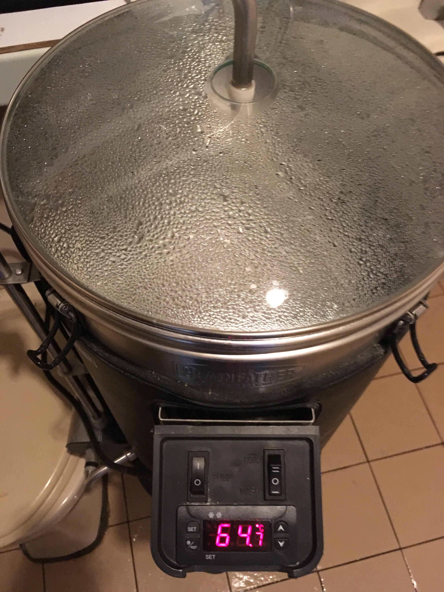
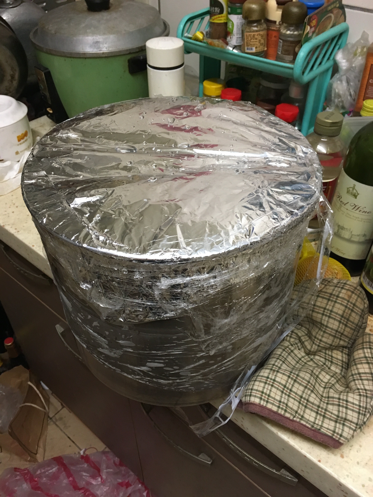
* 7/9 02:21 經過12hr, 麴味與米味明顯，並沒有預期的甜度，碘液測試顯示澱粉含量仍高，核心溫度為61度左右，也許是沒有攪拌的關係（今天整天在忙），攪拌繼續溫控放置12~20hr看看
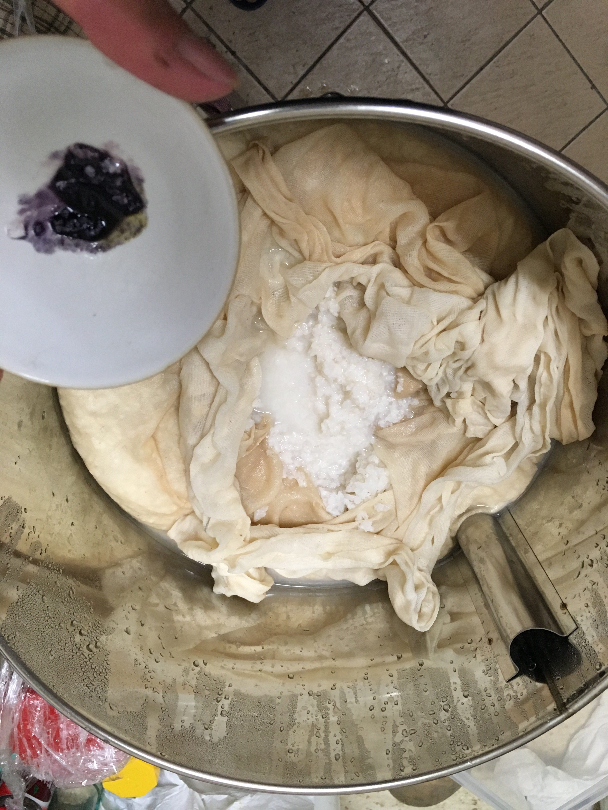
* 7/9 12:04 我開始覺得我得到了一鍋舒肥稀飯而不是甘酒Orz 有甜味，不過就淡淡的，澱粉分解的程度不如預期，現在看起來就像一鍋甜稀飯。我在想是不是該溫度降低點，或是米麴在冷凍庫待太久了。攪拌繼續放置
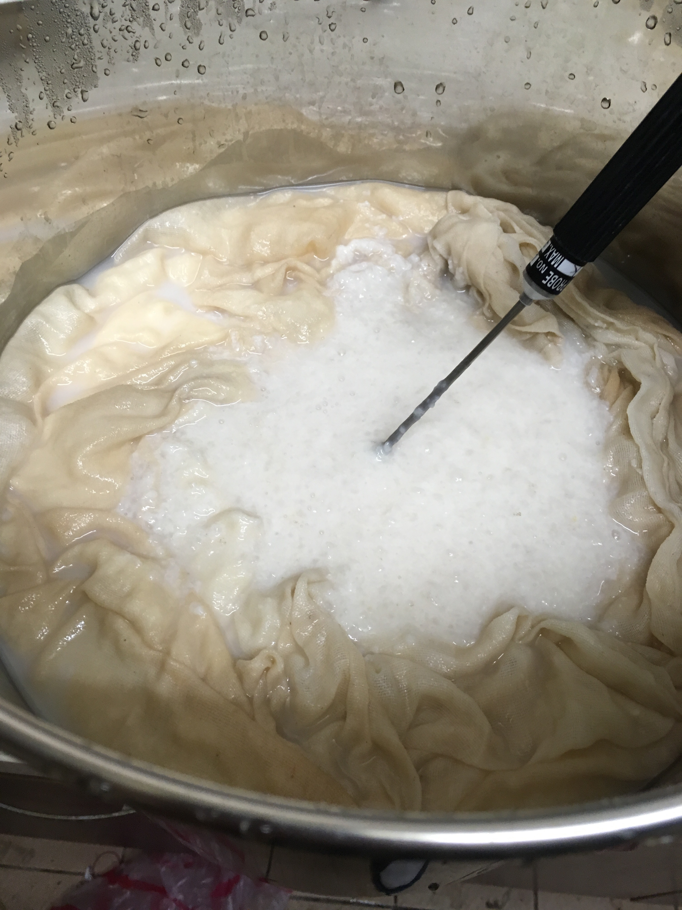
* 7/9 19:07 變成比較稀的舒肥稀飯，顯示酵素有作用只是很緩慢。依然有大量澱粉。核心溫度62，攪拌繼續放置
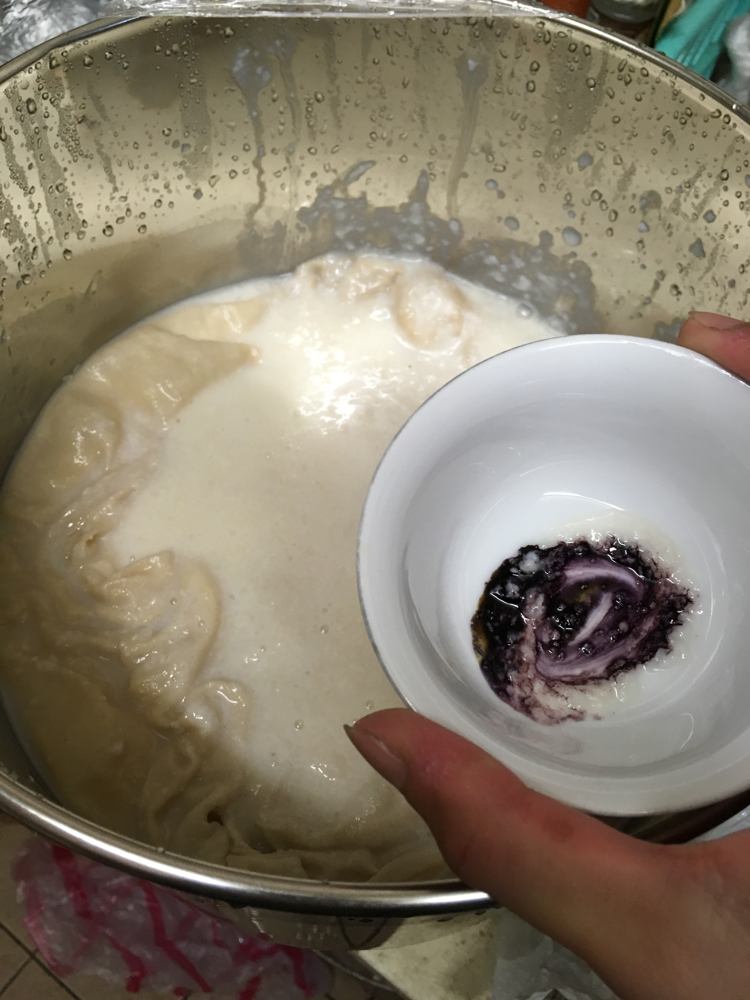
* 7/10 17:40 更稀一點，依然有大量澱粉，攪拌繼續放置
* 7/11 15:13 更稀一點，碘液測試依然有大量澱粉。已經經過72hr以上等不下去了，試著打入3條去皮芭蕉（去皮後199g, 連皮154g）利用他的醣化酵素看看
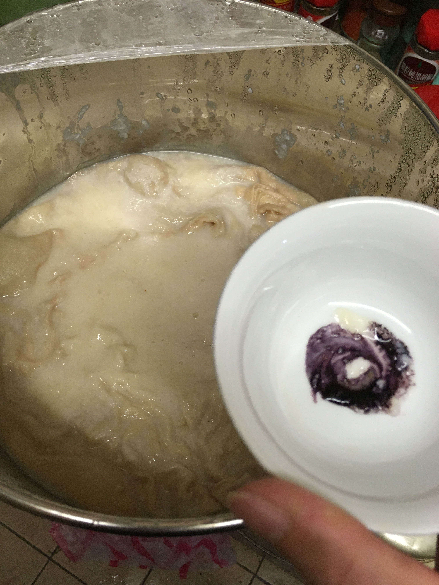
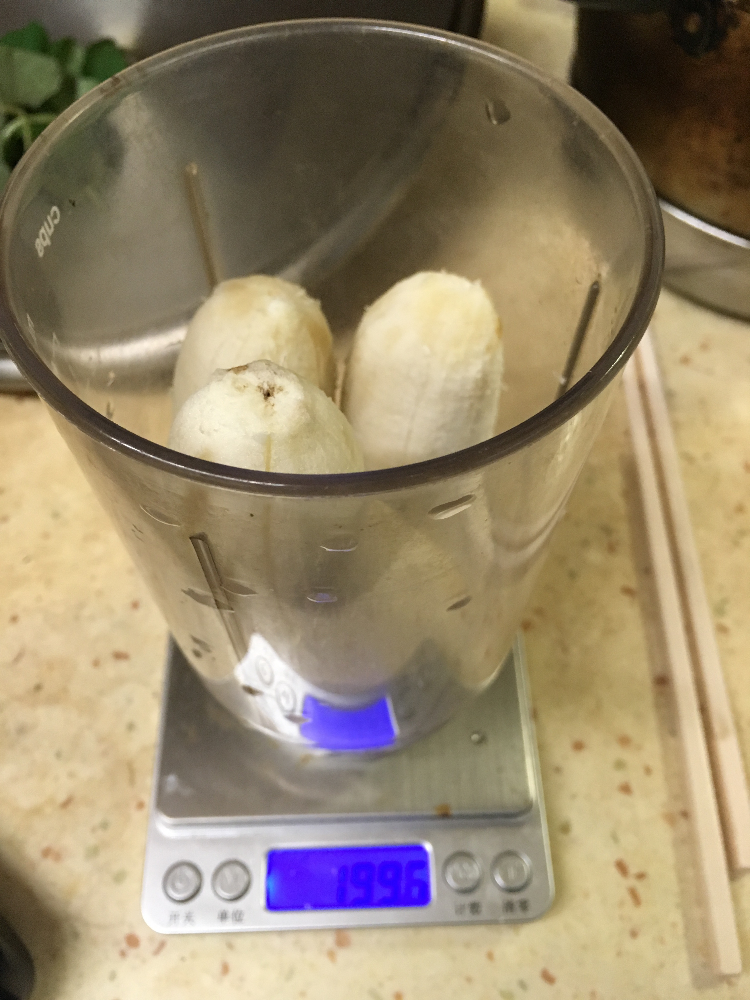
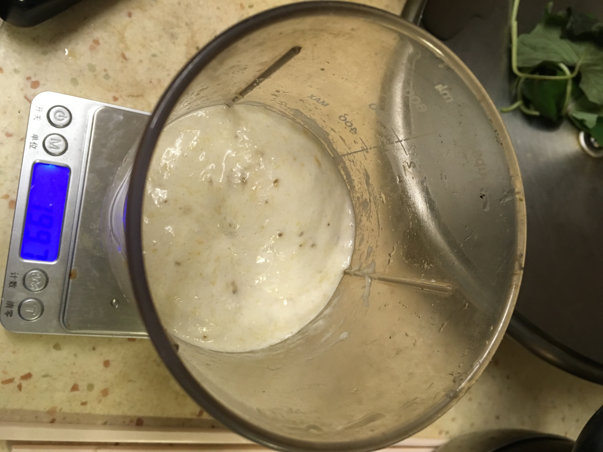
* 7/12 00:40 看起來稠度沒啥改變，多了點香蕉味... 碘液測試看起來沒有好轉的跡象，加入200g紐西蘭gladfield pale malt醣化，希望可以扭轉頹勢 
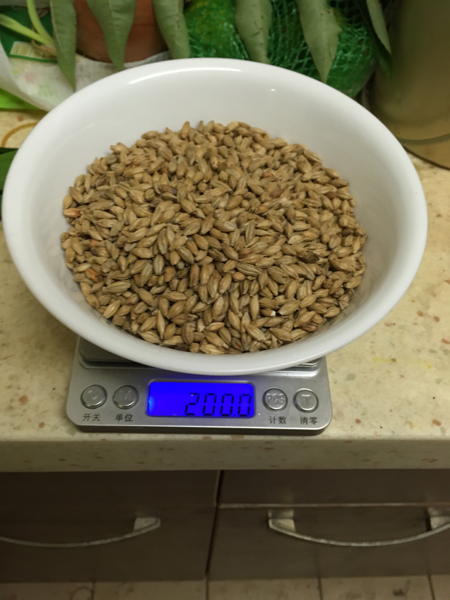
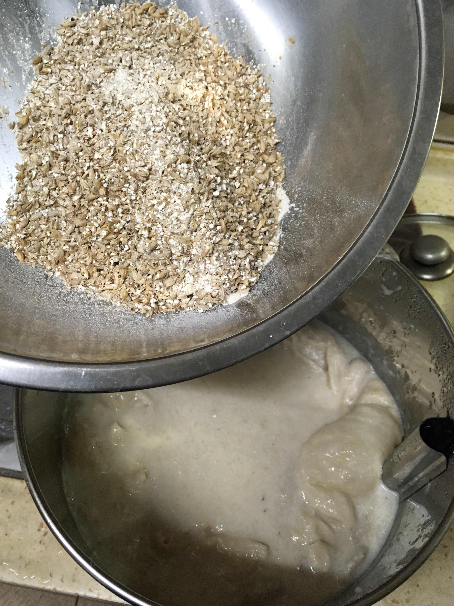
* 7/12 8:40 碘液反應看起來比較好了
* 7/12 2000 好吧，連Malt 24hr都沒有辦法完全解決這些澱粉，還是就當甘酒喝吧。太過黏稠無法使用濾網過濾，用豆漿袋壓榨處理
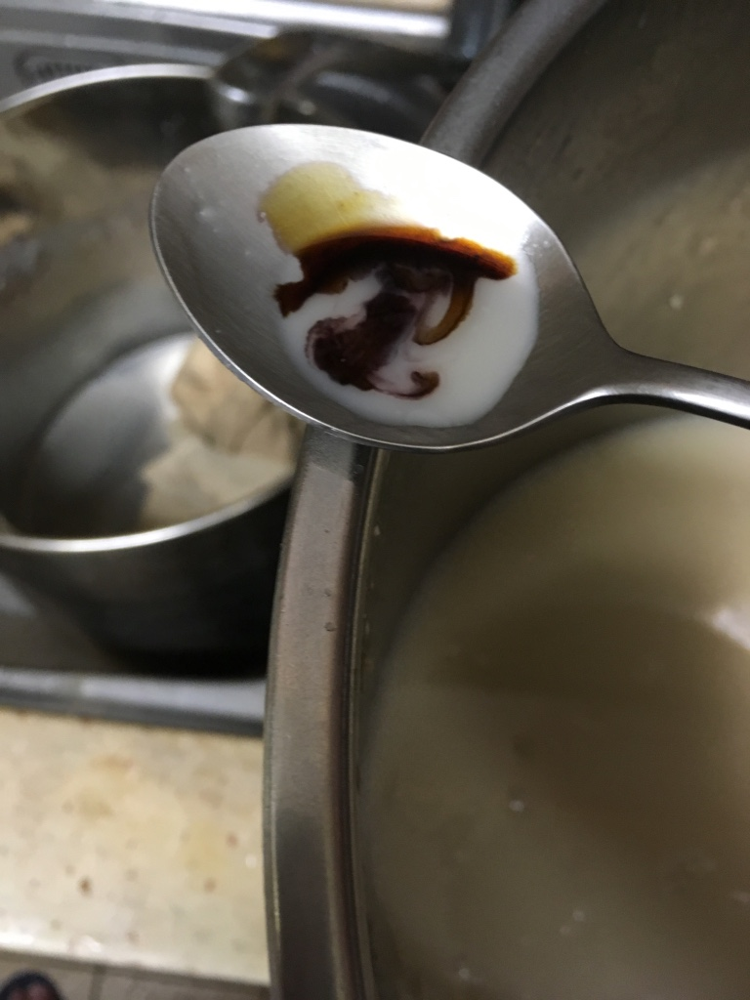
* 榨乾之後的渣
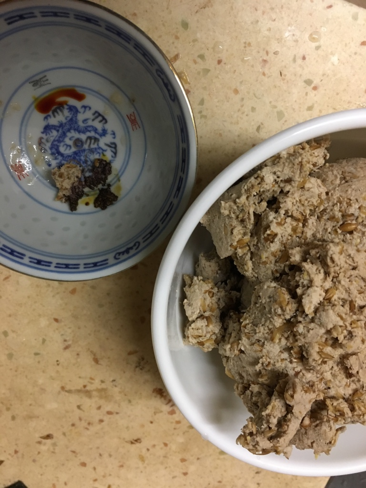
* 巴殺之後來喝
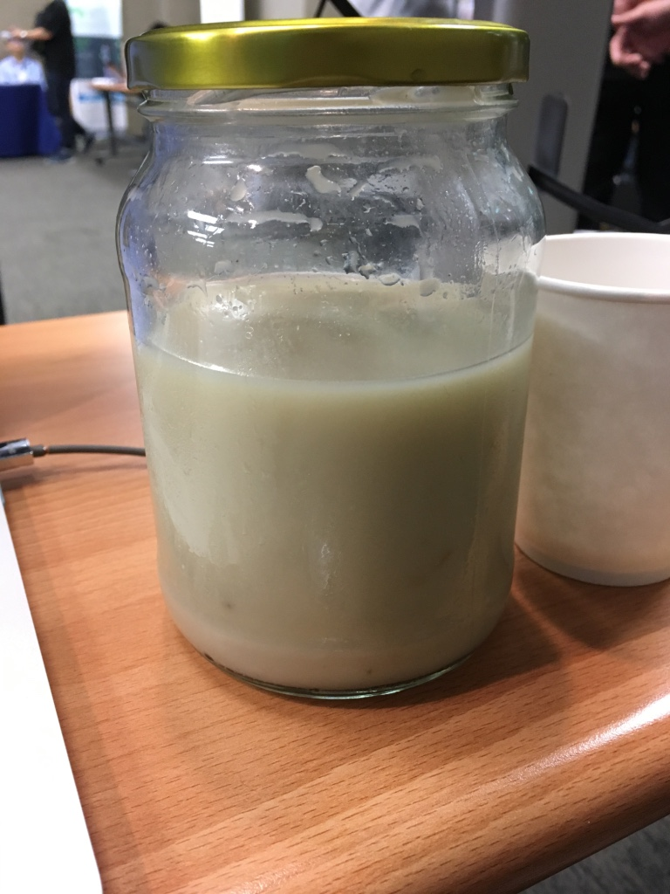

酵素確實有在作用，糖度有提升澱粉有減少，但澱粉沒有如預期的被完全分解
我投入了不只米麴，後半段也嘗試投入了 香蕉 與 Pale malt來做醣化，不過速度依然緩慢，我開始在思考，說不定這是米的特性？

正規清酒採用複式發酵，也就是使用有活力的米麴菌，而非甘酒的米麴進行，而時間長達數個月。也許要把澱粉完全分解完在米上面有一些不知道的阻礙，把澱粉顆粒包住了？
甘酒雖然僅使用米麴醣化12hr, 但最終成品是允許有澱粉的。或許要在數天時間內完整醣化本來就是不可行的？

很甜，很稠像米漿，氣味有明顯的麴味（白醬油那種味道），舌頭上可以感覺到米的甜感與澱粉的甜感