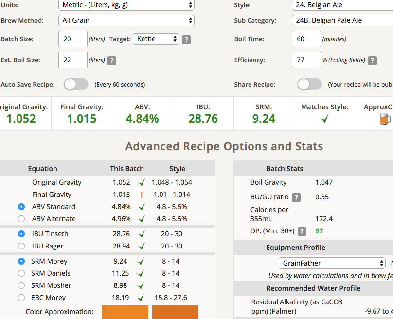

# 180806-ethen-BelgianPaleAle

2018自釀大賽比利時組，基於雷大的譜

https://www.brewersfriend.com/homebrew/recipe/view/680041/r-taiwan2018-bpa

**設備**

GrainFather

**麥**

* 德BEST Pils 3800g
* 比利時Biscuit 200g
* 英Crystal 60L 200g
* 比利時SpecialB 100g

67度醣化60min

碾麥狀況佳

糖化效率77%

**酒花**

* EKG 5.2% 28.35g 60min
* Warrior 17.3% 3g 20min(煮花時糖化效率預估會到85%所以補了苦，苦啊...)
* Saaz 3% 28.35g 15min

**酵母**
 
* S-33 比利時乾酵母兩包

約18度直接投入，發酵溫度20

**流程**

糖化效率煮到最後都預估是85%, 沒想到進桶之後重測大跌QAQ

最終產量 20L 糖化效率平均77% 分成一桶一瓶

大桶 16.62kg OG1.051 FG1.015 ABV4.71 IBU29.08 SRM9.24 19.5gS-33(0.75)

小瓶 3.345kg OG1.057 FG1.017 ABV5.34 IBU27.52 SRM9.24 3.5gS-33(0.63)

冷降之後把小瓶上清液合併到主桶，重量變成18.415 / 1.55，姑且就使用平均值1.052吧

大桶 18.415kg OG1.052 FG1.015 ABV4.84 IBU28.76 SRM9.24 

## 