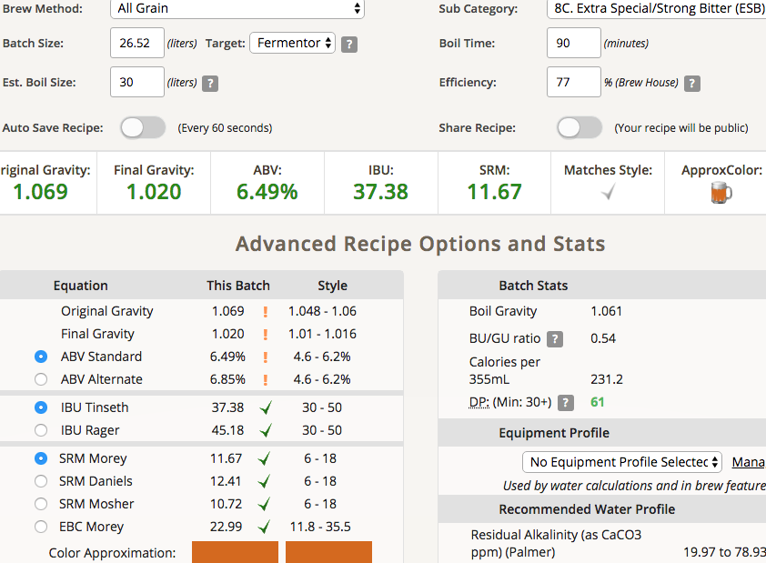

# 180812-ethen-ESB

2018自釀大賽英式組，基於Fullers官方的譜微調

https://www.brewersfriend.com/homebrew/recipe/view/648636/r-taiwan2018esb

**設備**

GrainFather

**麥**

* 英MO 4100g（有2kg的麥桶沒標籤..我不是很確定是MO還是Gladfield Ale）
* 英Golden Promise 3000kg（取代用完的MO）
* 英Crystal 60L 550g（調降色度）
* 英Chocolate 15g（調降色度有減量）

65度醣化60min

碾麥狀況好像太細了會卡

糖化效率 77%

**酒花**

* Target 8.4% 28.35g 60min
* EKG 5.2% 15g 60min
* Challenger 7.2% 28.35g 5min
* Admiral 10.9% 28.35g 5min
* EKG 5.2% 13.35g 5min
* EKG 5.2% 28.35g DryHop 3days

試著不用酒花簍直接投入鍋內，結果似乎反而影響了旋沉，熱渣與酒花變得很分散，雖然冷降效果不差，但一開始抽酒冷渣立馬被捲起來

然後冷渣與酒花渣一起把keg的出口堵了，害我沒辦法量OG（眼神死

**酵母**
 
* Wyeast London ESB 1968 擴培2.4L

16度投入，發酵溫度17

**流程**

我發現我的折射式比重計好像故障了，跟比重式的比起來會偏高

由於出口冷熱渣＋酒花塞好塞滿，我只好收集起來冷降之後再來量

糖化效率77% 26.52kg 

大桶 18.16kg OG1.068 FG1.02 ABV6.4 酵母1.6L(0.88) 68.5% (+3L 1.059 1.017 5.49%)

小桶 8.36kg OG1.073 FG1.021 ABV6.87 酵母0.8L(0.99) 31.5% (+2L 1.059 1.017 5.54%)

加總 26.52kg OG1.069 FG1.02 ABV6.49 IBU37.38 SRM11.67 

加總補水4L OG1.06 FG1.017 ABV5.64 IBU32.48 SRM10.6

## 180828 補水換桶

虹吸取出

大桶15.7L 補水3L FG1.004.....

小桶5L 補水1L FG1.004 WTF 看來是酵母有問題了？怎麼吃成這樣

這批酵母繼代的次數有點多，有可能因此產生了特性改變

聞起來酒精感略強，一點高級醇，口感甜有一點酵母感，但大致上是舒適的，還可以期待

## 181001 冷泡EKG1oz

FG1.006 顏色有點深，有種brown ale的感覺Orz, 酒色有點濁，酵母味與刺激感，好像是因為底層沈澱的關係... 這次乾投一併改成上層出酒好了，或拉虹吸管出來？

決定多冷泡一倍，然後用虹吸管抽出來做瓶內碳酸化，給他一點氧化看看

冷泡EKG2oz 溫度14-17

## 181004 冷降

## 181006 換桶強制碳酸化

3.33度6psi=2vol, 考慮到等壓裝瓶的壓力喪失我應該會給到10psi吧

2vol 1,67度 6psi up to 10

分成瓶裝6.2kg 2.0vol 31g 與keg 9.4kg 

## 181007 等壓裝瓶

## 181008 最終評比

分成瓶內碳酸化與等壓裝瓶版

瓶內碳酸化的版本顯然時間不夠，過甜了，放棄

等壓裝瓶版，氣味有點皮革，可以喝，不過跟心目中的ESB依然有巨大差距Orz