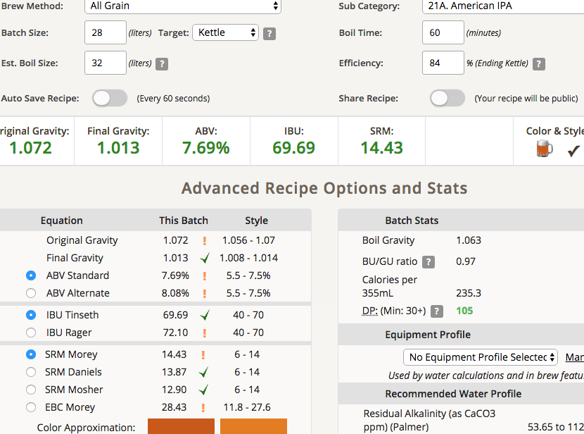
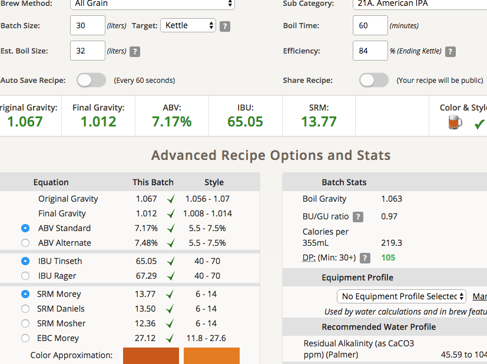

# 180816-ethen-CentennialIPA

2018自釀大賽IPA組，基於Founders Centennial IPA Clone的單一酒花變體

https://www.brewersfriend.com/homebrew/recipe/view/687423/r-taiwan2018-cenipa

**設備**

GrainFather 26L

**麥**

* 紐Gladfield Ale 5360g
* 英MO 1131g
* 英Crystal 60L 565g
* Munich 565g
* 比利時CaraMunich 198g

7.82kg

67度醣化60min 26L 

也許是吸水膨潤效果好，這次也幾乎頂到GF的上限，下次麥量得控制在7.5kg以下了

投入一半麥芽一半水攪勻後再投入另一半，有輕鬆一點

這次麥床通過效果有好一點，但還是有點緩慢，導致最後加入的量沒有辦法煮回100度只到90，得再調整看看

**酒花**

* Centennial 9% 56g 60min
* Centennial 9% 80g 15min (糖化效率預估過低，緊急調整又拉太高，只好省略掉5分鐘的那次，剩下整包酒花全乾投跟他拼了)
* Centennial 9% 138g DryHop 5days

煮花階段評估糖化效率84%。由於入keg會有一些麥汁損失，能補齊還是要補齊這樣IBU比較少誤差

以後應該煮花階段做一次糖化效率評估，keg水冷之後做OG取樣不要拖到冰箱降溫後，這樣比較順

盤館操作失誤，冷卻階段噴了一些水出來，幸好不多且溫度還熱，pitch rate+高酒花應該可以壓制

**酵母**
 
* US-05 擴培2.4L+一包乾的，pitch rate 0.94Mcells/ml/p

上次做完覺得1332麵包香有點太強了，改用US-05應該會比較符合美式IPA的感覺

17度投入，發酵溫度18

這幾次擴培都有加入鋅跟B群，不過沒有如貝肯布說的那樣大爆發

另外最近擴培發現滅菌釜可以一瓶800ml沒問題不會溢出去

由於是高活力的酵母投入沒有冷降，應該要把體積加進去算的。不過擴培本身也有麥芽精的存在（SG1.037），有點難算啊...還是假裝沒看到吧

一個失誤是忘記計算加入酵母的體積，所以第一桶變成19L了...大噴發的預感（抖

**流程**

糖化效率81% 27kg 

大桶 17.48kg OG1.071 FG1.013 ABV7.61 酵母1.6L+一包(1.09)

小桶 9.5kg OG1.075 FG1.014 ABV8.09 酵母0.8L(0.73)

整體27kg OG1.072 FG1.013 ABV7.69 IBU64.19(酒花調降前69.69) SRM14.43

應該不用補水，要補的話2L OG1.067 FG1.012 ABV7.17 IBU60.23 SRM13.77

## 