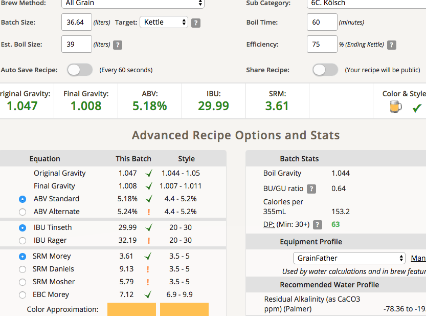

# 180822-ethen-Kolsch

幫朋友做的，目標是一支快速、清爽順口又有點風味的酒，搭配陽光與沙灘

**設備**

GrainFather 36L

**麥**

* Gladfield pale 6.35kg
* 英Wheat malt 0.74kg

3.3 23.4L初始水量

67度醣化60min

碾麥間距把下面的放鬆一點，這次醣化順利多了

糖化效率75%（煮鍋83%）

旋沈，這次熱渣析出的效率不錯

**酒花**

因為Hallertau AA太低所以調整

* Warrior 17.3% 20g 60min 25.23IBU
* Warrior 17.3% 5g 15min 3.13IBU（糖化效率修正）
* Hallertau 1.4% 24g 15min 1.22IBU
* Hallertau 1.4% 31g 5min 0.41IBU

**酵母**
 
* W-34/70擴培2.4L新鮮酵母

壓力發酵10psi, 發酵溫度17.5

**流程**

糖化效率75% 32.64kg OG1.053 FG1.009 ABV5.84 IBU29.25 SRM3.66 83%

+4L水 OG1.047 FG1.008 ABV5.18 IBU29.99 SRM3.61

## 180827 室溫發酵

理由很簡單，冰箱沒空間了...

SG1.014

發酵味跟之前釀造拉格很像，我想是因為酵母跟發酵溫度的綜合關係。口感還有點甜，苦味略強，應該可以期待發酵後的成果

## 1808xx 換桶補水