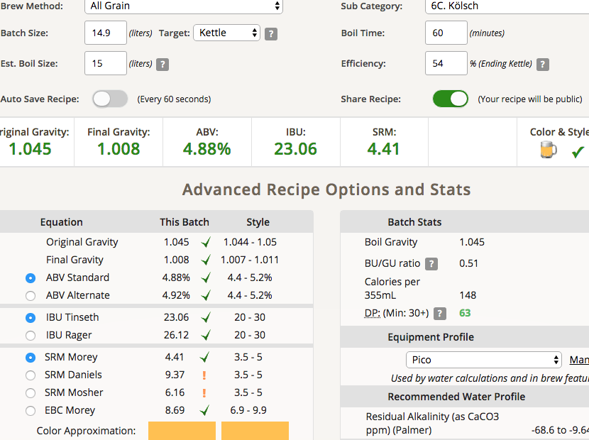
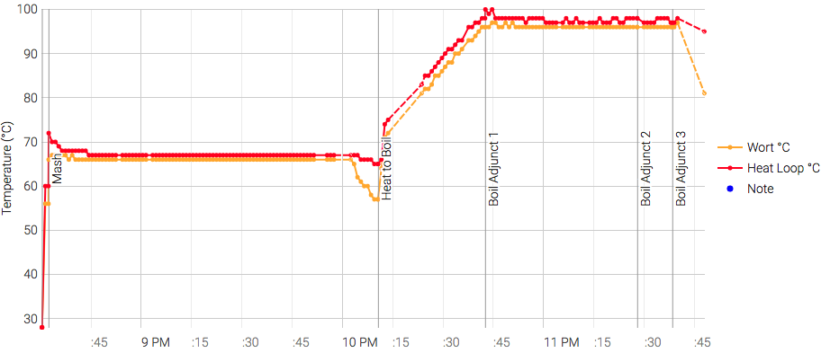

# 180825-pico-Kolsch

測試pico使用低酒花與壓力發酵的效果

**設備**

Pico Zymatic

**麥**

* Gladfield pale 3.45kg
* 天鵝Wheat malt 0.41kg

15L初始水量

67度醣化90min

糖化效率54%

桶子冷卻法

**酒花**

因為Hallertau AA太低所以調整

* Warrior 17.3% 7g 60min 21.55IBU
* Hallertau 1.4% 9g 15min 1.11IBU
* Hallertau 1.4% 8.1g 5min 0.4IBU

**酵母**
 
* US-05一包直投，Pitch Rate 0.66

壓力發酵10psi, 發酵溫度室溫約28

另分3.5L做溫控17度常壓發酵，測試看看長時間放置與大量清潔是否對Pico味有改善

**流程**

糖化效率54% 11.9kg OG1.057 FG1.01 ABV6.11 IBU28.88 SRM5.15

+3L水 OG1.045 FG1.008 ABV4.88 IBU23.06 SRM4.41 match，直接加

麥汁的感覺有點化學味，除此之外感覺很標準，苦度稍高

## 180829 冷降

FG1.008，放氣冷降準備轉桶

酵母味有點重並不舒適，應該跟抽到不少酵母有關

酸味...ＴＭＤ哪來的酸味Orz, 估計是乳酸或果酸之類的東西，感染了嗎？對Pico來說不太可能啊

## 180829 換桶

FG 1.0065 一點點乳酸味，感覺普通多了，考慮讓他變成芬達