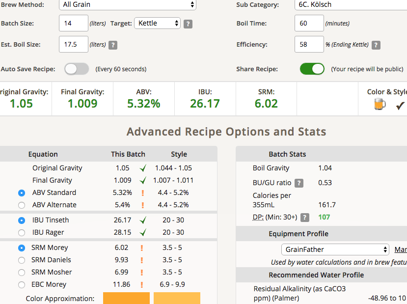
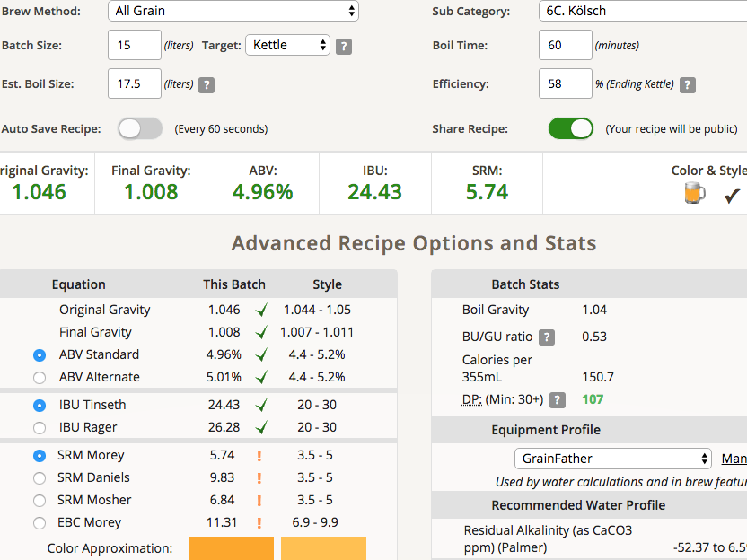
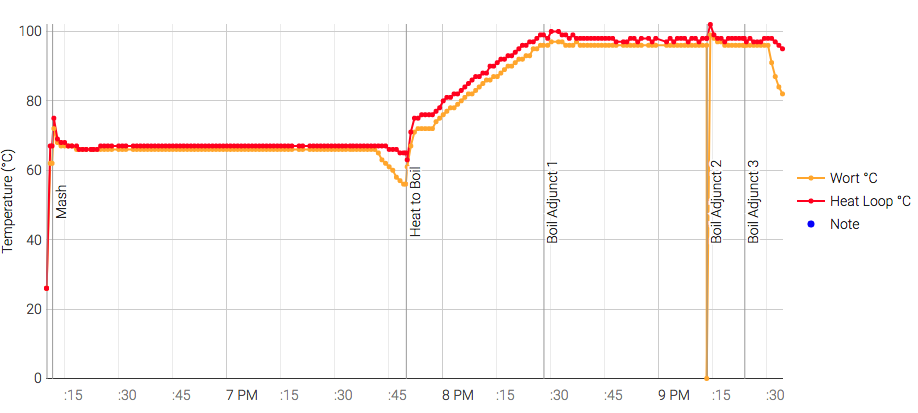

# 180830-pico-Kolsch

測試pico使用低酒花與壓力發酵的效果

**設備**

Pico Zymatic

**麥**

* Gladfield pale 3.45kg
* 天鵝Wheat malt 0.41kg

17.5L初始水量，下次可以再多一點...?

67度醣化90min

糖化效率57%

桶子冷卻法

**酒花**

因為Hallertau AA太低所以調整

* Warrior 17.3% 7g 60min 24.25IBU
* Hallertau 1.4% 9g 15min 1.25IBU
* Hallertau 1.4% 15g 5min 0.84IBU

**酵母**
 
* US-05一包直投，Pitch Rate 0.65

降溫到26度後投入

壓力發酵12psi, 發酵溫度室溫約29

**流程**

麥汁...就一般pico的結果

糖化效率58% 14.075kg OG1.05 FG1.009 ABV5.32 IBU26.17 SRM6.02

補水1L OG1.046 FG1.008 ABV4.96 IBU24.43 SRM5.74

## 180905

FG1.009，送去冷降

## 181006 換桶繼續冷降

風味還不錯，有一點酵母味，麥香，給我一種CreamAle的感覺

TODO: 補水1L, 換桶裝瓶

## 181008 最終評比

香氣比最好那隻略遜一籌，略帶一點酸感，有點高級醇，所以最後加糖瓶內碳酸化一段時間試試