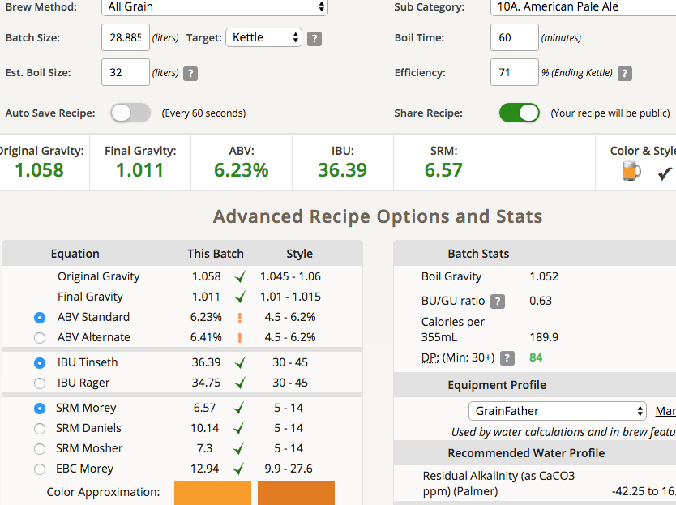
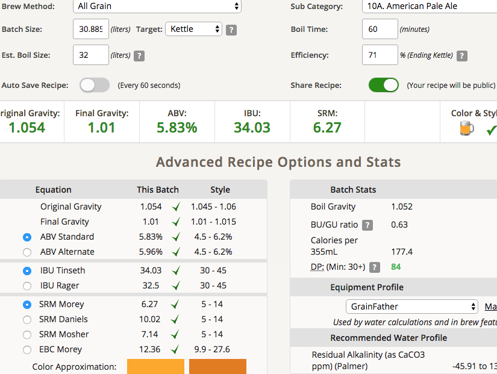

# 180906-ethen-CascadeAPA

2018自釀大賽美式組

https://www.brewersfriend.com/homebrew/recipe/view/699679/cascade-apa-mod

**設備**

GrainFather 32L

**麥**

* 英MO 7kg
* 英Crsytal 60L 0.2kg
* 英CaraPils 0.3kg

25L初始水量

67度醣化60min

糖化效率71%

桶子冷卻法搭配冰箱冷卻，底渣有點多

麥子的香氣鮮明，蛋白質也有感，苦度存在不過還算均衡

**酒花**

* Cascade 2017 5.4% 20g 60min 9.29IBU 原訂50g, 一開始誤判糖化效率51%修正
* Cascade 2017 5.4% 15g 49min 6.58IBU 推估糖化效率65%補苦
* Cascade 2017 5.4% 26g 22min 7.77IBU
* Warrior 2017 5.4% 17.6g 10min 9.5IBU 推估糖化效率70%補苦
* Cascade 2017 5.4% 26g 7min 3.24IBU
* Cascade 2017 5.4% 50g 0min 0IBU
* Cascade Cryo 5.4% 28.3g 3days 估計42.45g顆粒
* Simcoe Cryo 5.4% 28.3g 3days 估計42.45g顆粒

= 264.6g = 9.69g/L

乾投量 3.11g/L

* 貝肯布表示 「Cryo一包大約等於一般顆粒的1.4~1.5包， 所以100g一般顆粒大約2.5包Cryo的苦度，但香味更強。」

**酵母**
 
* US-05，Pitch Rate 1.26

降溫到18.8度後投入，發酵溫度18度

**流程**

糖化效率71% 25.3kg OG1.058 FG1.011 ABV6.23 IBU36.39 SRM6.57

第一桶17.315kg 第二桶7.97kg 底渣回收3.6L

補水2L OG1.054 FG1.01 ABV5.83 IBU34.03 SRM6.27

## 

TODO: 補水2L, 冷泡、換桶裝瓶