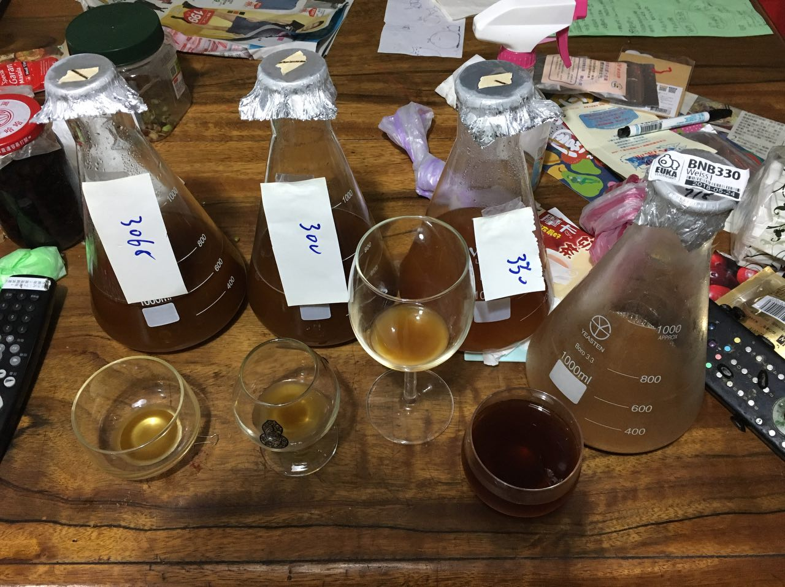

# 180913-ethen-weissbier

2018自釀大賽小麥組，基於雷大的譜微調

https://www.brewersfriend.com/homebrew/recipe/view/566595/r-taiwan2018-hefe

嘗試重現[上一次的結果](https://github.com/sakura26/ethanol/blob/master/brewingHistory/180413-ethen-rayhefeweizen.md)

**設備**

GrainFather 36L

**麥**

* Gladfield american pale 3.79kg
* 英/天鵝Wheat malt混用 3.79kg

25L初始水量

67度醣化60min

糖化效率78% 堵得有點煩...

桶子冷卻法搭配冰箱冷卻至13度

這次有特別等洗槽確定糖化效率之後才煮花，沒想到還是邊煮邊量邊改....怎麼會這樣呢？

我的鍋子的刻度好像有點問題？還是說是我用重量量測的誤差？也許該寫個計算機來更精確一點？

**酒花**

* Hallertau 4.5% 38g 60min 12.13IBU
* Hallertau 2.2% 38g 15min 2.94IBU

**酵母**
 
* 林大凍菌管 3068，Pitch Rate 0.5（13L）
* 貝肯布 330，Pitch Rate 0.5（13L）
* 林大凍菌管 WLP300，Pitch Rate 0.5（10.1L）

降溫到13度後投入，發酵溫度17度

意料之外的插曲：這隻是比賽酒，考慮到上一次實驗300落敗，由於之前有聽說過300的菌株源頭事實上跟3068是同一隻，想說做一個交錯比對，所以跟貝肯布拿了330。投入前攪拌時發現330這隻揚起時酵母整片掀起來，類似1968那一類型的英式酵母特徵，感覺有點古怪，所以倒了一部分出來品嚐。

* 3068的結果是以香蕉酯味為主體，有點香蕉糖那樣的氣味與口感
* 300也是香蕉酯味，但感受偏向比利時的那種風格
* 330...酸的囧。

330這隻5月底拿到之後擴培過一次，不過放到現在酵母有可能衰退所以再次擴培，在想是不是擴培操作不當所以回去拿第一次擴培那瓶出來比對，很酸 = * = .. 只是第一次擴培那瓶底下的酵母沒有英式那種牽拖感。究竟是發生什麼事了呢... 找時間做四區劃線看看？

**流程**

分成三桶：13kg, 13kg, 10.1kg（含冷熱渣），糖化效率78%

3068 13kg OG1.053 FG1.013 ABV5.33% IBU15.07 SRM3.4

300-10.1kg/330-13kg OG1.053 FG1.013 ABV5.24% IBU15.02 SRM3.4

補水3L OG1.049 FG1.012 ABV4.9 IBU13.87 SRM3.22 match

##

TODO: 補水3L, 換桶裝瓶