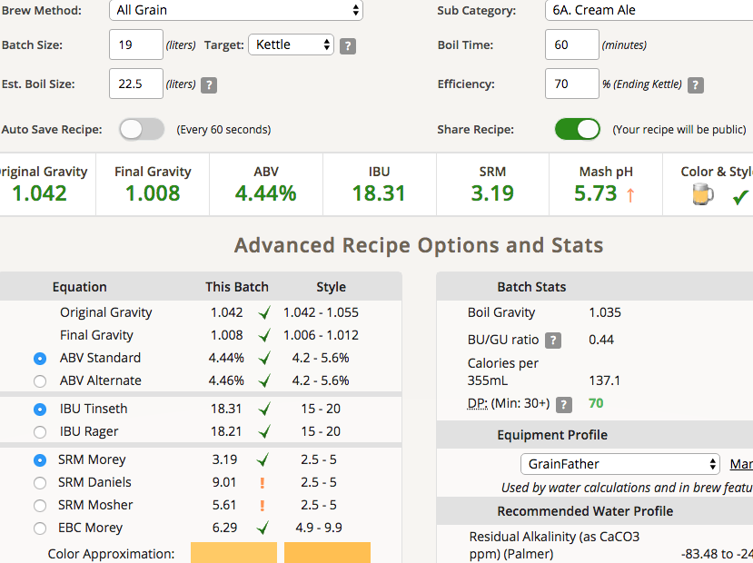

# 181215-Ethen-CreamAle

回到最原始的狀態

**設備**

GF 批量16L

**麥**

* MO 3kg
* White Sugar 300g

碾麥一開始很悲劇，但後來慢慢發覺調整間距的方法了，目前的版本感覺不錯，不卡彈

麥水比6.6，隨便下結果下太多了...導致mash結束的量太大，只好火力全開1hr煮花

糖化溫度64, 水通過麥床相當順利，醣化效率約70%, 低得有點囧

**酒花**

* Hallertau hersbrucker 45g AA2.2 60min 18.21IBU
* Cascade 10g AA5.4 5min 3.54IBU

用了大酒花簍，感覺效果挺不錯的

煮花後試著直接熱麥汁進入發酵桶後倒立消毒5min後冷卻

對醣化效率預估太高所以苦度太高...幸好這個style可以加糖加水，那就來個誤打誤撞吧

**酵母**

* S-04 一包 發酵溫度21(跟蜂蜜酒測試一起)

投入溫度24

**流程**

產量16L 糖化效率70%

16L S-04 OG1.05 FG1.01 ABV5.27 IBU21.75 SRM3.59

補水3L 19L S-04 OG1.42 FG1.008 ABV4.44 IBU18.31 SRM3.19 match

 

## 181226

FG1.008 ABV5.51%, 搬去冷降，準備換桶補水

風味感覺還不錯，還有一點酒精感

