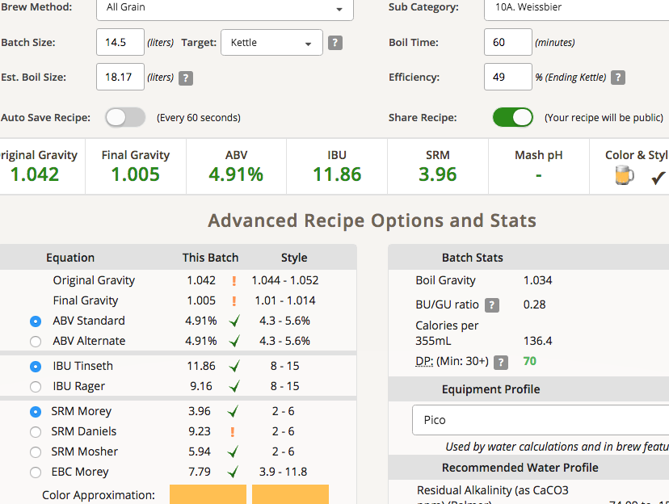

# 190223-Ethen-PicoWeissbier

**設備**

Pico

**麥**

* MO 2.3kg
* 天鵝白小麥 1.7kg

糖化溫度45 20min/66.7 20min/75 20min, 水通過麥床相當順利，但最終殘餘的黏著區還是一樣的大，而且往底層移動。看起來事先挖坑的效果有限....

**酒花**

* Cascade 12g AA5.4 30min 10.76IBU
* Hallertau hersbrucker 20g AA2.2 5min 1.89IBU

**酵母**

* WB-06 0.8包 發酵溫度17

投入溫度 11

連續三天氣溫都偏低，溫度都在15-16度

**流程**

產量14.5L 糖化效率49%

14.5L WB-06 OG1.042 FG1.005 ABV4.91 IBU11.86 SRM3.96 OG偏低

麥汁氣味就pico, 但是喝起來有股肥皂味，不知道是怎麼回事。苦度還是偏高

 

### 190228

桶子搬出來室溫發酵20度

