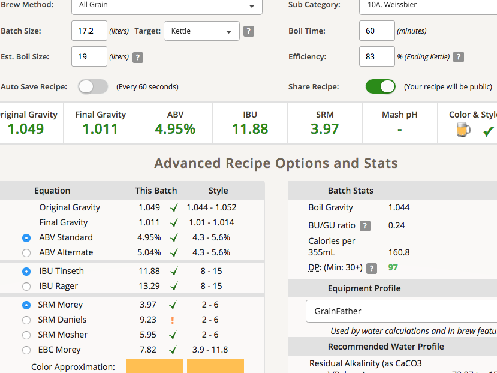

# 190228-Ethen-RayHefeweizen

本次測試小麥酵母Munich Classic

**設備**

GF 15L

**麥**

* Gladfield Pale Ale 1.62kg
* 城堡白小麥 1.62kg

麥水比3.3, 10.8L

醣化64度60min，跟前面相比果然麥床通過速度變慢了，小麥多有差

糖化效率83%

**酒花**

* Hallertau 29g AA2.2 60min 11.1IBU
* Hallertau 29g AA2.2 5min 2.2IBU

**酵母**

* Munich Classic 一包

投入溫度15，發酵溫度17

有趣的是Munich Classic花了整整48小時才啟動，我差點要補酵母了...

**流程**

14.2L OG1.059 FG1.014 ABV6 IBU14.39 SRM4.53

補水3L OG1.049 FG1.011 ABV4.95 IBU11.88 SRM3.97 match

#### 190312 發酵幾乎結束

#### 190315 冷降

#### 190316 裝瓶

FG1.011 ABV6.3%

毫無疑問，香氣確實有著香蕉糖的氣息，不過還是沒有3068那麼好，以後我可能還是會以3068為主。但這會是一隻輕鬆做的好工具