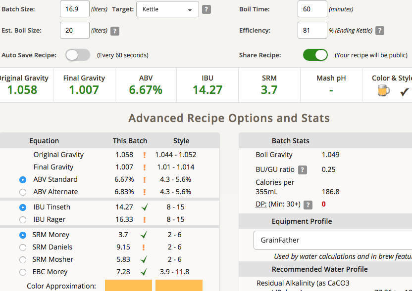

# 190228-Ethen-Weissbier與義大利麵測試

新的系列實驗再開，德國小麥，這次得記得多階段醣化

https://www.brewersfriend.com/homebrew/recipe/view/566595/r-taiwan2018-hefe

想測試這個

* Munich classic v.s. 3068，使用德國小麥1:1譜 10L兩桶同一批麥汁
* Munich classic，pales50%, wheat malt30%, 打碎煮熟的義大利麵20%
* Munich classic，pales50%, wheat malt30%, 打碎生的義大利麵20%
* Munich classic，pales50%, 打碎煮熟的義大利麵50%

最終成品都10L keg裝，其他裝瓶瓶發

後添加：羅勒當香花煮，番茄呢？

要不要測比利時小麥？

https://www.brewersfriend.com/homebrew/recipe/view/550107/bw-witbier

**設備**

GF

**麥**

* Gladfield American Pale 2kg
* 義大利麵2kg

塞爆，◢▆▅▄▃ 崩╰(〒皿〒)╯潰 ▃▄▅▆◣，切換到大鍋加熱醣化

本來以為小麥芽的過濾效果有限所以全部換掉應該也還好，看來還是不能小看糊化後的東西。如果發生跟甘酒相同的情況，我就要加alpha澱粉酶了

碘液測試發現殘存的粉末狀並非澱粉，有趣

糖化溫度45-50x20min, 64x60min, 醣化效率約%81%, 意料之外

**酒花**

* Hallertau hersbrucker 32g AA2.2 60min 10.1IBU
* Hallertau hersbrucker 16.4g AA2.2 5min 1.03IBU
* Hallertau Tridition 18.2g AA4.5 5min 2.34IBU

**酵母**

* S-04 一包 發酵溫度17

投入溫度15

**流程**

產量16.9L 糖化效率81%

OG1.058 FG1.007 ABV6.67 IBU14.27 SRM3.7

補水2L 18.9L OG1.052 FG1.006 ABV5.96 IBU12.76 SRM3.42 酒精偏高

補水3L 19.9L OG1.049 FG1.006 ABV5.66 IBU12.12 SRM3.3 酒精偏高

我覺得酵母可能不會吃到那麼兇...觀察看看

 
 