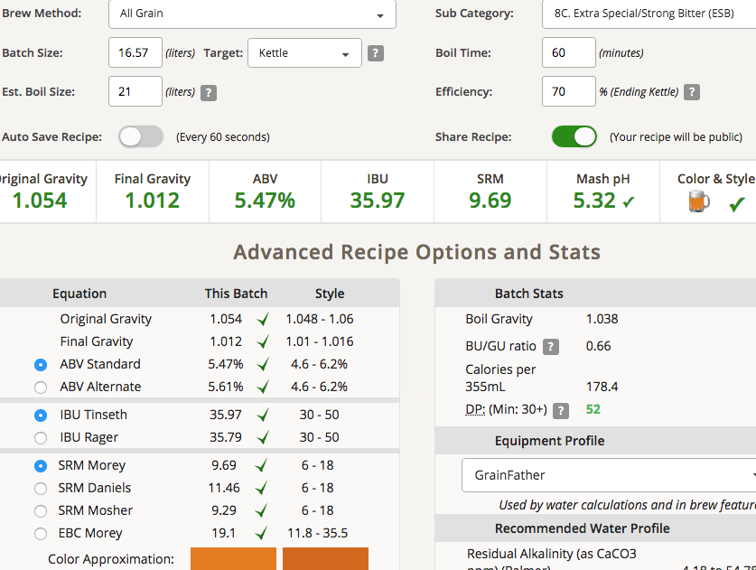

# 190228-Ethen-WhiteHouseHoneyAle

https://www.brewersfriend.com/homebrew/recipe/view/784105/whitehouse-honey-ale-allgrain-edit

https://obamawhitehouse.archives.gov/blog/2012/09/01/ale-chief-white-house-beer-recipe

**設備**

GF

**麥**

* Gladfield American Pale 3kg（丟錯，應該丟MO的...）
* 比利時城堡Wheat 300g
* Crystal 60L 300g
* 龍眼蜜500g(後添加)

糖化溫度64, 水量有點少所以泵浦開開停停，醣化效率約%70

**酒花**

* EKG 20g AA5 60min 16.67IBU
* 硫酸鈣（石膏）10g 60min
* EKG 8.35g AA5 20min 4.21IBU
* Challenger 28.35g AA8.5 1min 14.18IBU

e04, 放水冷卻桶子時不小心蓋過桶子，雖然是第二段冷卻壓力差有限，不過希望不要有水跑進去了 

update: 氣密似乎不錯，好像沒問題

**酵母**

* Windsor+London ESB各一包 發酵溫度16

投入溫度 15

**流程**

產量16.57L 糖化效率70%

OG1.054 FG1.012 ABV5.47 IBU35.97 SRM9.69 match

蜂蜜導入+1L OG1.051 FG1.012 ABV5.16 IBU33.92 SRM9.31 match

 

### 190304加入蜂蜜

蜂蜜+1L水煮沸後加入

#### 190312 發酵還剩一點

#### 190408 冷降兩週裝瓶

9L keg force cab

7.17kg 裝瓶 Vol2 sugar36g

FG1.015 ABV4.73

感覺很棒，苦味鮮明但又有蜂蜜香，希望瓶發後可以維持
