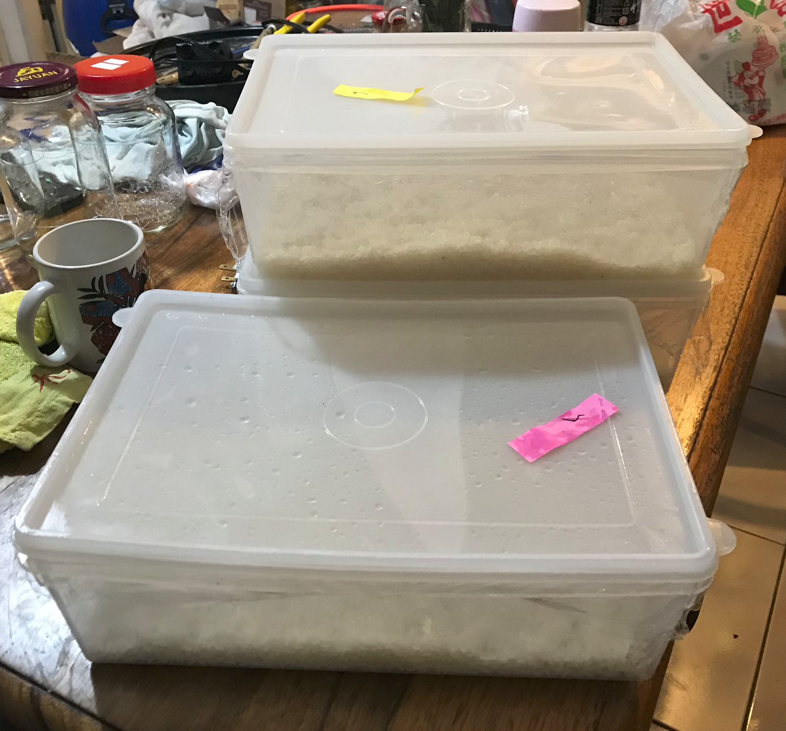
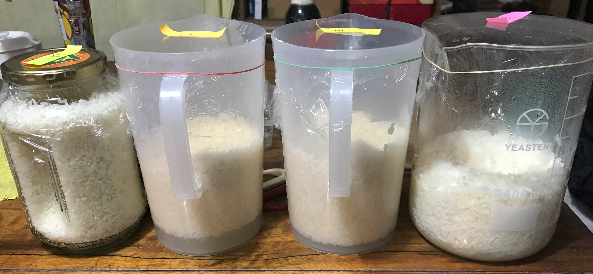
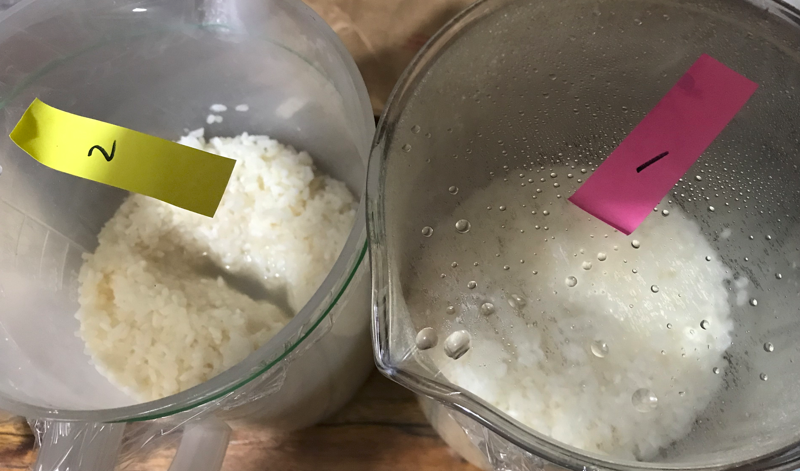
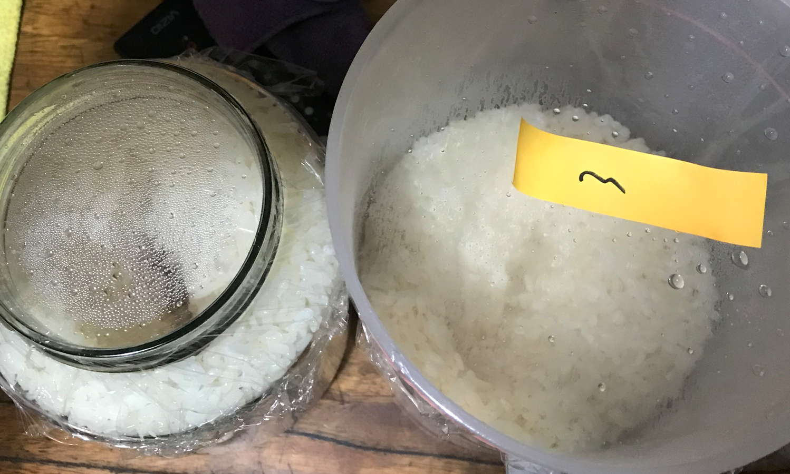
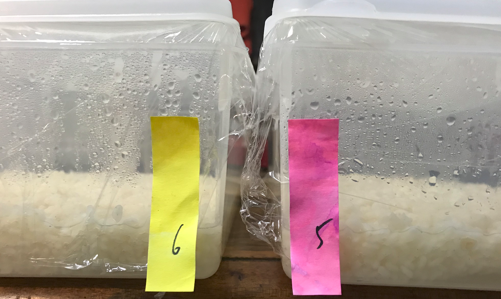
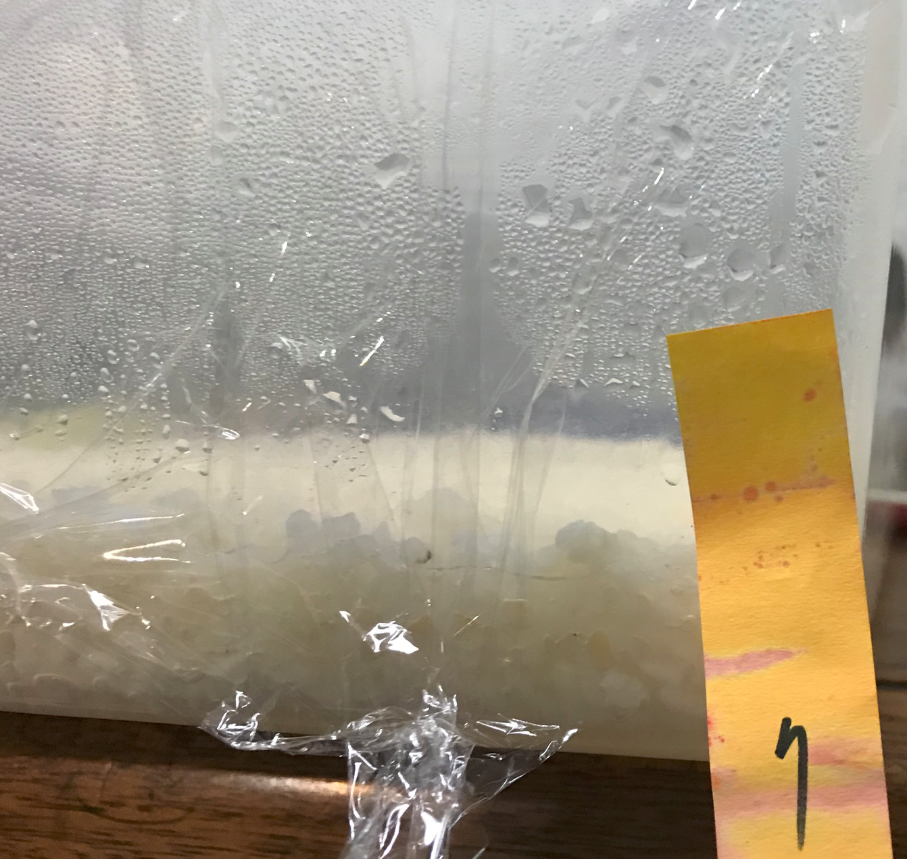
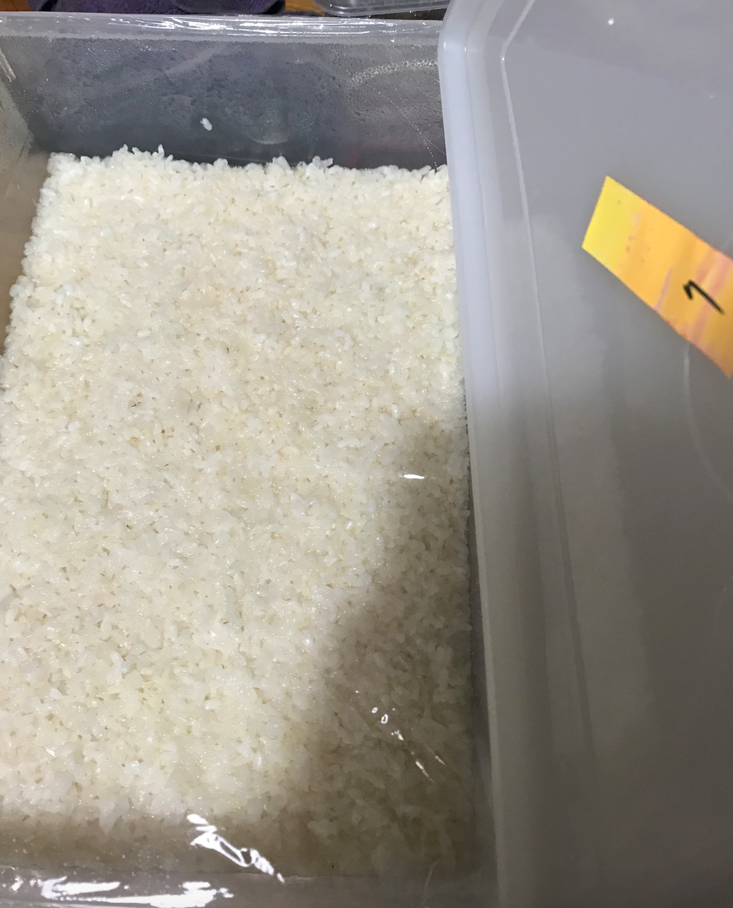

# 190421-Ethen-甜酒釀

按照 羽逸(力升) 的譜，測試七隻不同的酒麴，每份0.6kg圓糯米，採購自永康街七巷米糧行

麴菌水化對50cc水，容器與水使用滅菌釜滅菌

1. 羽逸自製麴，投入1.5g
2. 安琪甜酒麴，建議用量0.3%, 實際投入1.8g
3. 孝感甜酒麴，建議用量3g, 實際投入3g
4. 黃酒麴，建議用量0.1%, 實際投入1.5g
	* （後來才知道是糖化後添加用的酵母菌ＸＤ）
5. 蔡老師楓香黃酒麴，實際投入1.5g
6. 蔡老師酒味甜酒釀麴，實際投入1.5g
7. 蔡老師京都白雪米麴，實際投入1.5g

## 酒釀實驗計畫
* 使用米種：圓糯米 1斤(600克)
* 使用種麴：安琪甜酒麴(甜味型) 0.3% (1.8克)
* 佈麴方法：先用50CC水化，再佈麴

### 酒釀製作步驟
1. 洗米：先用自來水把米洗乾淨，洗到水清澈無白濁狀
   * 如果使用水沖的話才有機會水清澈，用手洗沒辦法的，會產生碎粒
2. 泡米4小時（實際泡米24hr, 置於冷藏）
3. 瀝水：把水倒掉，飯瀝乾
4. 蒸米：用蒸籠、或是飯桶 (下面放一個蒸巾，後續會比較好處理)
   * 大致上是30-40min
   * 蒸鍋水量要夠，小心別把鍋子燒了
   * 原始米量4.2kg, 蒸完變7.6kg, 約膨脹1.8倍
5. 淋飯：蒸好拿起來用開水淋飯冷卻，到不燙手為止 (我沒測過溫度，憑手感)
   * 最好蒸好立刻動手，避免飯吸收水分變得太黏，這次因為水化花的時間有點太多所以延遲了，變得不是那麼好操作
6. 佈麴：把水化後的菌水與飯攪拌均勻
7. 入甕、中間挖個洞，蓋子蓋上 不鎖緊
   * （1-4放置容器中做窩，5-7沒地方放只好置於盒中鋪平，皆以保鮮膜做隔絕）
   * 一斤至少要準備2L（3罐）的容器
8. 結束

攤涼

裝盒

裝罐做窩

### 190426

* 1.2.3.5.6.7出水量皆已到達八分
* 4 黃酒麴看起來沒有麴菌的成分所以沒有出水
* 1.3 有顯著氣泡，酵母工作中，應該會有酒精感，567因為盒子的關係比較難以觀察有無氣泡
* 2 安琪完全沒有氣泡，很有可能是不含酵母菌的純麴菌

### 190428 品評

主要失誤點是米沒有蒸透，我想是因為鍋子空燒緊急降溫導致的問題，實際蒸的時間大概不到30min，下次要加足量水蒸滿40min。

另一方面安琪酒麴也有冒泡，看起來還是有酵母菌混進去了。幾乎所有的成品都有酒感，安琪已經是相對酒感較弱的了，下次要嘗試不攤飯，單純用淋的來減少酵母菌影響風險。

酒釀差異比較 問題集 by羽逸

Q:淋飯該怎麼淋比較好??   
A:以我自己為例，我不會再意淋了多少水，而是在淋飯時要注意不讓水積住無法及時排掉，這樣會造成飯較為黏糊，且淋飯要淋透，中心溫度也要達到手摸不燙，涼涼的即可，不必在意一定要幾度

Q:可以用冰水淋嗎?   
A:目前沒試過，但是麴菌有的適合的佈菌溫度約在28~30度，若過度冷卻，基本上還是要等他回溫才有辦法產生作用，這樣是否有不良影響?  要在實驗

Q：怎樣把酒釀變成黃酒?   
A：酒釀窩水出到八分滿後，即可添水、黃酒曲

Q：要添加多少水?   
A：這問題是因人而異，各人喜好甜度不同，第一次一定是做為實驗性質的添加，好做為後續修正的依據，先建議添加生米重的0.5倍，後續再以自己所期望的去增減

21:15 姿君 Sola 阿索 上次的酒釀，回來之後加了一點水跟黃酒麴，現在完全沒甜味，成了濁酒了
21:15 姿君 Sola 阿索 不過感覺酒度有點高，蠻嗆的
21:16 羽逸(力升) 濁酒是因為還沒完成  米都沉了嗎
21:16 姿君 Sola 阿索 液面下，都還在懸浮
21:17 羽逸(力升) 那就是還沒 要沉到底
21:17 羽逸(力升) 酒度高 應該定型了
21:17 羽逸(力升) 當初一斤扣掉拿去試吃的 應該剩不多 你家多少水?
21:18 姿君 Sola 阿索 大約補500CC喔
21:18 羽逸(力升)已收回訊息
21:18 羽逸(力升) 先重0.5加  約300CC
21:19 羽逸(力升) 但是因為有多挖出來 所以又要再更少  ，不過 你應該要重做一次比較準 一次做3斤米為準比較好 不然沒酒喝
21:20 羽逸(力升) 我那是指 一斤米的話 0.5倍水 就加300  2斤加600
21:20 姿君 Sola 阿索 最近氣溫有點刺激
21:21 姿君 Sola 阿索 那應該差不多
21:21 羽逸(力升) 對 氣溫變化太大  所以一般是說冬天是釀酒的好時機 夏天是喝酒的好時間 也就是希望溫度能夠控制低一點 不然發酵過快了 酒也不會太順口 跟啤酒有點類似
21:22 s2 (Ethen) 黃酒一般想到不會是清爽的酒，還是適合夏天喝嗎？
21:22 姿君 Sola 阿索 我是用舌頭測試，感覺應該差不多2X糖度的感覺
21:22 羽逸(力升) @s2 (Ethen) 可以冰著喝唷...
21:22 羽逸(力升)已收回訊息
21:22 羽逸(力升) 也可以做的淡一點...不過就是酒精強烈感會高一些
21:23 羽逸(力升) 糖度越低的酒 越會感受到酒精感越高  越甜越感受不到 但後勁很強 但若要酒精感與甜度平衡 發酵速度就要慢一些了
21:25 羽逸(力升) 若要酒精感不高 又要不嗆 是有一個辦法 不過我不喜歡
就是加水加酒曲控溫發酵 達到自己喜歡的口感 就下去煎酒
21:26 羽逸(力升) 煎酒相對會損失一些香氣 但可以避免酒精感過高
21:26 姿君 Sola 阿索 煎酒，是指把酒拿去加溫？
21:26 羽逸(力升) 等同巴殺
21:27 羽逸(力升) 大陸叫煎酒
21:29 羽逸(力升) 是有不少人透過巴殺 控制酒在自己喜歡的口感  雖然我不曾做過 因為覺得久的一些組成就被破壞了 但這的確事一個還不錯的方法
21:30 羽逸(力升) 但要小心爆瓶 因為答到喜歡的口感 其實也都還在發酵中
21:31 羽逸(力升) 打完沒選字就送出了 XD  好多錯字
21:33 羽逸(力升) 另外黃酒還有一個無敵的解決辦法.....難喝的就一直放...幾年後...就好喝了....= =!
21:34 羽逸(力升) 之前想做氣泡黃酒 但實在太多要試了 就一直推遲實驗了....

## 190430 加酒麴

雖然有挖掉一點，不過都當一斤來加，也就是300cc水+0.6g黃酒麴
