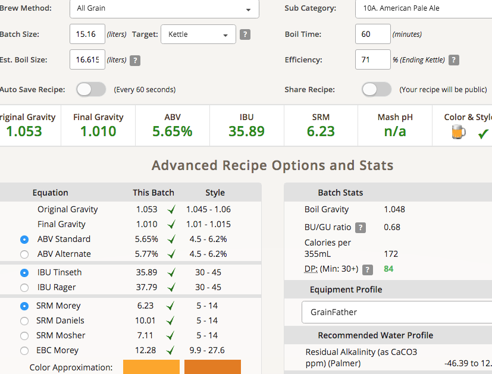

# 190501-Ethen-CascadeAPA

延續前一批洗槽，顏色有點深

9.47kg 1.032=9.17L，+2L初始化水量 +2L循環補正

13.825kg 1.056=13.1L

19.395kg 1.045=18.56L

**設備**

GF 11.22L

**麥**

* MO 3.15kg
* UK Crystal 100g
* Oat flask 150g

3.4kg, 麥水比3.3, GF11.22L

醣化65度60min(原譜67)

糖化效率71% 燕麥造成的混濁讓我一直以為醣化效率變差了，沒想到真的也變差了Orz

**酒花**

* Cascade 24g AA5.4 60min 21.08IBU 11
* Cascade 13g AA5.4 49min 6.24IBU 27
* Cascade 13g AA5.4 22min 7.38IBU 15
* Cascade 13g AA5.4  7min 3.08IBU 7
* Cascade 25g AA5.4  0min 0IBU
* Cascade 25g AA5.4 DryHop 3days

**酵母**

* US-05 1.2包

投入溫度，發酵溫度19

**流程**

Target OG1.054 ABV5.84 IBU38 SRM6.14

13 1.066=12.195L +3L 酒花、甜味、苦味，帶一點淡雅茉莉花香氣

15.16L OG1.053 FG1.01 ABV5.65 IBU35.89 SRM6.23

