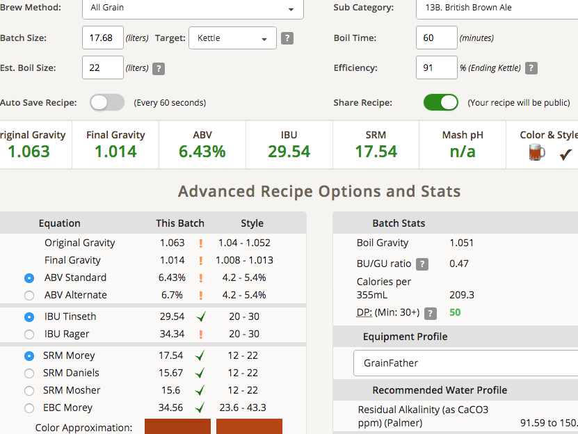

# 190501-Ethen-RayBrownAle

Imperial Stout的麥床殘留糖分很高，想用Brown Ale把甜份吃完，結果Brown Ale醣化效率噴到91%去 ＸＤ

加入前一批Imperial Stout洗糖水10L 1.03左右

**設備**

GF 13.2L

**麥**

* MO 3.2kg
* 城堡 Brown 0.5kg
* T Crystal 60L 0.25kg
* ? Chocolate 0.05kg

麥水比3.3, GF13.2L

醣化65度60min

15.5kg SG1.07=14.5L=>19L 1.054 5.46%

糖化效率91%（吃到前一批洗糖水）

**酒花**

* Chinook 14g AA13.1 60min 25.29IBU
* EKG 11.7g AA5.7 10min 3.47IBU

**酵母**

* S-04 2包

投入溫度20，發酵溫度19，之後8hr溫度持續降到12度去了緩慢回升

**流程**

Target OG1.049 ABV5.2 IBU28 SRM16.5

15.8kg 1.076=14.684L 91% +3L + 咖啡豆、烤土司、愉悅

17.68L OG1.063 FG1.014 ABV6.43 IBU29.54 SRM17.54

轉桶後補5L水 22.68L OG1.049 FG1.011 ABV5.02 IBU23.03 SRM14.79

### 180517 冷降

SG1.008 ABV5.12

### 180522 轉桶

15.665kg -> 15.54L, 17度熟成