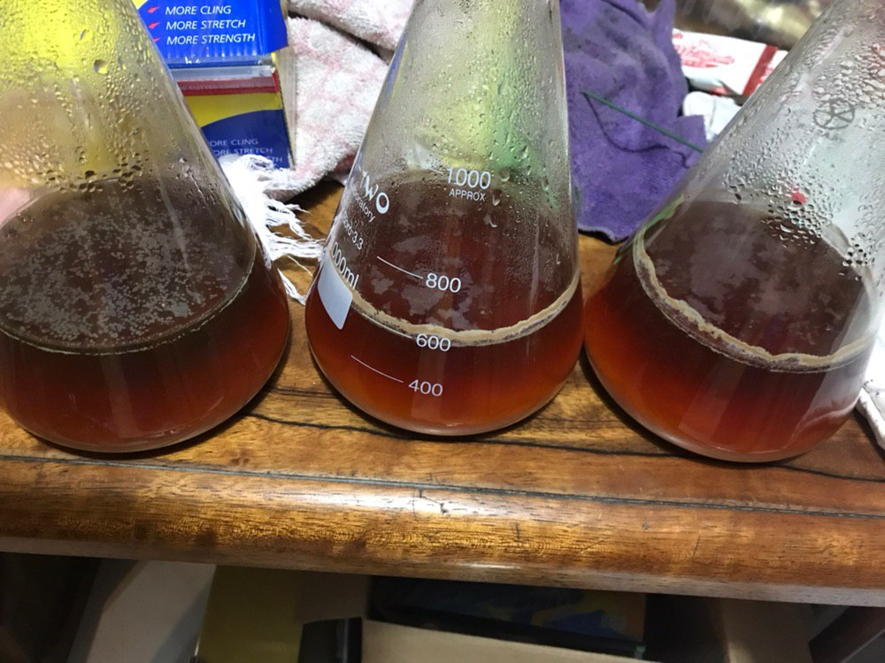
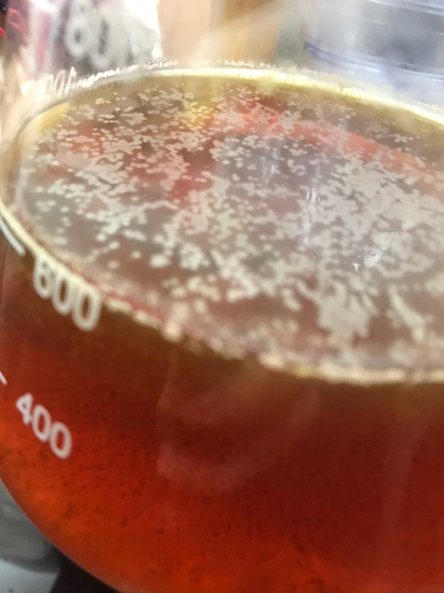
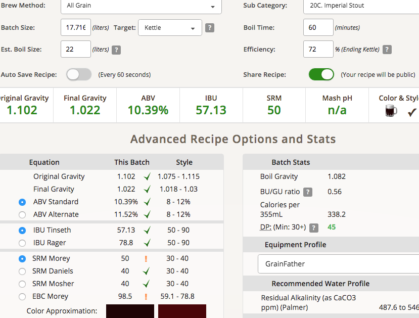
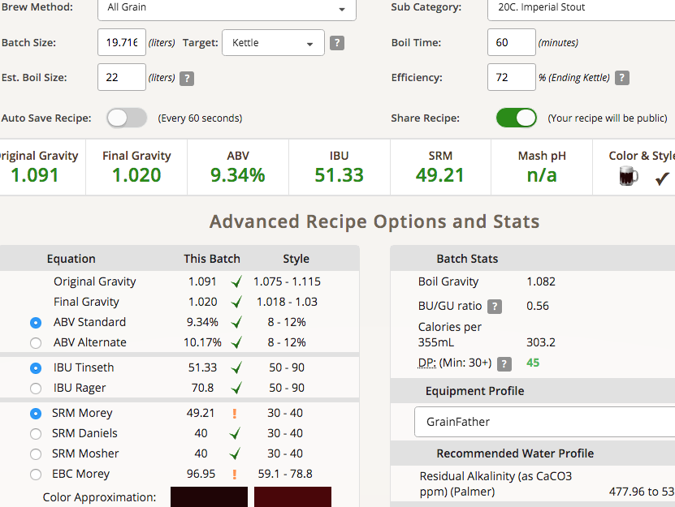

# 190501-Ethen-RayImperialStout

初次挑戰

牡蠣啤酒的歷史

https://sunmai.life/material/foodpairing/beer-to-drink-in-winter

最初是在超市看到日本做的牡蠣Stout才起了這個念頭，不過實際喝起來感覺沒有比一般Stout更加驚人的地方

網路查了一下，看起來這事實上不是一個歷史悠久的風格（可能百年吧？），但黑啤酒配牡蠣似乎是以前酒吧常見的組合。一些形容表示會增添鹹味、鮮味與厚實度，也有人使用罐裝牡蠣來單純作為酒體增厚，單純使用碾碎的殼做過濾也常見。有的酒廠會整顆牡蠣丟下去煮沸，據表示煮完之後的牡蠣並不好吃，看來風味是會釋放進酒體裡去的

除了深色、Strong的Stout, 似乎也有人用牡蠣搭配Black IPA，牡蠣芫荽gose。所以這次我先用Imperial Stout來試試看

類別範例

http://abv.com.tw/craft-beer/britain/Oyster-Stout/

**設備**

GF 18L

**麥**

* MO 6kg
* 城堡 Brown 1kg
* T Crystal 60L 0.25kg
* Special B 0.25kg

以下分開熱泡，使用約2L熱水

* Chocolate 0.6kg
* Roasted Barley 0.15kg

麥水比2.42, GF18L，沒有拌得很均勻所以底下有一點點結塊

醣化68度60min(原譜69)，糖化效率72%

**酒花**

* Magnum 28.35g AA12.4 60min 37.33IBU
* Chinook 8g AA13.1 60min 11.13IBU
* EKG 45g AA5.7 15min 13.52IBU

**酵母**

* US-05 1.8L

投入溫度20，發酵溫度19，之後8hr溫度持續降到12度去了緩慢回升

有趣的東西，這是600ml的US-05擴培

一般擴培會持續攪拌，所以不會有浮在上面的情況，但是這批擴培因為擴到一半就預期到接下來沒時間開釀要放置好一段時間，所以中止了攪拌來減緩糖分被吃掉的速度，就這樣在室溫中放置了兩週

漂浮在上面的也是酵母，預估應該是隨著氣泡滾動漂到上層之後依附於表面張力而成長的US-05

一開始看到很緊張，不過倒出上清液評斷，不管是氣味還是口感，都是標準的US-05，另一個滅菌對照組也沒有長出雜菌，判斷沒有任何感染。

**流程**

Target OG1.086 ABV9.5 IBU61 SRM46.8

18kg 1.11=16.216L 72% +1.5L 一點橡膠氣息，濃厚、強烈

=> 17.72L OG1.102 FG1.022 ABV10.39 IBU57.13 SRM50

轉桶後補水1-2L

=> 18.72L OG1.096 FG1.021 ABV9.84 IBU54.07 SRM50   
=> 19.72L OG1.091 FG1.020 ABV9.34 IBU51.33 SRM49.21

