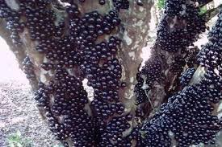

# 220225-樹葡萄

第一次嘗試樹葡萄，過往喝到多數為非常濃厚，很甜的版本，甜味澀味鮮明，所以這次有刻意迴避澀味

一直覺得樹葡萄是一種很克蘇魯的水果...長在樹上看起來會觸發密集恐懼症，捏開是白色果凍狀配上紅色果汁，攪拌入桶看起來種子像眼睛在裡面飄，不過真的味道滿棒的

直接吃有各種如山竹、紅心芭樂、木質精油的香氣

常溫樹葡萄高鐵直送，感謝 Julie/玲

清洗去蒂後3.5kg，加入1.8kg（51.4%）砂糖醃漬（1.2kg特砂，0.6kg二砂）並碾破

六天後（3/3）加入[S-33](https://fermentis.com/en/product/safale-s-33/)比利時酵母一包，與RO水10L（286%）

約兩週後轉桶冷降，同時果肉加入砂糖1.2kg（34.3%）再次醃漬取糖漿

酒喝起來有特別的香氣與澀味，感覺近似紅酒，加入糖漿（約1/7吧？）調整厚度與甜度後，裝瓶64度巴氏滅菌

最終產出約12.2L（348%）