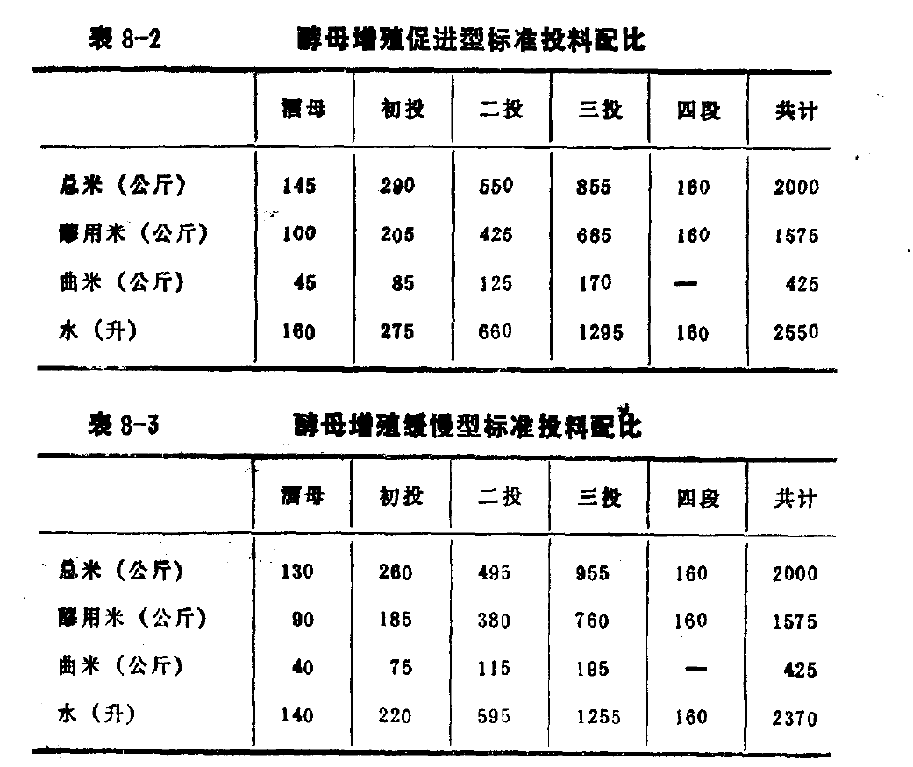
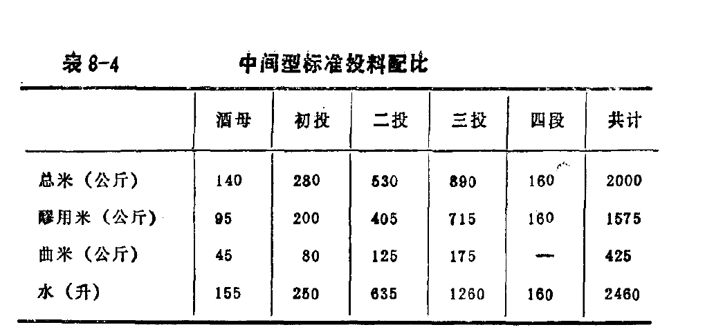

# 220731-Ethen-Sake

算是第一次正式的清酒釀造，使用米麴糖化、加入乳酸、協會酵母#9、10度低溫並行發酵

過去使用根霉菌進行糖化有溫度25-30度的限制，低於此糖化不佳，高於此酵母雜味太多，所以這次使用米麴低溫並行發酵試試看能不能把吟釀味做出來，至少發酵45天

配比參考不好抓，蔡老師與網路教學建議比率是 米麴1:米6-8，不過我懷疑糖化能力會不夠

羽逸的建議是 米麴1:飯2 ，甘酒 米麴1:飯1:水3（糖度約23，估計酒精度10左右）

這次使用 

- A桶：梗米（白米）2kg蒸熟後3.7kg, 米麴1kg, 水3.5L （對照組/測定糖度）
- B桶：梗米（白米）2kg蒸熟後3.7kg, 米麴1kg, 水3.5L, 600cc #9

2kg米麴來自羽逸，改良長白菌，29號完成30號取貨，中間冷藏，我想這樣的糖化酵素保留的應該是比較好的

31晚上梗米白米蒸熟降溫至室溫（有淋飯），與米麴充分混合，加入3g乳酸，加入RO水，其中一桶下酵母（有扣除水量），送去10度控溫

### 8/3

有加入酵母的那桶顯然工作速度快很多，有甜味且出水與泡沫明顯，彷彿甜酒釀，飯粒有糊化與顆粒狀兩種，顆粒狀咀嚼有反生感，可能是米麴顆粒

沒加入酵母的那桶則有整桶乾飯感，雖底部有濕不過水量比起來少很多，米表面有點色澤深淺不一，推測是有菌生長

