mead
====
## 數據收集

### 基本知識

<https://www.mdais.gov.tw/ws.php?id=948>

* 標準蜜酒 (standardmead) ，蜂蜜用水稀釋後加入少許營養成份及酵母菌。蜂蜜酒的香味來自天然的蜂蜜香昧。
* 果子蜜酒 (fruit mead) ，用果汁代替前者的營養成份，酒中有水果的香味
* 香味蜜酒 (metheglin; spiced honeywine) 加入肉桂、薑汁或肉豆蔻的香料後飲用，早期的英國人最喜歡這種風味。
* 香檳蜂蜜酒足由上述三種蜂蜜酒，放入香檳瓶中加入糖及酵母，在瓶中進行第二次發酵而成。有較多約二氧化碳氣，含酒精量約 10% 。

二氧化硫 作為防腐劑

釀白葡萄酒的酵母菌用來釀蜂蜜酒最好。其他釀酒用酵母菌都可以使用，釀出的酒質及風味略異。

* 4 磅純蜂蜜
* 4 公克磷酸銨
* 1 加侖水
* 4 公克檸檬酸 ( 或酒石酸、蘋果酸、或三者混合 )
* 4 公克酒石乳 (crean of fartar)

上列各項成份可混合酵母菌同時加入。結晶的蜂蜜先溫水慢慢溶解後使用。可加入少量的檸檬汁，以補充酵母菌生長所需的酸及營養。
也有用果汁代替上項各種成份者，使用量則 2 各人經驗，野生葡萄及草莓汁是好的添加物，使用總量在 10 ～ 50 ％之間。用量每加侖蜂蜜中加入 2 ～ 3 磅的果汁。

發酵的培養液中需要 22 ％的糖份，加入野生葡萄或草莓汁只有 5 ～ 8 ％的糖份，因之要計算出蜂蜜的正確用量。如有特殊喜好可加入多量的果汁，例如蘋果汁、梨子汁或其果汁，這些果汁的糖份在 10 ～ 12 ％。使用這些果汁須在蜂蜜的用量上再做調整。通常每加侖的果汁中可加入 1.5 ～ 2 磅的蜂蜜。有些釀酒者使用 2 磅的蜂蜜加入 1 加侖的西打 (soda) 混合使之發酵。西打中有足夠的酵母菌可供發酵，使用時須注意要與蜂蜜完全混合。

香味蜜酒近年來頗受歡迎，使用的香料不能浸在水中太久，浸漬太久會產生苦味，浸漬時間以 12 ～ 24 小時為宜。使用的香除前述的肉桂之外，還可用車葉草 (woodruff) 、甘菊花 (camomile) 、迷迭香 (rosemary) 、牛膝草 (hyssop) 、麝香草 (thyme) 、檸檬薄荷、羅勒 (basil) 。通常使用三至四種香料，可按個人喜好而取捨。

釀酒器中貯存的時間與酒的好壞有密切關係。貯存時間決定酒中的化學變化是否完全。貯存五至六年者較為香醇。深色蜂蜜釀造的蜂蜜酒要貯存較長的時間才能得到好的產品。果子蜜酒至少得貯存兩年以上。野葡葡及草莓的蜂蜜酒貯存十年至十五年味道較為強烈。
以溫度而言， 60 °～ 70℉溫度下釀造的蜂蜜酒品質最好。

#### 蜂蜜化學

<https://www.facebook.com/notes/%E7%AA%97%E5%8F%B0%E9%A4%8A%E8%9C%82-windowsill-beekeeping/%E8%9C%82%E8%9C%9C%E5%8C%96%E5%AD%B8/225322951487367/>

本文譯自：The Chemistry of Honey / Bee Culture

原文作者：Sharla Riddle

原文發表：July 25, 2016

蜜蜂是化學家。 利用酶和脫水，這些自然界的科學家能夠將花蜜中的糖轉化為過飽和的能量食物。

這是個不小的成就 - 蜂蜜由至少181種成分所組成。它獨特的風味是複雜的化學程序的一個結果，這就是為什麼糖漿替代品就是無法比較。他們無法模仿大自然的化學知識。單單去年（2015），美國的蜜蜂就生產出高達1.58億磅的蜂蜜。這裡面有很多化學作用。

蜂蜜主要由葡萄糖和果糖組成。科學家稱之為過飽和溶液。當糖被攪拌進一杯水時，通常會在底部留下一些糖。那是因為水（溶劑）只能溶解一定的量。但是，如果水被加熱，可以溶解更多的糖。因此，在過飽和時，熱、酶或其他化學試劑可以增加溶解的物質量。這些溶液易於結晶。糖漿、牛奶糖和蜂蜜都被認為是過飽和溶液。由於它的過飽和及低含水量（15-18％），蜂蜜是粘稠的。這意味著它的濃度相當高，且有時是固態。它的主要成分是碳水化合物（糖），但它還含有維生素、礦物質、氨基酸、酶、有機酸、花粉、香氣和風味化合物。

所有蜂蜜始於花蜜。雖然蜂蜜粘稠且含水量低，但花蜜含水量約為80％。它是一種非常淡的溶液 - 無色且不像蜂蜜那麼甜。它在化學上也是不同的。通過使用酶，蜜蜂能夠將花蜜中的複合糖轉化為更簡單的糖。這就是為什麼蜂蜜比普通食用糖更容易消化的原因。它的糖（葡萄糖和果糖）比蔗糖（食用糖）更簡單。

糖有時被稱為“甜味碳水化合物”。（碳水化合物是三大類食物之一，另兩類是蛋白質和脂肪。） 一些糖如葡萄糖和果糖很簡單，而其他糖如蔗糖（食用糖）較複雜。蜜蜂的秘密武器是它能夠將花蜜中的這些複合糖轉化為單醣。這個過程叫做水解。為了將蔗糖（食用糖）變成葡萄糖和果糖，必須加入熱、酸、或酶。這在實驗室中是一個複雜的過程。但是，當談到蜂蜜化學時，蜜蜂（和牠們分泌的酶）遠比科學家更有效率。

因為蜂蜜中95％至99.9％的固形物是糖，為了瞭解蜂蜜，有必要瞭解糖。純甘蔗糖幾乎都是蔗糖。它被稱為雙醣，在兩個簡單的糖結合時形成。這就是它有時被稱為“二糖”的原因。在花蜜中發現的蔗糖是由簡單的糖（葡萄糖和果糖）製成的。這些簡單的糖被稱為單醣，意思是“一糖”。儘管果糖和葡萄糖具有相同的化學式（C6H12O6），但它們是兩種不同的糖。那是因為他們的原子排列不同。這種原子排列的差異使得果糖的味道比葡萄糖更甜。蜂蜜也比食用糖稍甜，因為蜂蜜含有更多的果糖。

蜜蜂不只是採集花蜜，牠們也通過化學方式改變花蜜。他們在唾液腺中產生一種叫做轉化酶的酶。酶是加速生化反應的有機化合物。這些酶在反應中沒有用完，因此它們可以反複使用。蜜蜂採集花蜜後，加入轉化酶。這種酶有助於將蔗糖轉化為等量的葡萄糖和果糖。這是蜂蜜的開始。其它酶也有助於提升蜂蜜的味道。澱粉酶是一種幫助將直鏈澱粉分解為葡萄糖的酶。葡萄糖更容易消化，這是讓蜂蜜更甜的原因。另一種酶，葡萄糖氧化酶接著分解葡萄糖並穩定蜂蜜的pH。過氧化氫酶將過氧化氫轉化為水和氧氣。這使過氧化氫含量保持在低水平。 （儘管有些人認為蜂蜜中的過氧化氫有助於保存它，但它可能更多地歸因於其微酸性pH和低含水量。）

像任何優秀的化學家一樣，蜜蜂遵循既定程序來製作蜂蜜。 採集蜂通過它們的長喙（類似麥稈的舌頭）吸取花蜜。然後在牠們攜帶花蜜的同時添加轉化酶。這種轉化酶開始在蜜胃（囊）中將蔗糖分解成葡萄糖和果糖。然後採集蜂將花蜜轉交給內勤蜂，在那兒更多的酶加了進去。每當另一隻蜜蜂接手花蜜時，這種添加酶的過程就會繼續。內勤蜂在20分鐘內反芻並重新吸入花蜜，這進一步分解了糖。當花蜜的含水量降低至大約20％時，它會被存入蜜脾，在此蜜蜂搧風來加速蒸發過程並進一步濃縮蜂蜜。當水的濃度低至17-18％之間時，蜜蜂停止搧風並將其移至儲存位置。以此方式，透過蒸發和酶的作用，形成了過飽和溶液。

像任何過飽和溶液一樣，蜂蜜易於結晶。當蜂蜜中的長鏈葡萄糖（多醣）被分解時結晶就發生了。葡萄糖分子通常在一粒灰塵或花粉上開始彼此粘附。然後這些葡萄糖晶體沉到罐子的底部。結晶的問題在於當葡萄糖與蜂蜜分離時，剩餘的液體含有較高百分比的水。酵母菌，現在有足夠的水和糖導致蜂蜜發酵。這就是為什麼結晶的蜂蜜可能比未結晶的蜂蜜更快地發酵。溫度會影響結晶。蜂蜜最好儲存在50°F（10°C）以上。研究人員還得出結論，從蜜脾取出並用提取器和泵處理的蜂蜜比蜜脾中留存的蜂蜜更容易結晶，因為細微顆粒物質的摻入會啟動結晶。導致結晶的其他因素是蜂蜜中的灰塵、氣泡和花粉。結晶並非總是不好。鮮奶油狀的（可塗抹）蜂蜜取決於控制下的結晶。儘管天然結晶也會產生顆粒狀晶體，但控制下的結晶可產生光滑和鮮奶油狀的產品。

加熱蜂蜜也會引起化學變化。有時，由於所謂的美拉德反應（Maillard reaction）過程，蜂蜜會變暗。由於蜂蜜是pH值約為4的微酸性，隨著時間的推移，有時會發生褐變。這是因為蜂蜜中的氨基酸開始與糖反應。焦化作用，即糖的褐變，是在加熱開始破壞蜂蜜中的分子鍵時引起的。當這些鍵斷裂再重新形成時，就會產生焦糖。熱也會影響蜂蜜和高果糖漿。當加熱果糖時，有時會形成HMF（羥甲基糠醛）。 HMF對蜜蜂致命。 HMF可以在相對較低的溫度（ 43～46°C  ）下形成。如果蜜蜂被餵食了在炎熱條件下儲存或運輸的高果糖漿，它可能會殺死牠們。

熱和結晶也會影響蜂蜜的顏色。蜂蜜中的結晶體會使其看起來顏色較淡。這就是為什麼鮮奶油狀蜂蜜的顏色較淡。在自然界中，蜂蜜的顏色通常歸因於蜂蜜所取得的花蜜的種類。因此，秋季收集的蜂蜜通常與春季收集的蜂蜜顏色不同。那是因為不同種的花在盛開。美國農業部將蜂蜜分為七種顏色類別：水白、超白、白、超淺琥珀、淺琥珀、琥珀和深琥珀。淺色的蜂蜜通常比深色蜂蜜具有更溫和的味道。

蜂蜜是吸濕性的。意思是它會收集水分。如果它沒有被加蓋，蜂蜜將開始從大氣中收集水分。蜂蜜中的這種額外水分將使酵母菌啟動發酵過程。通常，蜂蜜含水量低，有助於保存。但是，如果其含水量超過25％，它將開始發酵。這就是為什麼從蜂箱中收取封蓋蜜是個好主意。它具有較低的水分含量，並且較不會發酵。

美國各州都有生產蜂蜜。美國農業部估計美國有超過2.66億個蜂群，平均每個蜂群產出59磅蜂蜜。讓這些數字如此耀眼的原因是，蜂蜜不是人造的。它只是由人類引導。蜂蜜生產中真正的化學家是蜜蜂。他們尋找並將花蜜轉化為蜂蜜的能力已經帶來了數百種不同花卉品種的蜂蜜。這是一些甜蜜的統計數字。

### 蜜源選項

#### 百花蜜

最常見的雜蜜，基本上

#### 咸豐草

#### 龍眼蜜

#### 烏桕蜜

烏桕樹為大㦸科落葉喬木,花期約在每年的4-6月.
烏桕樹為漢人民族特有的經濟樹種已有1400多年的栽培歷史.其葉子.樹皮.根皮皆可入藥,假種皮可做蠟燭及肥皂,種仁可榨油其木 也是優良的木材更是"渡邊氏長吻白蠟蟬"成蟲的寄主植物.
烏桕蜜呈金黃琥珀色略有酸味其蜜香帶有獨特木頭炭培香氣

ps : 烏桕蜜含有高葡萄糖結晶為正常現象

烏桕蜜是蜜蜂採集烏桕樹花蜜釀造而成，顏色呈琥珀色，有輕微的酵酸味，結晶顆粒較粗。據安徽農業大學對600多種植物所做研究表明，烏桕清楚自由基的能力。而蜂蜜的功效主要取決於蜜源植物，因此，烏桕蜜在清除自由基，抗輻射、抗氧化、防衰老方面有特殊作用

#### 荔枝

#### 柚子

#### 柑橘

#### 水筆仔

#### 小花曼澤蘭

#### 台灣樹蘭

### 酵母選項
<http://meadist.com/making-mead/great-ale-yeast-mead-experiment-brewing-mead-with-ale-yeast/>

* 常見使用葡萄酒酵母，但啤酒酵母也有不錯的特徵
* 實驗比較九隻酵母，恆溫19.44，前五天每天搖動
* 啤酒酵母的果紙增強了蜂蜜的感知甜度，有的強化酸味感覺較dry
* 橙花蜜 001 002 028最突出
* 沙漠野花041 002 001最突出
* WLP545 004 007避免 
* 沒有考慮到熟成
* 外國人、啤酒評審可能對風味有偏好

常見酵母

* champagne yeast 21度
* WLP720  21度
* Sweet Mead 4184 21度
* M05 Mead Yeast 高酯香、花香、低溫表現好、高酒精抗性、高吃糖、高沉降 15-30度 10g23L
  * https://mangrovejacks.com/products/mead-m05-yeast-10g

### 網路上找來的recipe分佈
OG1.1是常見的配置，酒精濃度10~18%，發酵溫度常見21

* 3.785L+1.587kg honey OG1.147 18.52% 21度 age很久
* 73gallon+7lb honey OG1.098 9.65% 20度 4184 
  * https://www.brewersfriend.com/homebrew/recipe/view/363603/blood-orange-mead
* 5gallon+16.75lb honey OG1.141 13.85% 20度
* 1gallon+4.5lb honey OG1.189 18.6%  20度
* 3gallon+6lb honey OG1.097 8.27% 22度 4184 
  * https://www.brewersfriend.com/homebrew/recipe/view/265322/cranberry-orange-mead
* 1gallon+2.3lb honey OG1.097 9.64% 1388 
  * https://www.brewersfriend.com/homebrew/recipe/view/323286/mead
* 1.5 3.5 1.098 9.65% 20 
  * https://www.brewersfriend.com/homebrew/recipe/view/415125/pumpkin-mead-
* 1 3.5 1.147 19.05% 22 4184
* 老鼠: 我是算好 投到蜂蜜水 大概20brix(1.083) 的E6
* 蜂蜜3000g+水7500ml+花粉50g+擴培酵母液600ml OG1.1034 FG 1.003
* 2.84L+1.36kg 
  * https://hubpages.com/food/How-to-Make-Mead-Mint-Lime-Honey-Wine

### 市售成品
#### MEAD TROJNIAK PIASTOWSKI 蜂蜜酒
<http://www.1shot.tw/%E4%B8%80%E9%A3%B2%E5%95%86%E5%BA%97/%E4%BE%86%E8%87%AA%E6%B3%A2%E8%98%AD%E7%9A%84%E7%94%9C%E8%9C%9C%E5%A5%BD%E6%BB%8B%E5%91%B3-mead-%E8%9C%82%E8%9C%9C%E9%85%92>

* 推薦：喜歡較低酒精度、清爽細緻口感的酒友，美麗的陶瓷瓶適合送禮
* 由深色花蜜提煉而成，帶著細緻的草本、香料口感與香氣，還能夠感受到些微的高山植物優雅香味。依照傳統波蘭配方製造，陳年2年，蜂蜜和水以1:2方式製成。瓶身為陶瓷磨沙材質，特殊質感非常適合作為禮品。
* 酒精濃度：13%
* 容量：500ml
* 原料：蜂蜜、水
* 推薦飲用方式: 純飲加上冰塊

#### GRUNWALDZKI MEAD 格倫瓦德 蜂蜜酒
* 推薦：喜歡濃郁口感、較帶木質調香氣的酒友
* 格倫瓦德蜂蜜酒添加特殊的藥草˴香料及橡木皮釀製而成， 這些成分賦予酒較深的顏色。獨特的香料使此酒品嘗起來的味道更凸顯，富有層次。根據傳統波蘭酒譜釀造而成，蜂蜜與水的比例為1:1。
* 酒精濃度：16%
* 容量：750 ml
* 原料：蜂蜜、水、香料/藥草（生薑,桂皮,小豆蔻,杜松,丁香,香草）
* 最佳飲用方式: 純飲加上冰塊
* National Contests of Honey and Wine Products 2010 金牌
* Grand Pix 2011 金牌

#### PIASECKI (皮亞薩克) 伏特加榲桲
* 推薦：習慣喝烈酒的酒友，作為調酒材料使用   
* PIASECKI是一種蜂蜜利口酒，雖然酒精濃度高達40％，但濃郁的花香氣和蜂蜜風味讓你根本不覺得這是烈酒！純天然製作而成，使用的蜂蜜是來自許多不同花種的花蜜組合而成。   
* 藉由陳年過程讓伏特加榲桲擁有細緻和諧的口感及香氣。此款酒味道介於蘋果與梨子之間，會因人味覺不同而有所差異，有著濃郁迷人的風味，很適於用在不同的調酒上。（也很適合加進熱紅酒增添風味喔！）   
* 酒精濃度：40%   
* 容量：500 ml   
* 推薦飲用方式: 純飲/調酒使用   

#### cyser
<http://www.icheers.tw/iCheers/Beer/WineDetail/wine_detail/13229>

"cyser"是眾多蜜酒風格中的一種，特色是將蜂蜜與蘋果一起釀製，奇妙融合了蘋果酒與蜂蜜酒的兩種特色。這款「似水年華」（Out of Time）便是此種風格的一員：分別使用英國傳統蘋果莊園的蘋果與野花蜜一同釀製，再放入中烘烤的美國白橡木桶，培養至少半年以上。以上幾種元素的堆疊，使其產生蘋果酒、蜜酒與焦糖梨子皮風味，與強壯單寧澀感等豐富滋味交織。餐酒搭配上，與風味強勁的起司、比目魚等都十分合拍！

## 實驗測試
每種測試批量為3.5L, 預計雙方可各留存4瓶330cc作為熟成測試

### 蜜源

本次取得

* 牧蜂 烏臼蜜 13kg (濃度-4, 製程-3, 蜂蜜-1)
* 劉x伶 百花蜜 約9L 五月份北部蜜源 含水量20% （酵母-7, 蜂蜜-1）
* 愛蜂 阿Ken 百花蜜 12L (蜂蜜-1, 蒸餾-10)

### 酵母比較 
測試目標：常用酵母，與國外測試的優良酵母的風味比較

* 液態蜜酒酵母 WLP720 70-75 ABV15 
* 液態蜜酒酵母 Sweet Mead 4184 65-75 ABV11
* 液態蜜酒酵母 Dry Mead 4632 55-75 ABV18
* 乾粉蜜酒酵母 M05 Mead Yeast 59-86 ABV18 (ATT95-100%, 5*10^9)
* 液態啤酒酵母 WLP001 California Ale 68-73 ABV15
* 液態啤酒酵母 WLP002 English Ale 65-68 ABV10
* 液態啤酒酵母 WLP028 Edinburgh Scottish Ale 65-70 ABV12

* WLP720 FG1.001 12.98%
* 4184   FG1.001 12.98%(上限11%)
* 4632   FG1.000 13.11%
* M05    FG1.000 13.13%
* WLP001 FG1.001 12.99%
* WLP002 FG1.002 12.92%(上限10%)
* WLP028 FG1.001 12.96%

實驗條件：1kg百花蜜、OG1.1 3.5L、PitchRate2、發酵溫度21   

全測試使用蜂蜜7kg，預定酵母花費2000$，設備花費1400$

#### 181130

使用劉x伶百花蜜

加溫開水調配OG1.103 25L後60度巴氏滅菌60min（整個在pico進行控溫）

降溫至21度後投入酵母

啤酒酵母PitchRate2.2(1.2L，其中一半後面才補上) 
蜜酒酵母PitchRate1.1(0.6L) 
M05PitchRate0.58(一包)

啤酒酵母001有烏梅感，需確認

隔日Yeast nutrient WLN1000 半茶匙（適用25L）70cc滅菌投入(各10cc)，開始養第二批啤酒酵母

8hr未投營養劑酵母M05已經有明顯氣泡冠蓋，1720 sweet mead有啟動反應，其他都有變色，獨4184 sweet mead尚無顯著反應

巴氏滅菌中

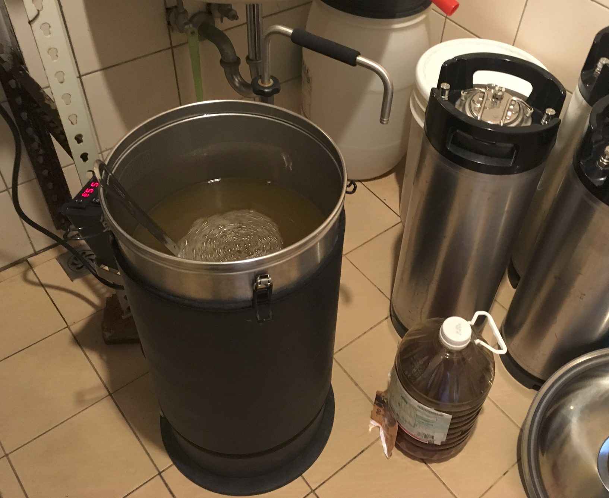
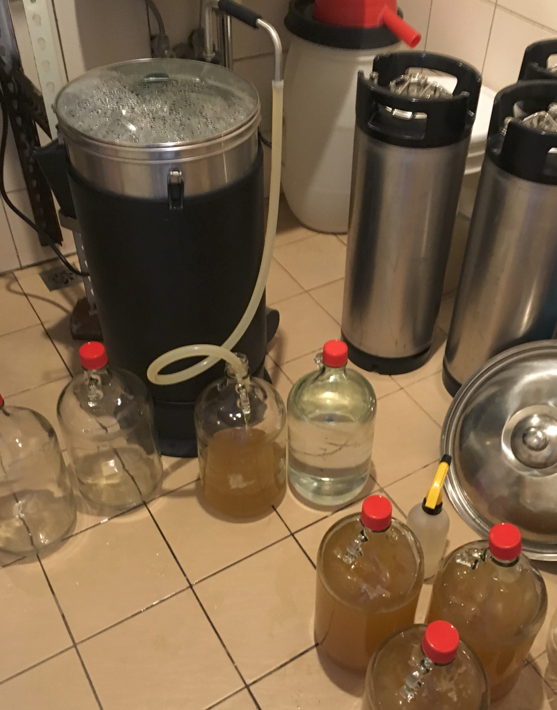

培養好的酵母

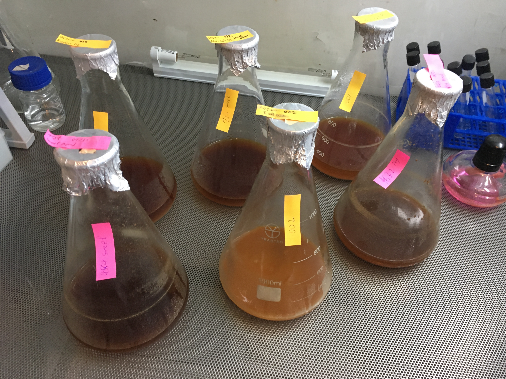

#### 181202 

酵母測試028瓶內發現異物，是什麼尚不明，需要對菌種進行檢查

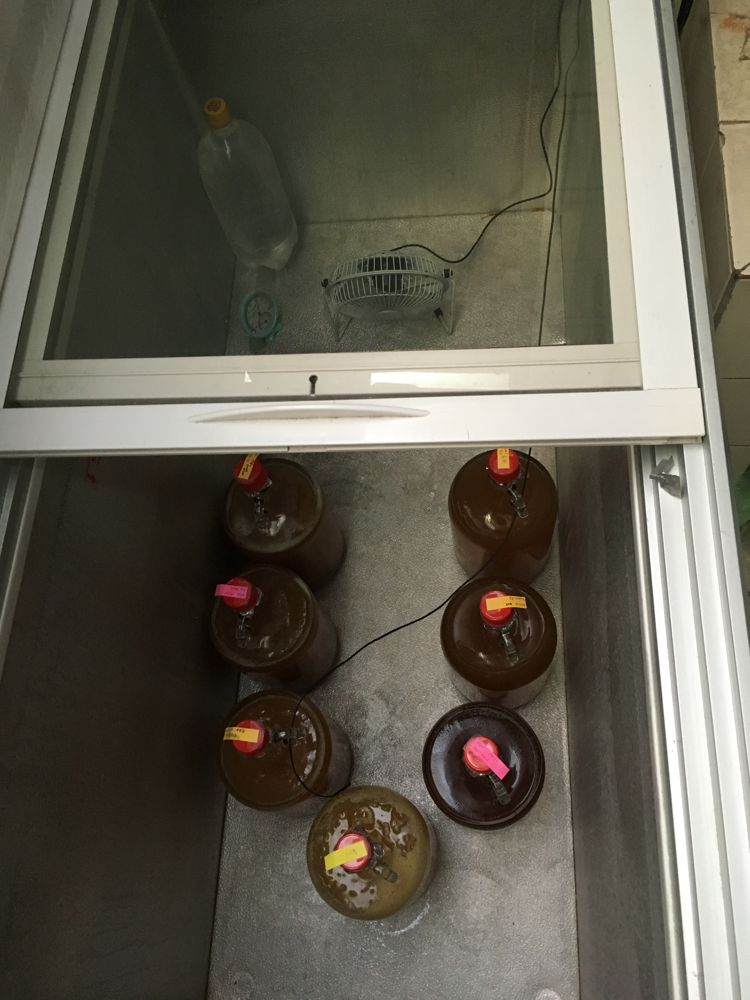
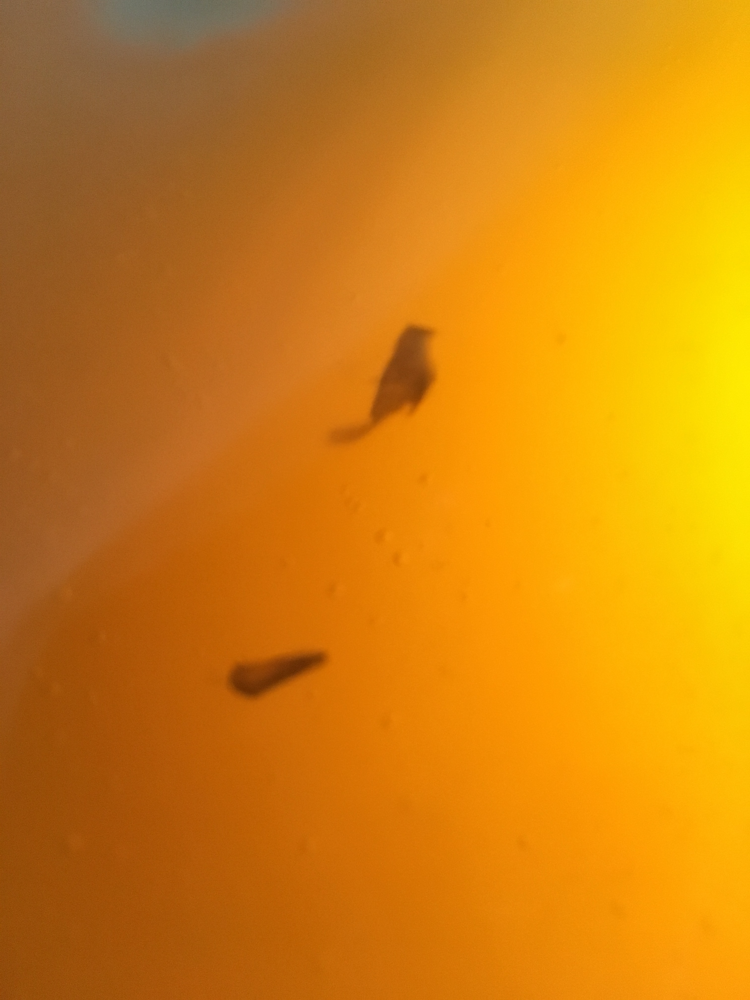

所有發酵槽皆工作中

#### 181208

所有發酵槽顯著的活動皆已停止，測定M05比重為1.04(ABV7.88%)

目前酒體依然混濁，顯示工作尚未結束

保險起見替WLP002 WLP028投入600cc酵母量補足，繼續觀察

#### 181210
溫度調高一度（目前21）之後所有瓶子都活起來了
較澄清：001 002 4184 4632 028 1720 烏桕 
其他顏色都偏白

#### 181221

* 4184 dry mead SG1.064
  * 色澤：金黃
  * 氣味：酵母味鮮明
  * 口感：蜜味明顯而甜，感覺不錯但就是還沒發酵完，繼續觀察
  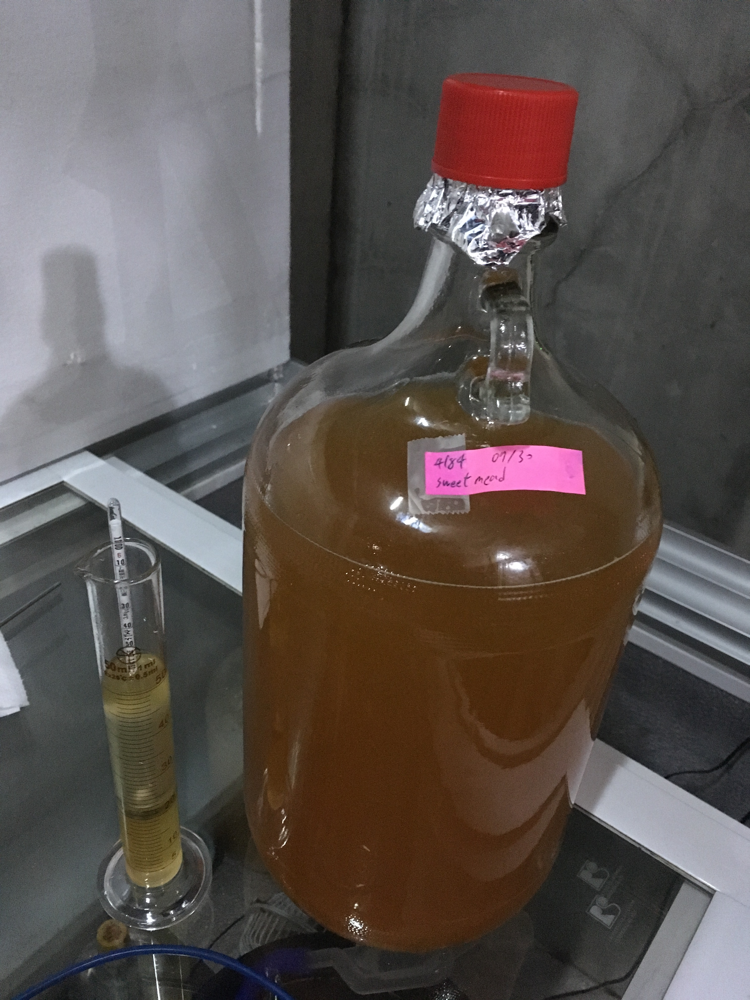
* 001 SG1.062
  * 色澤：略帶混濁的金黃
  * 氣味：一點烏龍茶感、一點蜂蜜感
  * 口感：酸甜交織，我很意外，但感覺很棒。感覺有醋酸感所以菌株應該有問題，不過現在的狀態是絕佳的
  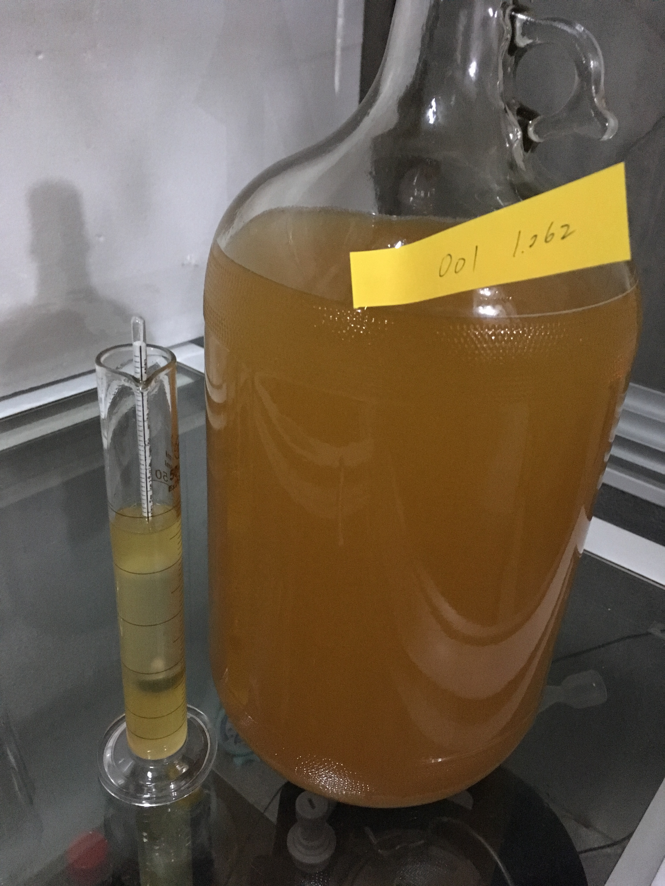
* 002 SG0.997 ABV13.52% 移動去冷降
  * 色澤：漂亮的金黃
  * 氣味：酵母味、一點甜、一點發酵不全感
  * 口感：酸味明顯，其次是酵母、一點苦味，不討喜
  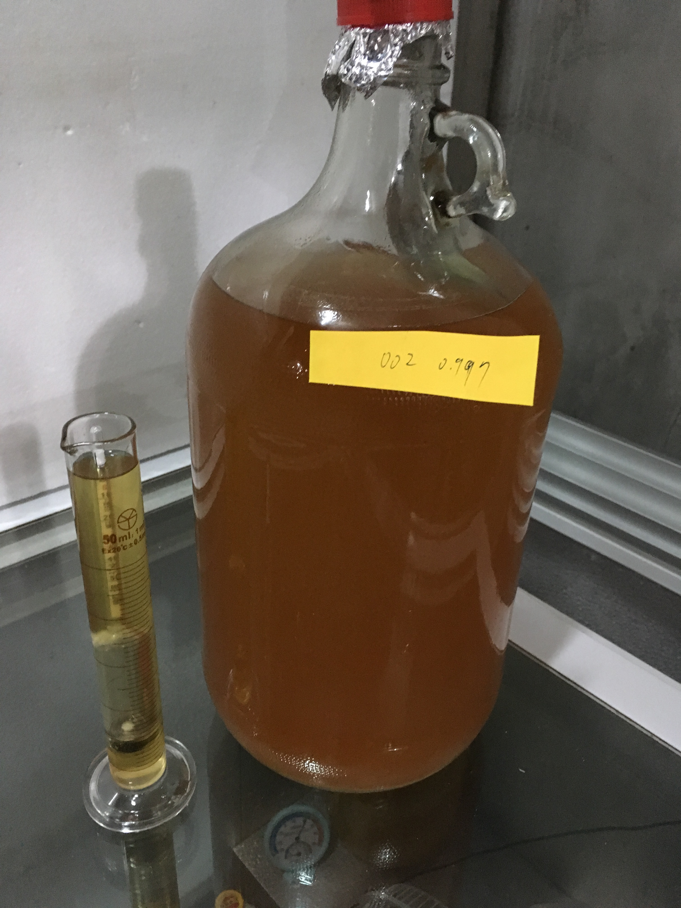

其他都還處於混濁狀態

#### 190105

* 001 CA SG1.06 ABV5.25% 冷降去，應該要巴殺了
  * 色澤：黃色略淡
  * 氣味：略帶Cider、酵母、蜜味、藥味，不差
  * 口感：顯然地，醋酸菌進去了，這是蜂蜜醋Orz 雖然還不錯啦
* 028 SG1.002 ABV12.86%（發酵未完成）
  * 色澤：略濁的黃色，有不少酵母沈澱
  * 氣味：略深的酵母味、發酵中途的氣味、香甜味
  * 口感：果酸感略強，略有酒精感
* 4184 sweet mead SG1.06 ABV5.25%（繼續放置室溫21度發酵看看）
  * 色澤：黃色略深
  * 氣味：略帶藥味與蜂蜜的甜味，一般
  * 口感：滿甜的混合果酸味，感覺挺舒適的，我喜歡
* 4632 dry mead SG0.995 ABV13.78% 冷降去
  * 色澤：略淡的金黃色
  * 氣味：淡淡藥味與Cider，有甜味的hint, 不差
  * 口感：一點白白的酵母味，酒精感，有種在喝白酒的感覺，也許那一派的朋友會喜歡，不錯
* WLP720 Sweet mead SG1.04 ABV7.88%（繼續放置室溫21度發酵看看）
  * 色澤：金黃色，還有點酵母
  * 氣味：較深的甜甜的氣味，一點點藥味一點點酒精感，不差
  * 口感：甜味為主體，酵母的麵包感有點多
* M05 SG0.996 ABV13.65% 冷降去
  * 色澤：清澈的淡黃色
  * 氣味：一點點藥味，感覺這次的百花蜜似乎就是這個基調？一般
  * 口感：略帶酒精感，略帶甜味，感覺標準

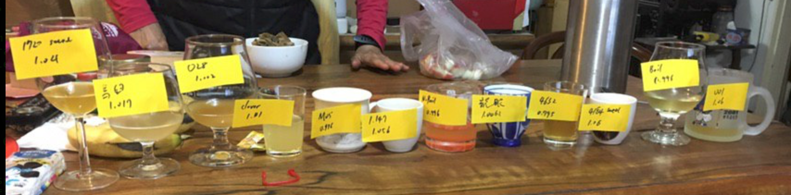

#### 190206

* 028 SG0.96
  * 色澤：清澈的金黃
  * 氣味：略帶酵母味
  * 口感：酵母感、麵包感、酸味略強，感覺是乳酸
* WLP720 Sweet mead SG1.018，搞不好可以繼續發酵，不過我等不下去了
  * 色澤：略濁的黃色
  * 氣味：甜香氣，一點點木質或草本，感覺很讚
  * 口感：很棒的甜味，相當均衡

### 蜂蜜比較
台灣蜂蜜各有強項，那哪一種比較適合做酒是個問題

* 百花：最便宜的雜蜜 （tocheck）
* 龍眼：最具台灣代表性的香氣 （tocheck）
* 荔枝：其次常見 （簡誌良 tocheck）
* 苜蓿/咸豐草：草味特殊
* 小花曼澤蘭：藥味
* 烏臼 （簡誌良 tocheck）

實驗條件：1kg蜂蜜、OG1.1 3.5L、M05 Mead Yeast PitchRate0.5、發酵溫度21
預定FG1 ABV13.13%

全測試使用蜂蜜5kg，預定酵母花費750，設備花費1000

#### 181202

使用花粉1/4茶匙與Yeast nutrient WLN1000 1/8茶匙

溫水巴氏滅菌60度1hr（大鍋隔水加熱）

Costco美國苜蓿 1.2kg OG1.1

簡誌良烏臼 1.2kg OG1.097

陳政緯龍眼蜜 1.2kg OG1.097

色度比較

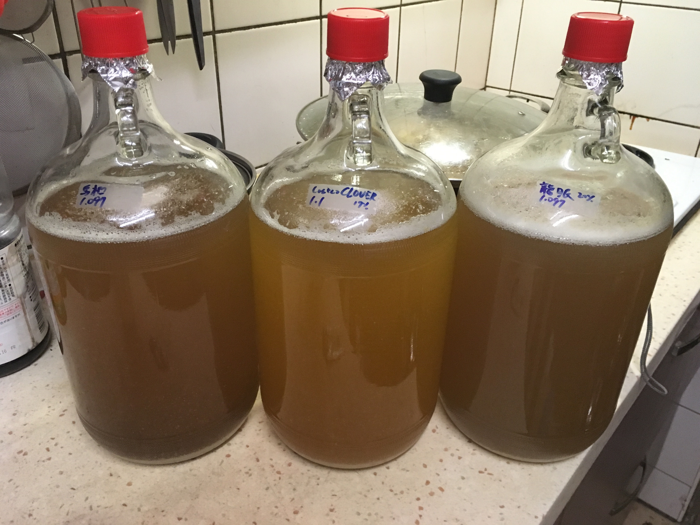

發酵槽滿載

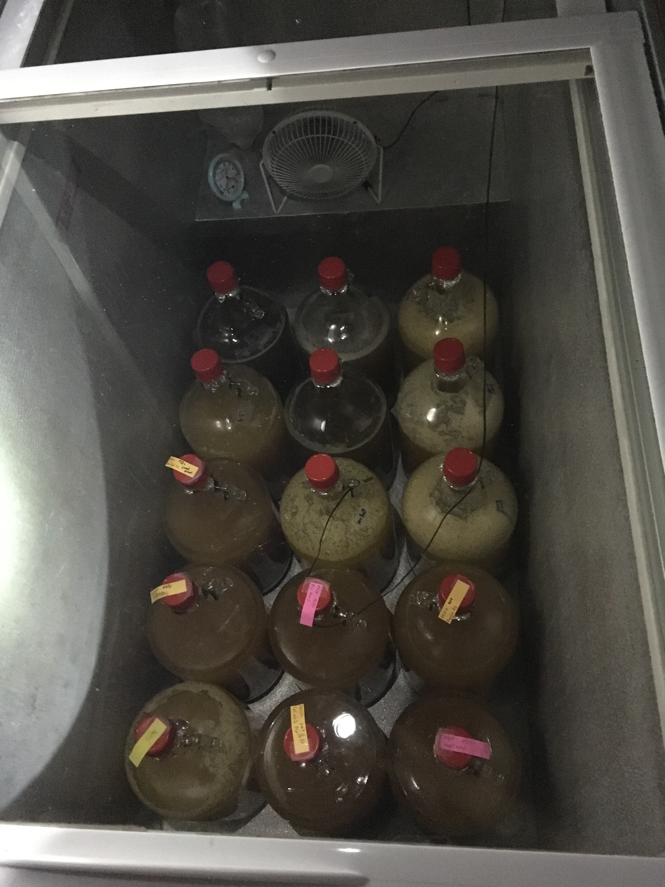

#### 181208

所有發酵槽顯著的活動皆已停止，測定百花比重為1.04(ABV7.88%)

#### 181210
溫度調高一度（目前21）之後所有瓶子都活起來了
較澄清：001 002 4184 4632 028 1720 烏桕 
其他顏色都偏白

#### 181221

* 烏桕SG1.032
  * 色澤：略混濁的淡黃色
  * 氣味：cider感，一點藥味
  * 口感：有點甜，一點酒精感
  

其他都還處於混濁狀態

#### 190105

* 龍眼 SG1.0062 冷降去
  * 色澤：清澈的淡黃色
  * 氣味：Cider, 龍眼/香蕉果糖得香甜感，好
  * 口感：甜味、一點苦味、酒精感，但香氣很足，不錯
* Clover SG1.01 （發酵未完成）
  * 色澤：黃色偏白，大量浮沫，帶了一點殘渣，有點奇怪，是酵母嗎？
  * 氣味：植物系的酸甜感，不錯
  * 口感：酸酸甜甜，感覺跟氣味一致，好
* 烏桕 SG1.017（發酵未完成）
  * 色澤：黃色偏白，有些浮沫，有不少酵母沈澱
  * 氣味：一點藥味，一點cider酸甜感，些微的酒精感，一般
  * 口感：甜度略高，略有酒精感，好

#### 190206

* clover SG1.002
  * 色澤：略濁的淡黃色，表面有白色泡沫
  * 氣味：一點點藥味
  * 口感：一點藥味，一點酒精感，有一點殘糖，一點酸度，也是不錯的成果
* 烏桕 SG1.01
  * 色澤：清澈的淡黃色
  * 氣味：一點點藥味
  * 口感：甜味有留下來，感覺舒適，口感有一點點熱度，很不錯
  
### 濃度比較
試試看怎麼樣的濃度比較喜歡

* OG1.05 0.5kg蜂蜜 ABV6.56
* OG1.08 0.8kg蜂蜜 ABV10.5
* OG1.10 1.0kg蜂蜜 ABV13.13
* OG1.15 1.5kg蜂蜜 ABV19.69(上限18%)

實驗條件：3.5L、M05 Mead Yeast PitchRate0.5、發酵溫度21
預定FG1.0

全測試使用蜂蜜3.8kg，預定酵母花費600，設備花費800

#### 181201

使用劉x伶百花蜜

使用花粉1/4茶匙與Yeast nutrient WLN1000 1/8茶匙

溫水巴氏滅菌60度1hr（大鍋隔水加熱）

* OG1.053 0.56kg蜂蜜 -FG1.001
* OG1.076 0.86kg蜂蜜 -FG1.001
* OG1.1 -FG1.001
* OG1.147 1.65kg蜂蜜 使用M05兩包 -FG1.002

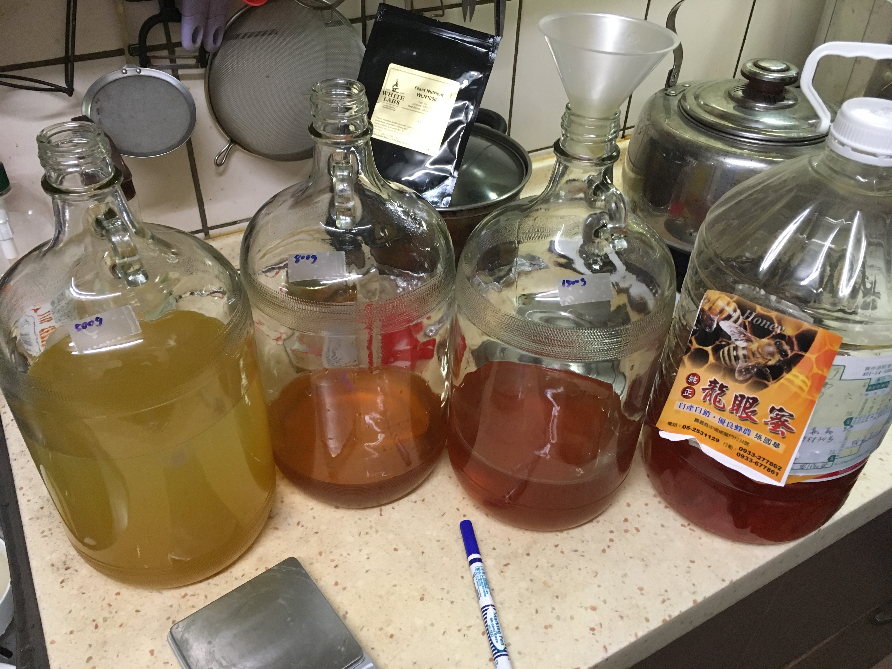
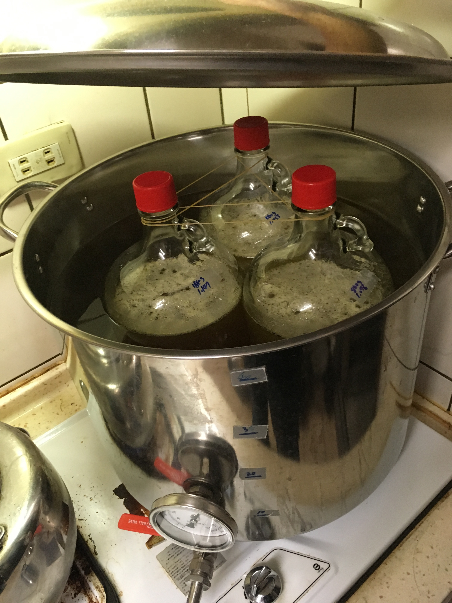

#### 181202

四份皆有高泡衝頂

#### 181208

所有發酵槽顯著的活動皆已停止，測定OG1.1比重為1.04(ABV7.88%)

#### 181210
溫度調高一度（目前21）之後所有瓶子都活起來了
較澄清：001 002 4184 4632 028 1720 烏桕 
其他顏色都偏白

#### 181221

* OG1.053 FG0.995 移動去冷降 
  * 色澤：淡黃色，很淡 
  * 氣味：一點藥味、一點酵母、一點點酸，沒有蜜感
  * 口感：微酸的蘋果西打，有點太淡，碳酸化之後或許會不錯
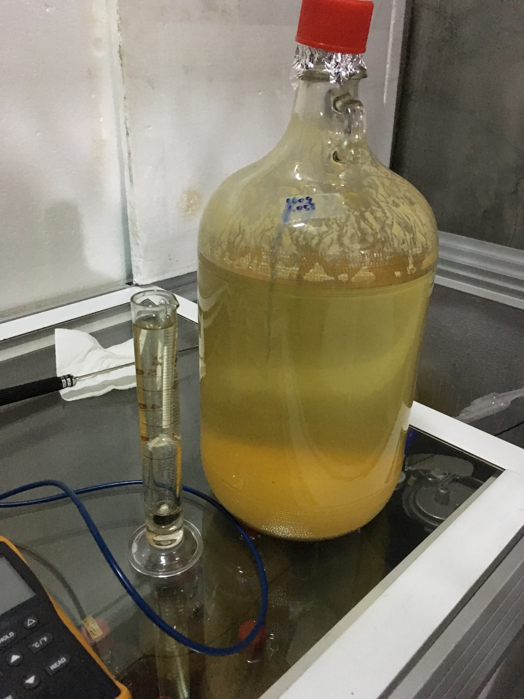
* OG1.076 FG0.996 移動去冷降
  * 色澤：淡黃色
  * 氣味：較濃的cider感
  * 口感：略有酒精感的Cider
  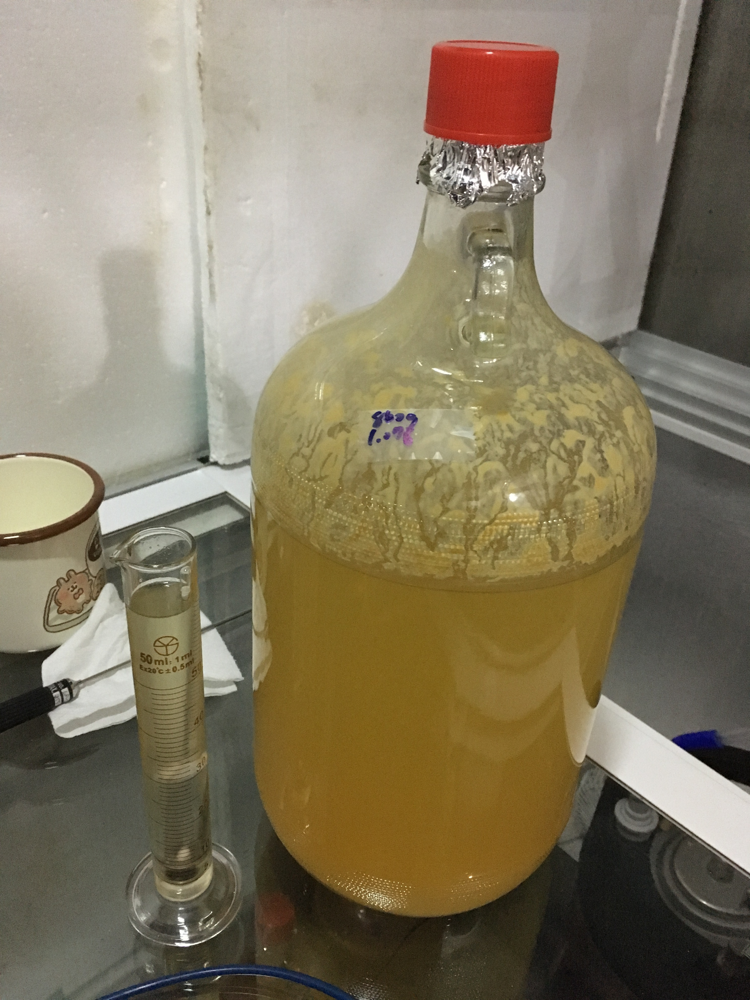
* OG1.1   SG1.002 再放一下
  * 色澤：淡黃，但懸浮酵母不少，沉降得很快
  * 氣味：較濃的cider感
  * 口感：帶甜味，酒精感略強，有一點苦味在後味
  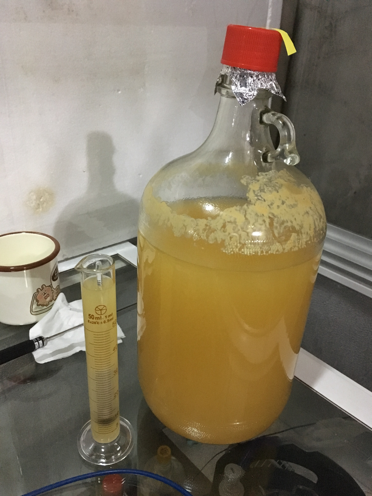
* OG1.147 SG1.055
  * 色澤：黃色略帶褐色，有懸浮酵母
  * 氣味：一點藥味，可能是發酵尚不完全，些許蜜味
  * 口感：很甜，略有酒精感
  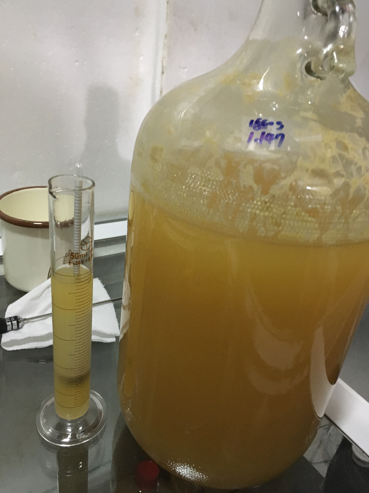

#### 190105

* OG1.147 SG1.056 ABV11.94%（比重不變，應已發酵完成 冷降去）
  * 色澤：淡黃色
  * 氣味：一點藥味，一點點酒精感，一點點厚重的甜感，不差
  * 口感：甜度很高，一點點的花香感，喉頭有點灼熱但又夠厚實

### 製成比較
未經消毒的蜂蜜直接發酵會有大量雜菌干擾，但老酒譜大多都沒有經過滅菌。如果有明顯差異，再額外將發酵前的糖汁進行生菌量測試

* 蜂蜜煮沸後使用
* 蜂蜜60度巴殺60min(...)
* 蜂蜜直接投入使用（僅水煮過放涼）

實驗條件：1kg蜂蜜、OG1.1 3.5L、M05 Mead Yeast PitchRate0.5、發酵溫度21
預定FG1.0

全測試使用蜂蜜3kg，預定酵母花費450，設備花費600

#### 181201

使用劉x伶百花蜜

使用花粉1/4茶匙與Yeast nutrient WLN1000 1/8茶匙

煮沸後使用：蜜1.2kg, OG 1.099，煮沸後滾3min後，封口吹涼

直接投入：蜜1.2kg, 使用無菌礦泉水，OG 1.01

#### 181202

除了煮沸後的版本，其他都有高泡衝頂，看起來菌的影響確實是存在的

#### 181208

所有發酵槽顯著的活動皆已停止，測定巴殺比重為1.04(ABV7.88%)

#### 181210
溫度調高一度（目前21）之後所有瓶子都活起來了
較澄清：001 002 4184 4632 028 1720 烏桕 
其他顏色都偏白

#### 190105

* Boil SG0.996
  * 色澤：淡黃色
  * 氣味：淡淡藥味與酸甜感，不差
  * 口感：口感略顯辛辣，酵母，而後一點cider，明顯的灼熱感，不算很好
* NoBoil SG0.996
  * 色澤：略濁的淡黃色
  * 氣味：略帶酸甜的Cider，不差
  * 口感：有點輕爽，有點酒精感，一點酵母味，不錯

都送去冷降

### 熟成時間
蜜酒有個說法是至少熟成一年才會好喝。    
這個實驗簡單，留存的瓶子在指定時間開啟就好，不需獨立測試

* 兩個月
* 半年
* 一年
* 兩年

### 蒸餾酒比較
看你想不想試試蒸餾酒了，優點是可以長期保存，且一次將大量蜂蜜壓縮至小空間

10kg百花蜜 v.s. 10kg龍眼蜜

實驗條件：10kg蜜、OG 1.14 25L、M05 Mead Yeast PitchRate0.5、發酵溫度21，ABV18.38，預定蒸餾出7L 60%蜂蜜蒸餾酒（一段蒸餾）

啤酒花的抑菌效果就是alpha酸嗎？還是其他成分？
我在想，單取抑菌能力的話，我酒花應該看哪個屬性？苦味越高抑菌能力是否也提高？酒花煮多久可以取得最大的抑菌能力？

<https://en.wikipedia.org/wiki/Alpha_acid#Anti-bacterial_properties> 
異構化後的alpha酸群對格蘭氏陽性菌多數有抑菌效果，包含乳酸菌，所以看來苦度越高抑菌效果確實會提升。beta酸中的lupulones似乎也有抑菌效果

蒸餾鍋20L, 預定發酵桶20L一桶，每桶5kg蜜，OG1.088 FG1.001 ABV11.36

投入

階段式擴培

### 心得

* 總發酵期間三個月又一週
* 高比重高殘塘得到的評語比較好
* 濃度淡了沒感覺，也許可以作氣泡酒
* Sweet的話帶一點酸味會更討喜
* Sweet目前4184的評價較高，WLP720也不錯
* Dry的話目前4632的感覺最好
* 沒有酒花的抑菌關係，挺容易感染的，要留意你的酵母與操作
* 煮沸/巴殺/無煮沸的差異並不大，反而是煮沸了味道單調
* M05極限可能在ABV11.94%
* 營養劑是必要的
* 啤酒酵母不是很有力，需要加倍投入
* 龍眼蜜的香氣評語最好，其他的香氣都不突出
* 蜜的CP值雖然南美洲苜蓿很划算，但是發酵的感覺怪怪的
* 也許下次試試看加入酒花作甜度平衡與抑菌，或者是加入常用的二氧化硫，亦或是進行巴殺。考慮到帶一點殘糖的感覺與香氣會較好，巴殺也許是最好的路線

#### 190225

* 龍眼蜜香氣仍在，不過口感變得很dry
* 720的甜香依舊不錯，帶點麵團感，開瓶後的氣泡顯然發酵依舊還沒完全完成
* 4184酸味略強，不過香甜感依舊很棒

## 進階測試

### 蜂蜜酒1.5後添加
* 第一段OG1.053 0.56kg蜂蜜, 1g chinook AA13, M05擴培600cc
* 第二段OG1.147 1.65kg蜂蜜, 預定FG1.002

先做前者3.5L，各下600cc擴培，此時菌數1.55M/ml/p 

發酵完全後取出2L(剩0.24kg honey), 加入下方酵母=0.32honey+2L ABV7.27%，此時菌數4.36M/ml/p

加入0.3kg蜂蜜+0.5L水＝0.62+2.5L ABV11.27

加入0.5kg蜂蜜+0.5L水=1.12+3L ABV16.96%

再三天後加入0.5kg蜂蜜+0.5L水

### 蜂蜜氣泡酒
* OG1.053 0.56kg蜂蜜, 1g chinook AA13, 預定FG1.001

發酵完全後取出3L(剩0.08kg honey), 加入上面

強制碳酸化，氣壓3vol

#### 190305 投入酵母

OG1.053 0.56kg蜂蜜, 1g chinook AA13, M05擴培600cc, 營養劑1/8茶匙, 鋅與B群, 3.5L兩桶

#### 190312 發酵結束

FG0.998 ABV7.22

#### 190316 二添加

各取出2L/3L後，酵母泥合併為一桶，500cc 300gHoney，加熱至65度後保溫滅菌放涼後投入，之後連續數天都處於混濁狀態

#### 190329 三添加

發酵結束，FG0.996 ABV大約11%，略有烈酒感，不甜略帶酒精的苦

導入500cc 500g蜂蜜

### Sweet mead高濃度

* 液態蜜酒酵母 WLP720 70-75 ABV15 
* 液態蜜酒酵母 Sweet Mead 4184 65-75 ABV11

先以11% ABV為目標

3.5L 0.8kgHoney OG1.08 FG1.001 ABV10.38%

1. 300g+2L水 OG1.053 6.81%
2. 300g+1L水 OG1.7 9.09%
3. 200g+0.5L 

#### 190329 二添加

* 720 FG1.008 ABV5.91 酸酸甜甜帶一點發酵不完全感，有點太淡
* 4184 FG1.012 ABV5.38 略甜的蜜酒，也是有點淡

300g+1L水 OG1.7 9.09%