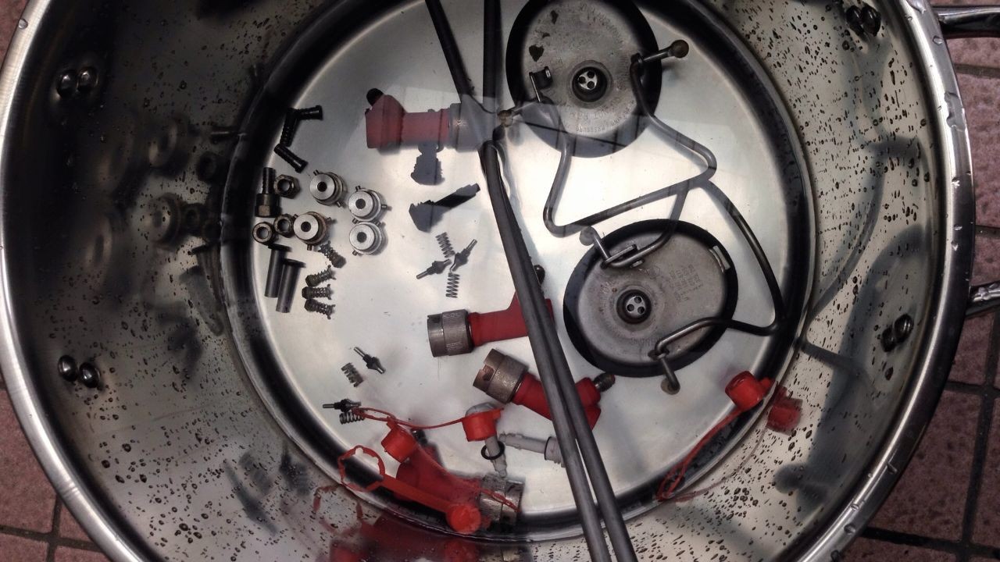

# 可樂桶改裝

[https://sites.google.com/site/homebrewtw/equipment/cornelius_keg#TOC--2](https://sites.google.com/site/homebrewtw/equipment/cornelius_keg#TOC--2)

買

*   空壓行

連通管矽膠25$尺，編織塑膠15$尺、洩壓閥400、空氣過濾器400

O環 大條130$ 小條8$

*   大華氣體行 [02-25969531](tel:02-25969531)：鋁瓶4.1L 2900$、壓力調節閥(小) 1200$

## 簡介

**優點**

*   二手可樂桶超低成本（18.9L 1100~1200含接頭）(一般[keg 20L](http://goods.ruten.com.tw/item/show?21446697907184) 2600$，接頭組400$)

**缺點**

*   糖漿味洗不掉，有人說換O環也一樣
*   多是Pin lock，接頭不好買
*   一定要換O環

## 材料

**空桶**

普遍推薦苗栗可樂桶老爹 （0988271422貳妻依是兒兒）

[一般寶塔頭](http://goods.ruten.com.tw/item/show?21403068714938)

[快拆空壓頭](http://goods.ruten.com.tw/item/show?21403075049791)（應該不能用，可能會堵）

實際到貨裡面還有壓力！！！請先洩壓，不要硬開！！

桶內可能還有殘餘糖漿，小心不要被顏射！！

pin頭裡面都可拆，一隻扳手就夠了，先泡水清理，然後用牙刷刷乾淨

*   另類選擇 餐廳用sanke keg [http://goods.ruten.com.tw/item/show?21408018218421](http://goods.ruten.com.tw/item/show?21408018218421)
*   不好清潔（需要特殊機器），但是氣密性更好 [http://homebrewacademy.com/sanke-vs-corny-keg/](http://homebrewacademy.com/sanke-vs-corny-keg/)
*   冰箱面積38.9x62(41)
*   5加崙直徑 23 公分 高55 公分 ... 3加崙直徑 23 公分 高37-39 公分

**Pin lock頭**

[http://world.taobao.com/item/524785818489.htm#detail](http://world.taobao.com/item/524785818489.htm#detail) 150RMB

**壓力聯通管**

啤酒王 專業級酒管 耐壓 120 PSI 8mm*12mm 每公尺加購價 70

**CO2氣瓶**

鋁瓶2L 1750$ [http://goods.ruten.com.tw/item/show?21408053245228#auc](http://goods.ruten.com.tw/item/show?21408053245228#auc) 啤酒王正在找他的食品級證明文件
update: 看來也是沒有

2L 1499$ [http://goods.ruten.com.tw/item/show?21406062573871](http://goods.ruten.com.tw/item/show?21406062573871)

**CO2填充**

食品級CO2是存在的，而且有相關規範

[http://www.mobile01.com/topicdetail.php?f=168&t=4224899&p=2#55844392](http://www.mobile01.com/topicdetail.php?f=168&t=4224899&p=2#55844392)

FDA 1040016680號公文事實上挺怪的，他表示Co2目前不以食品添加物管理，而是說“如果你符合[食品加工用二氧化碳衛生標準]的話，可以自主管理”。事實上這是比較嚴格的規範，因為僅允許“發酵法生產”且有檢驗標準，詳細食品添加物標準還在擬定中

[http://mohwlaw.mohw.gov.tw/Chi/FLAW/FLAWDAT01.asp?lsid=FL020106](http://mohwlaw.mohw.gov.tw/Chi/FLAW/FLAWDAT01.asp?lsid=FL020106)

不過，除非打蘇打水或是強制碳酸化，單純推酒的話是可以不用這麼搞剛就是.... 

大華氣體行 [02-25969531](tel:02-25969531)  對方表示並沒有證明文件

[http://mashup.com.tw/dahua/?page=product_list&group_id=5836](http://mashup.com.tw/dahua/?page=product_list&group_id=5836)

有13.5L鋁瓶4800$含Co2，調壓閥1000$

**壓力調節閥**

[http://goods.ruten.com.tw/item/show?21408010546168](http://goods.ruten.com.tw/item/show?21408010546168) 865$

[http://world.taobao.com/item/39923509456.htm#detail](http://world.taobao.com/item/39923509456.htm#detail) 85RMB

psi to mPa轉換表 [http://www.asknumbers.com/psi-to-megapascal.aspx](http://www.asknumbers.com/psi-to-megapascal.aspx)

**洩壓閥relief valve**

**O環**

EPDM ( 三元乙丙橡膠 ) 耐溫上限 120oC 

NBR ( 丁腈橡膠 ) 耐溫上限 100oC

各可樂桶 O-Ring 部件規格如下
<table style="font-size:13px;cell-spacing: 0px; border-collapse: collapse;"><tr><td style="border:1px solid #999; min-width: 50px;height: 22px;line-height: 16px;padding: 0 4px 0 4px;" class="added"> Parts</td>
<td style="border:1px solid #999; min-width: 50px;height: 22px;line-height: 16px;padding: 0 4px 0 4px;" class="added"> Standard</td>
<td style="border:1px solid #999; min-width: 50px;height: 22px;line-height: 16px;padding: 0 4px 0 4px;" class="added">CSxID (mm)</td>
</tr>
<tr><td style="border:1px solid #999; min-width: 50px;height: 22px;line-height: 16px;padding: 0 4px 0 4px;" class="added"> &#33995;&#23376;</td>
<td style="border:1px solid #999; min-width: 50px;height: 22px;line-height: 16px;padding: 0 4px 0 4px;" class="added"> &#29305;&#35215;&#21697;</td>
<td style="border:1px solid #999; min-width: 50px;height: 22px;line-height: 16px;padding: 0 4px 0 4px;" class="added"> 7 x 90 ( 7 x 88 &#20063;&#21487;&#20197;&#29992; )</td>
</tr>
<tr><td style="border:1px solid #999; min-width: 50px;height: 22px;line-height: 16px;padding: 0 4px 0 4px;" class="added"> &#26742;&#38957;(Pin Lock)</td>
<td style="border:1px solid #999; min-width: 50px;height: 22px;line-height: 16px;padding: 0 4px 0 4px;" class="added"> AS112</td>
<td style="border:1px solid #999; min-width: 50px;height: 22px;line-height: 16px;padding: 0 4px 0 4px;" class="added"> 2.62 x 12.37</td>
</tr>
<tr><td style="border:1px solid #999; min-width: 50px;height: 22px;line-height: 16px;padding: 0 4px 0 4px;" class="added"> &#21487;&#27138;&#38957;</td>
<td style="border:1px solid #999; min-width: 50px;height: 22px;line-height: 16px;padding: 0 4px 0 4px;" class="added">AS109</td>
<td style="border:1px solid #999; min-width: 50px;height: 22px;line-height: 16px;padding: 0 4px 0 4px;" class="added"> 1.88 x 7.7</td>
</tr>
</table>

## 消毒

[https://www.facebook.com/groups/homebrew.tw/permalink/1419497371400900/](https://www.facebook.com/groups/homebrew.tw/permalink/1419497371400900/)

[許家維](https://www.facebook.com/profile.php?id=100000297023222&fref=ufi)  我個人習慣是洗好消毒好，組裝回去然後裝些 star san 封起來

TW Chu 偶使用前加2公升左右沸水蓋起來上下倒置 熱水消毒

藍翔 我也是、而且沸水搖一搖氣壓變大，直接從管路洩沸水出來順便消毒

要不要把零件拆下來消毒這點似乎也是見仁見智，有些人用消毒水跑管路就收工了，也有全拆的

## 推酒壓力

[藍翔](https://www.facebook.com/profile.php?id=100000879473052&fref=ufi)  順著這串文問一下、二發後有辦法利用桶內壓力把所有酒推出來嗎（不打CO2）

[Leo Chen](https://www.facebook.com/leo.chen.75?fref=ufi)  這應該要看酒的種類吧！個人的經驗是ok的，而且都會超過所需的壓力，所以還需要先洩壓，否則當ball lock頭與管子連接不牢時，冒然裝上去就很精采了（以上個人有慘痛經驗）

[Yen Kuo](https://www.facebook.com/kuo.yen1?fref=ufi)  還有keg新品耐壓才有120psi(可樂桶老爹表示中古桶70psi) 淘寶買的3加侖keg耐壓只有60psi。

當然如果你要用二發產生的頂空壓力去推完整桶酒最後的情況是，沙口感降低泡沫減少。

我以5加侖來說，酒液10公升的情況下最少頂空要有20psi才能順利推完。如果15公升酒液的話就是要40psi，在高我也沒試過，但我寧願用鋼瓶我也不想要喝沒有氣的酒…

## 改裝

**管線固定**

**發酵桶用出酒管裁切**

**無壓排氣閥**

基本上就是IN拉根管子接水桶

**帶壓排氣閥**

接壓力表與洩壓閥relief valve

參考[帶壓發酵](帶壓發酵與裝瓶.md)

**冷卻機制**

背心與循環管