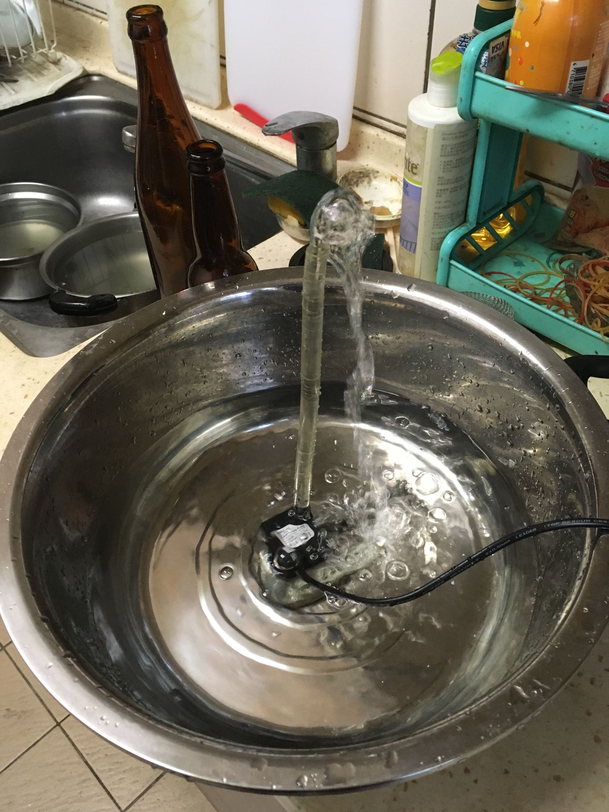
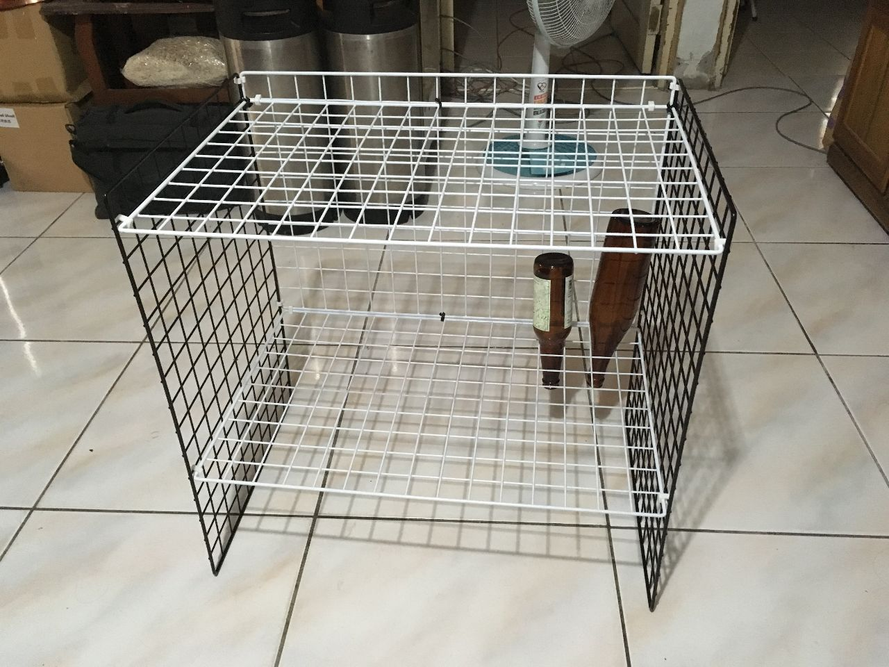

# 各種改裝

## 消毒系列

快速殺菌消毒器 enolandia 870$

[http://goods.ruten.com.tw/item/show?21631220288117](http://goods.ruten.com.tw/item/show?21631220288117)

自製酒瓶消毒沖洗器（建議搭配二氧化氯或酒精，StarSan會讓你得到滿滿的氣泡）

[http://goods.ruten.com.tw/item/show?21514870604222](http://goods.ruten.com.tw/item/show?21514870604222)

**酒瓶架**

## 水冷系列

**水冷泵浦**

【才嘉科技】WH-D12350 直流12V 大老鼠微型無刷潛水泵 沉水馬達 水冷水魚缸 揚程 3.5米 (附發票)

http://goods.ruten.com.tw/item/show?21617592097863

【台北益昌】RUTAX 正台製 1/6HP 沉水馬達 沈水馬達 沉水泵浦 沉水幫浦 抽水機 抽水馬達 水龜 園藝造景噴泉

[http://goods.ruten.com.tw/item/show?21206057203671](http://goods.ruten.com.tw/item/show?21206057203671)

**冷卻水桶**

60公升 60L塑膠桶 原料桶 餿水桶 廚餘桶 化工桶(二手)

[http://goods.ruten.com.tw/item/show?21523654197230](http://goods.ruten.com.tw/item/show?21523654197230)

**把冷卻水架高**

不打釘
<undefined><li>**角鐵架**</li></undefined>

打釘吊掛重物
<undefined><li>**膨脹螺絲**</li></undefined>

膨脹螺栓是使風管支、吊、托架固定在牆上、樓板上、柱上所用的一種特殊螺紋連接件。由沈頭螺栓、 脹管、平墊圈、彈簧墊和六角螺母組成。使用時，須先用沖擊電鑽（錘）在固定體上相應尺寸的孔，再把螺栓、脹管裝入孔中，旋緊螺母即可使螺栓、脹管、安裝件 與固定體之間脹緊成爲一體。

內牙膨脹螺絲：外部拆下後牆壁是平的，容易補土補回去

外牙膨脹螺絲：越拉越緊，比較堅固

正確安裝在混泥土中的一顆 M6/8/10/12的膨脹螺栓後，它的最不理想最大靜止受力分別是120/170/320/510公斤。