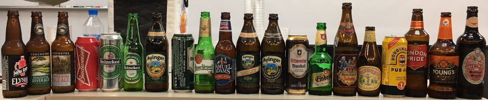

# 品飲學習筆記

**本日教學目標**

*   了解不良風味：老化、日照
*   學習不同的類型

這次遵照 2008 BJCP 比賽的標準

BJCP是美國那邊發展來的比賽規則

視覺、嗅覺、風味、口感（親爽、黏膩、厚重...）...

2014 2015個有一個更新版，但2015打散了之後有一百多種，有點太過繁雜

2008有兼顧國家、色彩等特性，會比較有架構

細節間的區分是品酒95-100分的關鍵

## 保存與老化

**光照**

日光照射只要五秒就會開始產生光照臭，甚至倒在酒杯裡在露天喝也是。一般形容為臭鼬味（skunky）

除了棕色或不透光瓶外，都無法對抗光線

如果需要老化樣本，台灣賣的海尼根玻璃瓶基本上都有光照缺陷，即便剛從便利商店買到也一樣

*   會有一點貓尿般的騷味，熱炒事實上大多數都有這個問題
*   但說句實在的，因為我們已經習慣了，所以感覺不出太多的問題...XD
*   基本上是一種騷味，動物的感覺

Corona就是標準缺陷味啤酒，所以才會需要檸檬。

**老化**

*   26度已經溫度太高了，不適保存
*   熱、高溫等會加速老化，一個月就喝得出來
*   有少數半年後喝不出來，可能是因為先天已經氧化過（如過桶），但這是很少見的類型（能放12年或以上）
*   一般來說六個月是極限（淡啤酒的話）
*   保存期限並非賞味期限，而一般會寫1-1.5年（法律要求）
*   紹興、西班牙雪莉還有葡萄牙波特酒都是氧化型葡萄加烈酒，所以這個味道不一定不好（看style）
*   紹興是氧化米酒；兩者看風格，難喝的埔里紹興簡直就是味覺垃圾，好喝的紹興(我一個朋友在紹興釀紹興)會有老雪莉Olorosso的味道，是一種濃葡萄糖甜味和強化的葡萄香氣味，又帶有葡萄酒發酵的green的味道。
**   但德國就是要新鮮
*   德國啤酒一定要新鮮，一有缺陷味馬上就被放得很大很大！
*   麥芽特別容易老化，但酒花也是，那不就意思是通通不能放了嗎？(囧
*   對，沒錯，麥芽在良好儲藏環境下大約1-2年；一磨開大概兩三天就要用掉。酒花未開封，儲放環境好，質保大約0.5-1；一開封，冰冰箱儘量也在一個月內用完。(所以寫酒譜的時候，除非是連續生產型工廠，不然多以酒花袋的數量計數，要嘛5kg、要嘛10kg；不要有什麼3公斤、7.2公斤)

*

**老化特徵**

*   顏色變深
*   幾乎沒有泡沫
*   幾乎沒有泡沫不一定。
*   可能會有紙板的氣味（但說真的，我覺得感覺不太像紙板，比較像稻草...但確實不是很討喜）
*   我認為是濕潤的稻草。
*   可能會有蜜味、變得黏稠
*   明顯的不屬於這種酒的「蜂蜜味」，是的，金X三麥的蜂蜜酒就是這個狀況，通常氧化的酒會賣得更好喔！
*   可能出現紹興（雪莉桶）、威士忌的氣味

*   姆...我得說這兩個氣味不一定不好，亞洲人還滿喜歡的，但是這肯定就已經不是標準風格範圍內該有的了
*   威士忌的氣味約要放到八年

**氧化四階段**

*   裝瓶半年：有些該有的風味不見了
*   超過半年：紙板味，或蜜香
*   第三階段：焦糖味
*   第四階段：深色，有烈酒的氣味，但是喝到的口感很貧乏如紙板水

**購買選擇**

現今來說，鋁罐裝的含氧量是瓶裝的10倍

但如果在一年內有良好保存，老化風味是可以被最小化的

兩個都被熱過，選玻璃

兩個都被照過，選鋁罐

但能夠的話，都跳過

**避免老化的釀造**

*   盡量減少混入酒的氧氣量，瓶內碳酸化（[bottle conditioned](http://blog.beeriety.com/2009/08/03/what-is-bottle-conditioned-beer/) ）可以增加保存性
*   避免酒花香氣強烈的類型，因為酒花香氣很不耐放
*   提高酒精度（但要注意均衡）
*   提高酒體厚度（如Stout、Imperal系列）
*   過橡木桶或雪莉桶
*   酸啤酒也常見桶陳
*   把氧化風味納入酒的風味中（注意均衡）
*   高單寧是葡萄酒常見的做法，但啤酒好像還沒看過

## 雜談

關於倒酒，一般來說市售啤酒瓶內會加上更多的壓，所以如果順著杯壁倒反而會造成碳酸過多

簡稱不要“杯壁下流”

德國玻璃瓶很勇猛，可以重複使用

人的味覺只能分辨到120 IBU，超過嚐不出來

啤酒比賽的評審品飲

一個半小時3-4個flight

一個flight可能有四到六種

一天可能可以喝到上百種

王鵬有比利時啤酒的書 [http://www.books.com.tw/products/0010408089](http://www.books.com.tw/products/0010408089)

不過看起來是徹底完售了，很多人在找的樣子

對王鵬來說語言是入門，語言挺重要的

風味是品飲的重點

-> 關聯到 原料、製成、風土....

上層下層酵母或許是因為容不容易被二氧化碳推動的分別

很多混合型發酵法：高溫拉格，低溫艾爾，分類為hybrid beer

## 自釀Tips

**偷酵母**

主發酵：風味與酒精為主

瓶內碳酸化：產氣為主，不應改變風味

商業酒出品的瓶內發酵有可能使用與主發酵不同的酵母，導致從瓶內培養出來的非主發酵的酵母

也可能商業酒有做過巴氏消毒，已無活酵母，而培養不出/培養到環境酵母

**酒精**

酒精濃度對於風味、口感也有所影響

金色三麥之前的版本只差了0.5%酒精就大幅影響了風味

酒精可以帶來辛辣、辛香料、厚度、溫度等風味

**保存**

如前面的光照與老化，必須收藏於無光照的環境，能冷藏最好，且最長不可擺放超過半年

**調配**

大致上的風格對應是：酸的搭酸的，水果搭水果

如果是要釀造水果啤酒，那用水果風味鮮明的啤酒做基底會比較好

如Christmas / Winter Specialty Beer （熱櫻桃啤酒 水果老褐啤酒 liefmans Gluhkriek）

基酒是17C Flanders Brown Ale

焦糖、巧克力、果乾等風味鮮明

深色麥＋高溫發酵增強果味

6%酒精

開瓶後泡熱水，適飲溫度60（不可到70）

少數的熱啤酒，比利時有名的褐色啤酒

可以直接喝，跟櫻桃與香料一起浸自發酵

冬季聖誕節特製啤酒

有子的水果不建議煮，果子的單寧可能會被煮出

基酒很重要

Stout跟櫻桃搭，但不搭鳳梨

淺色水果通常酸香豐富，熱帶感，適合輕盈

金三得牌完全是來自龍眼蜜，因為歪果人不熟，覺得這個風味很特別

濃得恰到好處

基酒搭配的適當 

如果加的味道壓過了酒的味道就不好，反之亦然

有時缺陷是特色，反而不應壓掉

有時桶陳只是因為酒賣不完....

最近開始衰落了

第一日

<ul class="comment"><li>以下註解為我當時喝的感受</li>
<li>不是每一個風格都有試飲，所以有些是空的</li></ul class="comment">

## Light lager

通常有穀類風味，高碳酸

可以有些DMS，可以有些許果香，不可有雙乙醯。

可使用小於35%的輔料

大體上是比較無聊的，風味太多等同缺陷

烈拉格也可以有果味，高酒精度可以帶來果味的感覺，烏梅、果乾、桑椹、藍莓果乾、黑醋栗...

**1A：Lite American Lager**

**1B：百威Budweiser鋁罐**

*   哈密瓜的香氣與甜膩感（玉米），相當清爽的口感，清甜，滿舒適的口感，有種吃甜點的感受（有一點青蘋果的感覺）
*   是一隻我很喜歡的酒款

加玉米造成氣味清爽，但一開始並非因為這樣。一開始是為了降低泡沫來減少裝瓶的時間，同時減少氧化的機會

可能有美西酵母的風味特徵（果味）

**1C：海尼根鋁罐**

*   氣味較為刺激，酒花苦味也比較重
*   全麥，會比較飽滿

**光照臭：海尼根玻璃**

*   會有一點貓尿般的騷味，熱炒事實上大多數都有這個問題
*   但說句實在的，因為我們已經習慣了，所以感覺不出太多的問題...XD

有趣的是這瓶並沒有特別去光照，而是市面上的海尼根幾乎一定會臭。

**1D：Munich Helles**

純粹的pilsner麥芽主導味道，但不應有發酵不全的甜味

**1E：Dortmunder Export （Ayinger愛因格 經典）**

*   濃烈的玉米感，感覺強烈
*   口感較為強烈、濃一點的感受

後面有甜味，這是來自於較高的酒精度

德國的煮沸法可以帶出更多的麥芽風味（麥殼等一起煮沸的效果）(可能有一點竹蓆之類的感覺)

pilsner麥芽帶來DMS風味，可能有硫味不算缺陷。麥芽與酒花均衡，但苦韻可能相當持久

歐洲的啤酒很重視傳統，往往色彩、氣味不對就被刷了，但美式則很自由

## Pilsner

**2A：German Pilsner （ottweller pils）**

（這隻在德國會被當成不合格的品牌）

純淨的拉格，不可有果香，不可有雙乙醯。

酒花限定為德系尊貴品種，麥芽稍弱，苦味主導且持久

*   淡淡玉米香（熬煮法）
*   非常清爽，但是沒有什麼苦味
*   說是酒花的風味比麥芽風味重，但我兩者都覺得沒啥感覺

傳統來說pilsner應該有35 IBU以上

（如果打個light就算是ok）

（有時酒廠會刻意標示錯誤的類型，行銷考量）

**2B：Bohemian Pilsner**

捷克比爾森，必須表現Saaz酒花的香氣特徵。可接受些許來自捷克拉格酵母的雙乙醯

苦味明顯但麥芽風味也濃郁

*   也是玉米或一點草蓆感，甜味不少
*   口感較濃，苦味較強，草味有點重

應該是金黃，但是這是深金黃

這隻是老化樣本：2014年（過期兩年）

老化特徵：顏色變深

幾乎沒有泡沫

可能會有紙板的氣味（但說真的，我覺得感覺不太像紙板，比較像稻草...但確實不是很討喜）

可能會有蜜味、變得黏稠

**2C：Classic American Pilsner**

## EURO AMBER Lager

**3A 維也納拉格 （Samuel Adams Boston Lager） （標準）**

維也納琥珀拉格已經失傳，全世界只剩下十家以內的廠

*   沒啥氣泡，顏色較深（說是冰的溫度較低所以碳酸比較沒出來）
*   酒花比前面幾個都明顯，不管是聞起來還是嚐起來
*   苦味不重，口感乾淨俐落

**3B Marzen （Ayinger OKtober Fest-Marzen）**

*   氣泡比較多一點，沒有特別氣味
*   有一點焦糖香（應該是淡淡的烤麵包香）
*   後味有甜味，愉悅的感覺

即便這隻放在維也納也有機會得前三名，不過遇上比較厲害的評審就會被踢出去，所以別跑錯組

## Dark lager

最黑的黑啤酒也應該有一些透光，散出棕紅、琥珀、橘黃不等的光澤

**4A Dark American Lager**

顏色變黑的lager, 基本上沒有差別

風味太多等同缺陷，WTF...

**4B：Munich Dunkel （Ayinger Altbairisch Dunkel）**

傳統巴伐利亞風格

*   適度的氣泡，顏色較深
*   烤土司的味道明顯
*   乾爽

早期德國全麥釀造啤酒是液體麵包的語源

**4C：Schwarzbier (black beer)（Ottweiler <s>Dunkel</s>/Schwarzbier ）**

*   很黑 沒啥氣泡
*   有點尿騷味
*   咖啡豆...呃...燒酒雞？
*   比較酸（來自深色麥芽）

## BOCK

音同山羊

**5A：Maibock/Helles Bock（Einbecker Ur-Bock Hell）**

又是老化啤酒....過期兩年

蜂蜜香氣 放一年或一年以上就會出現

苦味較明顯，但沒有其他特色

**5B：Traditional Bock**

**5C：Doppelbock（Paulaner Salvator）**

過期一年

*   氣味甜味明顯 麥芽感
*   一點紹興的感覺

酒精感明顯（可能是因為乙醇被氧化->乙醛，青蘋果味）

紹興、西班牙雪莉都是氧化葡萄酒，所以這個味道不一定不好（看style）

但德國就是要新鮮

**5D：EisBock**

冷凍散失很多二氧化碳，所以普遍會打氣

冰釀會特別有果味，有微甜感

## Light hybrid beer

**6A Cream ale**

**6B Blonde ale**

**6C Kolsch**

**6D American Weat or Rye beer**

## Amber hybrid beer 

**7A northen greman altbier**

**7B California common beer （Anchor Steam beer） （原版）**

像是德國的苦啤酒，口感乾淨，但是有了果味

用德國人的想法做，但因為地理限制，無法真的很低溫（零度），所以折衷放在倉庫熟成（八度），並高溫發酵

*   也沒有什麼啤酒花香，很淡的麥香
*   酒花也是用德國酒花Northern brewer 木質與薄荷

**7C Dusseldorf Altbier**

## English pale ale

苦味主導，但最好的版本還是要有麥芽與水果酯

**8A standard / ordinary bitter （Boddingtons pub ale）**

*   高碳酸，有氮氣球
*   有香蕉般的酯類香氣
*   沒什麼明顯的香氣
*   口感很單純 很順但也沒有特色

**8B special / best / premium bitter（Fullers London pride）**

*   很標準的ale
*   很溫順的口感
*   沒有太多特色

**8C extra special / strong bitter（Young’s bitter）**

英式的老化

*   貓尿味，這個味道在口腔中也可以感受到
*   可能本體已經沒什麼特色，老化之後更沒感覺了
*   不好喝

英式酒花較多松針、礦物等的味道

老化之後可能有薄荷的味道

**8C samuel smith organic pale ale**

*   確實酒的味道有一種森林般的感覺
*   口感有甜味，在嘴巴中的味道有兩個轉折，感覺驚喜也愉悅
*   但也有一點酯類的感覺黏在口腔裡（木瓜？）

## Scottish and irish ale

**9A Scottish Light**

**9B Scottish Heavy**

**9C Scottish Export**

## American Ale

意外這三隻都不苦，跟我以前喝到西岸的不一樣

**10A American Pale Ale（Deschutes Mirror pond pale ale）**

*   不苦耶，但是香氣不錯
*   但留在口中的香氣沒有很愉悅

**10A Deschutes River ale (Northwest session ale)**

session ale  午休期間的酒，酒精度不能太高

風味都在但是酒精下降

*   少了2%酒精，但口感大幅改變，像飲料

**10B Americal amber ale（Elysian The Men's Room）**

Amber ale = 美國的red ale

苦味稍微高一點，有茶的感受

第二日

一開場有點跳著講

## Sour Ale

**17E Gueuze（Cantillon Cueuze）**

*   酸香，帶一點乳酸的氣味，一點果香
*   這隻有蜂蜜香氣

酸香與野生酒香酵母氣味主導，最好有怡人的果香（柑橘、蘋果）

沒有酒花風味與苦味，碳酸強勁

酒花的風味會跟酸味打架

所以慣用老化酒花，利用酒花中的酚類物質抗菌

老爸顧廠的時期很酸（多了許多醋酸）

衛生做好，甚至替換成不鏽鋼，可以做出相同的味道，但是沒那麼酸

白天十度開始做，晚上的溫度一定要個位數甚至零

地點改變，依然可以做出相同的味道：他把舊廠的酒拿去新廠噴灑ＸＤＤＤＤＤ

他的廠區同時是布魯塞爾啤酒博物館

美國也有人從瓶子裡偷酵母來分析

瓶發的酵母很有可能跟主發不一樣，所以很難偷

金三的黑麥酒精加了0.5%就好喝了，酒精比例也是一個很重要的地方

## Spice / herb / vegetable beer

**21B Christmas / Winter Specialty Beer （熱櫻桃啤酒 水果老褐啤酒 liefmans Gluhkriek）**

相當罕見的熱啤酒

*   果乾的酸甜香氣
*   櫻桃風味強，帶著香草味，但也有點感冒糖漿感
*   甜味不錯，甜味像山楂
*   但整體相當均衡，非常愉悅

相當複雜，我想很難複製

基酒是17C Flanders Brown Ale

焦糖、巧克力、果乾等風味鮮明

深色麥＋高溫發酵增強果味

6%酒精

開瓶後泡熱水，適飲溫度60（不可到70）

少數的熱啤酒，比利時有名的褐色啤酒

可以直接喝，跟櫻桃與香料一起浸自發酵

冬季聖誕節特製啤酒

有子的水果不建議煮，果子的單寧可能會被煮出

基酒很重要

Stout跟櫻桃搭，但不搭鳳梨

淺色水果通常酸香豐富，熱帶感，適合輕盈

酸的搭酸的，水果搭水果

金三得牌完全是來自龍眼蜜，因為歪果人不熟，覺得這個風味很特別

濃得恰到好處

基酒搭配的適當 

如果加的味道壓過了酒的味道就不好，反之亦然

有時缺陷是特色，反而不應壓掉

有時桶陳只是因為酒賣不完....

最近開始衰落了

## 20 Fruit beer （杏桃啤酒 Samuel Smith organic fruit ale）

*   好強烈的杏桃香氣，但算是自然

奶油、杏桃，兩者互相呼應

## English Brown Ale

**11C 英國北方棕艾爾 （Nut brown ale）**

英國啤酒的祖宗 世界級經典

這支比較有風味架構，適合做範例

*   氣泡不多，氣味濃郁的焦糖香，沒有酒花香（但王鵬稱這應該是烤吐司邊、nuts）
*   口感不濃，但是焦糖感充足
*   一般的碳酸口感

**11B 英國南方棕艾爾**

只有到本地才喝得到，更黏稠，更黑，酒精也更低，殘糖高（未完全發酵

冷門類別，已經被掛掉了，喜歡的人不多

全世界只剩兩個酒廠再釀

**11A mild **

沒酸掉的11B

## Porter

**12A Brown Porter（Fullers london porter）**

*   氣味是巧克力、烤麥芽風味，甚至有一點菸味的感覺
*   很棒的巧克力與烤味，吐司邊的感受很強

Fullers的產量超高，但品質也不錯

這支是風味的下限

消費者喜歡

**12A Brown Porter（Samuel smith taddy porter）**

*   氣味顯然比fullers淡，有巧克力風味
*   碳酸較強，苦味較重
*   但舌頭的甜味還不錯

這支是風味的上限，再往上就變stout

品評一般會選擇這種

**12B Robust Porter（Deschutes black butte Porter）**

美式且強勁

*   說是有一點酒花，但實際上沒啥感覺
*   有麥芽的香甜味
*   有一點果香，一點花香
*   苦味較濃，舌頭上的烘烤味愉悅

整體來說，這三隻我都喜歡，但後兩支比fullers更喜歡

## Stout

**13A Dry Stout (Guiness Draught)**

這不是我認識的stout QQ

*   氮氣球，沒啥香氣，口感很水
*   酒花苦味殘留，有種酸味，大概是碳酸？

用深的麥芽，乾爽為主

**13C Oatmeal Stout （Samuel smith Oatmeal stout）**

*   燻烤味，但沒有明顯的風味
*   較為濃郁，酸味也強
*   苦味還行，甜的感覺滿多
*   飽和度很不錯

焦烤麥芽多了

**13F Russian Imperial Stout（Samuel smith Imperial Stout）**

*   沒啥氣味，但帶一點甜感，就是標準的imperal
*   很厚重，甜到酸的那種厚重感

也是要用麥芽，不可用深的麥粒

酒精度與用料都提高，更加厚重

美式會厚到撞牆，英是則是碰一下就好，這支是英式

焦黑麥芽超過6%就難以達到平衡

## IPA

美國人的最愛

**14A English IPA (Samuel smith India ale)**

*   水蜜桃般的香氣，但這不是酒花，是發酵
*   要說的話我也覺得感覺不出來有酒花的香氣，我想這大概是我被美國酒花荼毒太久了
*   說真的不苦，感覺清爽，尾韻的苦味更加清爽
*   但還是IPA的尾韻

**14B American IPA（Elysian Space Dust IPA）**

*   明顯的熱帶水果的香氣，就是美式酒花
*   很標準的IPA，荔枝、芒果的香氣與口感

**14B Deschutes Chainbreaker（White IPA）**

*   小麥粉、麵團般的味道
*   標準的白啤酒口感

傳統的比利時法式配方

圓綏子（香菜子）的味道

如果不新鮮會像火腿的味道

老師表示如果你喝不出酒花味，可能只是不熟悉或不知道怎麼描述

**14C Imperial IPA**

德國小麥有香蕉味是因為酵母，其他的酵母不會這樣

採用較多生小麥

## Belgian and french ale

**16A Witbier （Celis White）（經典）**

*   白啤酒的感覺

果味、圓綏子的味道，可以想像成Deschutes Chainbreaker（White IPA）去掉酒花的感覺

**16A Witbier （1664 Blanche）**

酒標表示：白啤酒，有一絲的柑橘香

*   很強的果香，有一點杏桃感，酸酸甜甜
*   入口很明確的花香，尾韻有一絲甜味
*   有一點柑橘果汁的舌頭上的感覺

（這個也是很容易老化的酒種，注意時間與瓶子光照）

## German wheat and rye beer

**15A Weizen / Weissbier**

德國小麥啤酒

一般試酒前要搖晃酒瓶(不是shake)，因為沈澱物的分類物質的馨香、丁香氣息是重要的特徵

不搖的話整瓶的味道會不一致

淺色

*   標準的德國小麥，濃郁的發酵酯類香氣
*   香蕉水般的口頭的味道，一點麵粉般的甜味
*   丁香的氣味混合其中

很多人拿來當水果啤酒的底，但不能澀（跟小麥的酚的澀感彼此加強）

深色

*   較淡的酯類香氣，但還是有
*   口感較為強烈，一點點焦糖感，香蕉酯類的感覺稍弱但依然是特色
*   我比較喜歡這一種

## Belgian and french ale

**16B 比利時pale ale（palm hop select）**

*   有趣，氣味也有點比利時的感覺，甚至有一點酸的感受
*   可以聞到些微的酒花味
*   中等碳酸，麥芽甜味不錯，有一點李子的感受
*   一點酒精感

這個比較特殊加入了啤酒花，配方也調整成較淺的顏色（不能用黏稠的感覺）

**16C Saiaon （Saison Dupont 金牌作品）**

*   明顯的saison氣味，一點動物味

農人本身不是專業的釀酒師，所以長久以來會有一點馬廄的動物騷味

比利時啤酒中果味最豐富的種類

但現在的酒則都是酵母所產生的

美國的模仿類別：farmhouse ale

**16E Belgian Specialty Ale（Bush Ambree Belgian barleywine）**

*   一點枇杷膏的感覺，香蕉水 （指甲油、去光水 可以有一點）
*   相當濃郁的氣味，有一點紹興感
*   高酒精度，口感很濃，但是酒精味道很濃郁

糖分高會導致副產物變多

**16E Belgian Specialty Ale（Kasteel Donker城堡黑啤酒）**

*   一點紙板味，沒有酒花味
*   麥芽風味老化
*   口感很濃郁的甜味，有點深沉的味道，但很甜

高酒精陳年可以作為old ale

## Sour ale

**17B Flanders Red Ale（Rodenbach Grand Cru）**

稱號：大麥釀的葡萄酒

*   果實、梅子的氣味，醋酸，愉悅的酸味
*   桶陳的氣息
*   口感甜味明顯，但並不突兀，很愉悅，我最喜歡的啤酒

不要求澄澈，微濁不算缺陷

發酵的果味綜合的酸香讓你想到紅色莓果，但沒有莓果

**17C Flanders Brown ale（Liefmans Goudenband）**

*   一樣氣味不明顯
*   這隻像稀釋的烏梅汁，也是酸的啤酒
*   酒精味道明顯

## Belgian Strong ale

比利時種類不多，但是每家酒廠的風格走向不同且明確，所以才會有大量的酒種區分

正統修道院 abbye

**18A Belgian Blone Ale **
<undefined><li>**Leffe Blond**</li></undefined>

*   氣味有一點動物味
*   酵母味道明確
*   嘴巴裡面有一點衝上去，口感較強，有蜜香
*   有一點甜
<undefined><li>**Brugse Zot Blond**</li></undefined>

*   酵母味道也強
*   風味跟前面滿一致的
*   據說有一點氧化
<undefined><li>**Affligem Blond**</li></undefined>

*   酵母的味道，一點小麥的感覺
*   深沉的甜味有一點出現，感覺滿足
*   然後出現酒精感

正統修道院不需要聲稱自己是修道院，所以酒標樸素

但買來的牌則大多會放上彩繪玻璃或光頭和尚之類的標凸顯修道院的感受

買來的牌大多比較市場取向，比較甜一點，但要多喝還是正統修道院比較不膩

Chimay藍標可以陳年

**18B Belgian Dubbel**

比利時最古老的類別之一，跟修道院同時

酒精度較高 

single 3.5-4% (修道院自用)

double 7%

triple 8%
<undefined><li>**Chimay Red 正統修道院**</li></undefined>

*   有點氧化，一點紙板味
*   氣泡很多，有點干擾舌頭
*   較為濃郁，麥芽的甜味
<undefined><li>**Westmalle Dubbel 正統修道院**</li></undefined>

*   較深沉的甜香氣
*   但是口感沒有那麼濃，但還是很棒的感受
<undefined><li>**St. Bernardus Pater 6**</li></undefined>

*   有一點發酵過快的澀感
*   有麥芽、麥桿的口感，一點氧化氣味

（這支有一點光照感，可能酒花品質不佳）

**18C Tripple**

靠糖拉高酒精，也因此味道較單純

或許因此風味缺陷容易被感受到
<undefined><li>**Westmalle Tripel 標竿**</li></undefined>

*   氣味酒精感略強，一點酵母味，一點甜味
*   強烈的深沉甜味，酒精感，但也有一點高酒精度的澀感
<undefined><li>**Chimay White**</li></undefined>

*   氣味有點白啤酒，有點酯類的味道
*   苦味比較重一點
*   口感酒精度沒有前面那隻那麼強

尾味是苦的，所以不算正統
<undefined><li>**St. Bernardus Tripel**</li></undefined>

*   一點點白啤酒的氣味
*   酒精感在舌根

一路喝到這我氣味與舌頭都麻掉了x_x
<undefined><li>**Tripel Karmelet**</li></undefined>

*   很棒的發酵香氣
*   一點點花香
*   口感也有點花香，讓我想到1664
*   跟酒精搭配有一點清潔劑的味道ＱＱ
*   酒精度明顯

**18D Belgian Golden Strong ale**

金黃烈艾爾 8.5-10%

怎麼都叫惡魔...XD
<undefined><li>**Duvel**</li></undefined>

*   一點紹興的氣味
*   不過是熟悉的味道 有一點動物味
*   說是高酒精度，但是喝起來並不強烈
*   高酒精度的舌根酸味是存在的
*   不過沒有以前馬尿的那麼恐怖，我想是以前上海的那隻酒受損嚴重
<undefined><li>**Satan Gold**</li></undefined>

王鵬表示：從來不對這隻報持期望

*   風味不佳？
*   呃...還好啦，但是沒有很喜歡 還行啦
<undefined><li>**Delirium Tremens 粉紅大象**</li></undefined>

*   像duvel的氣味
*   口感很類似duvel，但是甜一點，一樣有動物的感覺

風味比較世俗取向 偏甜

**18E Belgian Dark Strong Ale**
<undefined><li>**Chimay Blue**</li></undefined>

*   略帶濃郁的深沉甜香香氣，一點花香
*   酒精感，醣類的甜味
<undefined><li>**Trappistes Rochefort 10  11.3%**</li></undefined>

*   花香強，秀起來有一點點微妙的酸香
*   酒精度也強，但是口感感覺挺奇怪的

特殊酵母菌種造成的

沒有雜味，純粹
<undefined><li>**St. Bernardus Abt 12**</li></undefined>

*   一點點動物味
*   酒精感略強，一點放久的醣類香味
*   比較沒那麼好喝

## Strong Ale

**19A old ale（Fullers 1845）**

*   明顯的老味道（溫暖的燒烤杏仁、堅果）
*   一點陳年的感受，乾貨之類的香氣
*   強度不強，有一點陳放的糖的甜味
*   一點酒花苦味

（雪利酒）

## 風味檢查表

## Q&A

**精釀啤酒的最佳品飲時間，你們會留意嗎？**

對消費者來說，啤酒拿到就應該是最佳品飲時間

熟成應該在廠內完成

bottle condition只為了延長保存期限

*   我想這是純消費者的觀點來看，他並非自釀者，或許無法理解瓶內熟成的意義？

**關於陳年**

一般陳年是指一年以上

刻意製作可陳年的啤酒受益有限，除了中途變數大，也難以回頭重做改善

**什麼時候開始有氣的啤酒？**

  英國有氣但氣不多 木桶無法承受壓力

  德國拉格也是木桶，所以氣多一點？

  有碳酸是德國18世紀之前，玻璃瓶成形的時間，小麥艾爾的瓶中發酵。原本是為了保護啤酒而非口感。

  美國是二次大戰發明鐵罐開始。錫罐跟啤酒接觸會有味道，大概20-30年代，走高碳酸路線

**關於Ethen釀造的鳳梨酒2-2**

很不錯的酒款，酒尾可以切得更乾淨些

**關於Ethen釀造的燕麥Stout**

很不錯的酒，如果參加自釀比賽有得名的潛力

## 心得

*   要改一下酒的成品的保存方式，日光的影響速度太快了

*   不過自己的酒好像還沒有發生過這種事...? 下次試試看

*   保存時間得減少
*