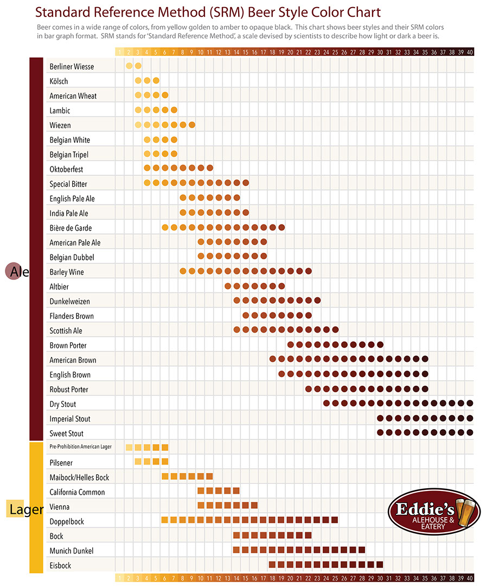

# 啤酒色度

資料來源：Homebrewing for Dummies, 2nd by Marty Nachel

**Lovibond Scale(拉維邦色度計)**

不同的麥芽製造者在為美國啤酒工廠製造麥芽時，幾乎都使用相同方式。其中在色度所遵循的一個工業標準就是Lovibond色度計，這標準同樣也可以運用在麥汁和啤酒。

因為與用描述的方式相比，我們可以輕易的用肉眼看出顏色的深度，因此Lovebond色度計被設計成使用一個特定數字來對應一個色深。在啤酒製造術語裡面，有時Lovibond會被簡化成L，或者在包裝或酒譜中連L都省略。

Pale Lager      1.6

Pale Ale          1.8

Vienna            3

Munich(light)   10

Munich(dark)   20

Crystal             20-120

**SRM 色度計( Standard Reference Method)**

比較現代的標準是美國顏色測量標準所使用的SRM色度計。它非常接近古老的Lovibond色度計，但主要的不同在於它使用了光譜分析儀，所以比較精確。Lovibond色度計另一方面來說，則仍然透過人類眼睛與著色玻璃去分辨顏色深度。

**HCU色度計(Homebrew Color Units)**

為了更複雜的原因，手工釀酒者有他們自己的標準叫HCU色度計。這種粗糙的方法仰賴一些簡單的規則來建立啤酒顏色：拿啤酒所使用的穀物每種幾磅，乘上每種穀物所對應的Lovibond數字，將這些數字加起來，再除以這些穀物所能製造啤酒的加侖數。

作者Marty Nachel附註：基本上沒有人在用HCU色度計，但人家問你時，別說我沒告訴你。