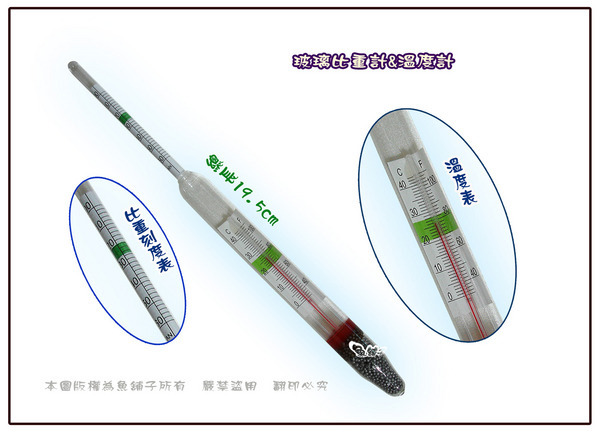
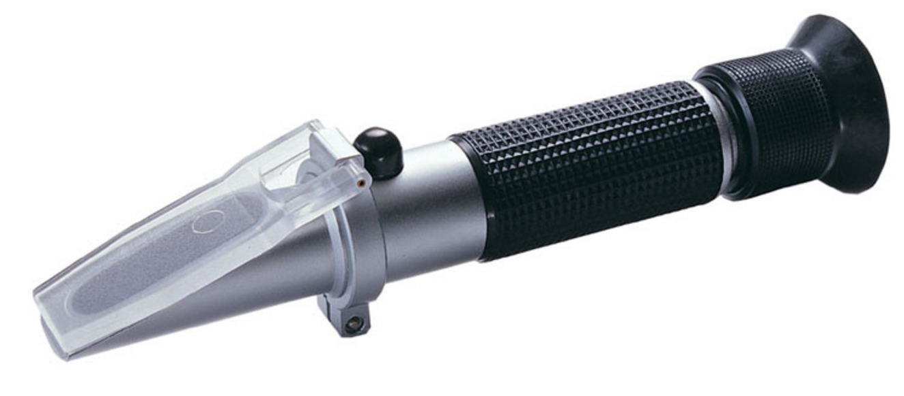
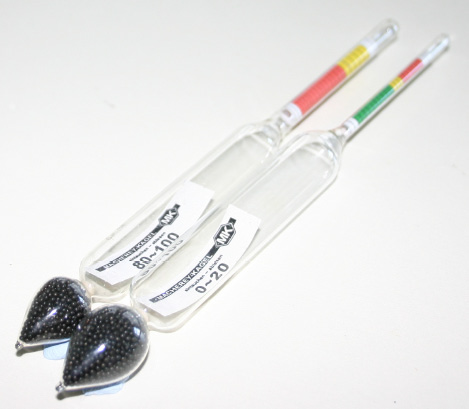
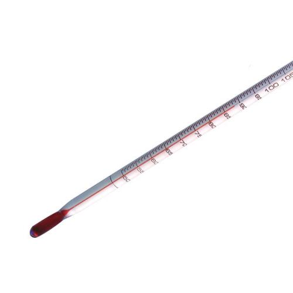
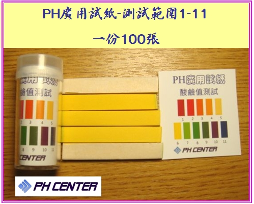

# 基礎設備操作

## 常用量測設備

**比重計（密度計）**

用來量麥汁比重，好瞭解酒的濃淡與發酵是否完成

推薦使用玻璃浮球這種比較適合

由於溫度會大幅影響比重計的數值，因此最好等酒體降溫到標準值（ 20 or 25度，請看比重計上的標準）再行量測。

＊過高的溫度可能會把比重計炸了，這玩意挺貴又不好買還是小心為上

當溫度並非標準值時，必須透過一張表對比重進行修正。

*   修正計算機：[http://www.brewersfriend.com/hydrometer-temp/](http://www.brewersfriend.com/hydrometer-temp/)

大多數麥汁的濃度為1~1.06，高糖化效率時也很少超過1.08，可以購買1~1.1或是1~1.06的

後火車站瓶罐材料行有售，160-360$之間

**糖度計（波美計）**

計算溶液或蜂蜜中有多少糖分

糖度是可以與比重換算的，所以不需要特別買儀器，除非你想另外加糖蜜

比重與糖度(Brix)換算計算機：[http://www.brewersfriend.com/brix-converter/](http://www.brewersfriend.com/brix-converter/)

玻璃浮球跟上面那種比重計長得很像，基本上也是利用比重來計算糖度。不過基本上不是很建議拿這種來量麥汁，因為一般糖度計是假設溶液中只有水與糖，對於充滿各種物質的麥汁來說，會高估糖的比例。

另外一種糖度計則是使用光線折射原理，看起來比較像實驗室的設備，基本上也是會誤判的。

**酒精度計**

計算溶液中有多少酒精

玻璃浮球跟上面那種比重計長得很像，基本上也是利用比重來計算酒精度。不過基本上不是很建議拿這種來量啤酒，因為一般酒精計是假設溶液中只有水與酒精，對於充滿各種物質的啤酒來說，會計算錯誤。

但是烈酒就可以用了，如果你有玩蒸餾酒的話

推薦用的計算法：[ABVIBU](/W2Kv6wZuHxm)

**溫度計**

常用的是玻璃的棒狀紅色溫度計

一般來說將紅色那一頭浸入麥汁中就可以測量，紅色那一頭事實上有一個刻痕，浸入深度要多於那個刻痕才會準確。

＊千萬別當攪拌棒用，會斷！

＊有一種紅外線槍可以測溫度的，並不適合在廚房使用。首先準確度不佳，其次霧氣與物體的顏色也會大幅影響其準確度

一般來說0-100度就足夠，如果你會煮糖漿，可能會需要0-200

**石蕊試紙**

如果有使用Star san，或是很重視麥汁糖化效率，你會想知道酸鹼度。

使用方式：撕一張下來，滴一滴溶液上去，然後去比對色彩

