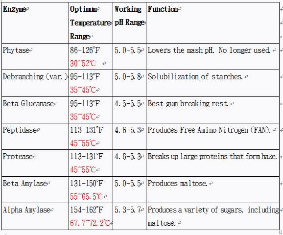
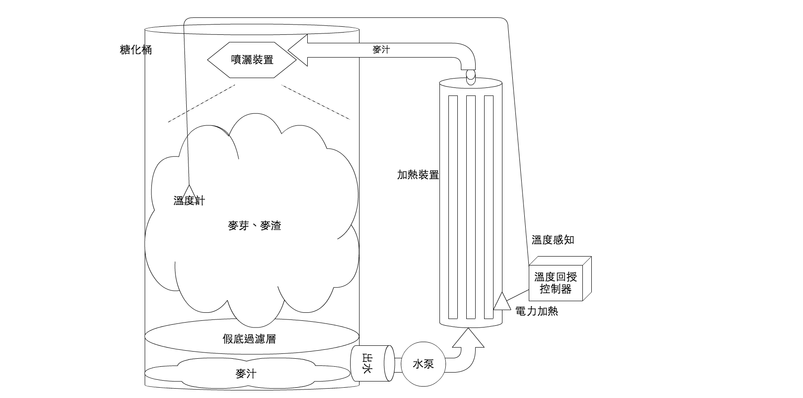
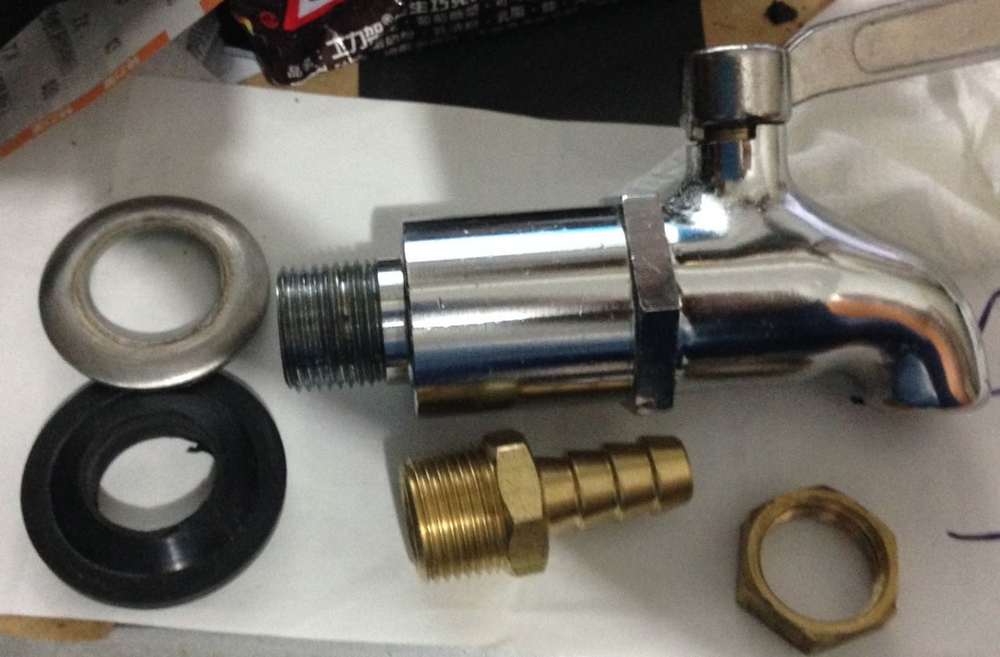
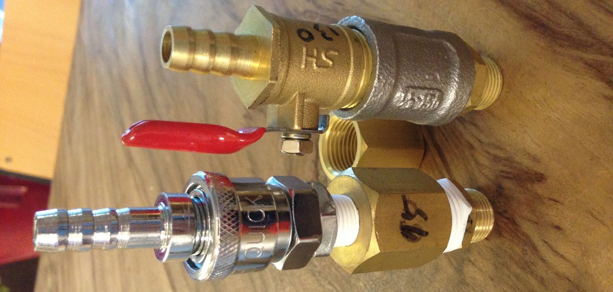
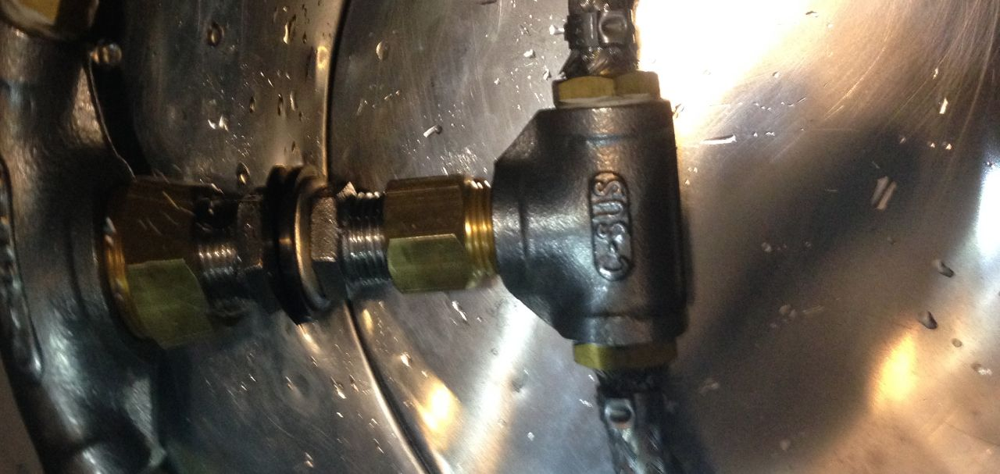
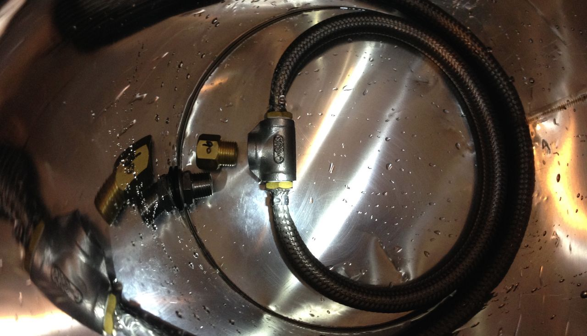
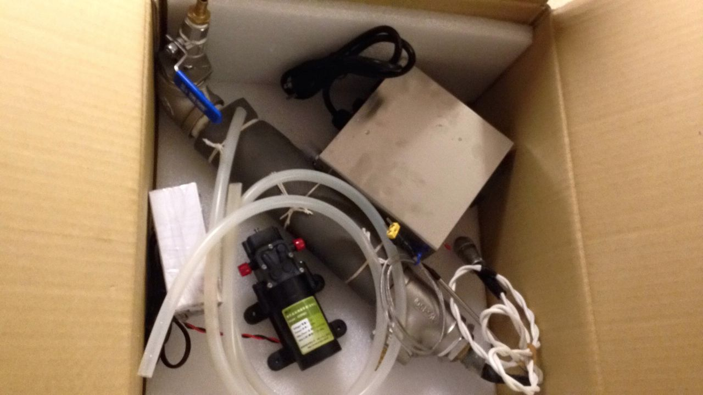

# 多階段糖化與設備改裝

## 需求

一般的啤酒使用預先發芽的酵素，成分也僅需溶出麥芽糖，所以用單一溫度（64-67）即可。

但在進階啤酒釀製，會需要引入不同風味的素材（改變口感風味、增加甜味等），如蛋白質、多醣類，而使用一些特殊麥或原料。這些原料中的素材不像一般麥芽，有的需要不同的酵素作用溫度，有些甚至本身沒有酵素（預先發芽）。假設使用傳統的單一溫度糖化，會導致需要的原料無法被融入麥汁，因此對策就是針對不同材料的酵素最佳運作溫度，緩慢提升糖化槽的溫度，讓每種材料都有足夠的時間進行轉化

**參考資料**

https://sites.google.com/site/howtobrewtwversion/brewing-your-first-all-grain-beer/ch16/16-2

https://sites.google.com/site/homebrewtw/know_how/mash

https://ethanol.hackpad.com/XIgTsYUqTUD

## 酵素工作溫度與酸度
<table style="font-size:13px;cell-spacing: 0px; border-collapse: collapse;"><tr><td style="border:1px solid #999; min-width: 50px;height: 22px;line-height: 16px;padding: 0 4px 0 4px;" class="added">&#21517;&#31281;</td>
<td style="border:1px solid #999; min-width: 50px;height: 22px;line-height: 16px;padding: 0 4px 0 4px;" class="added">&#24314;&#35696;&#28331;&#24230;(&#8451;)</td>
<td style="border:1px solid #999; min-width: 50px;height: 22px;line-height: 16px;padding: 0 4px 0 4px;" class="added"> &#24314;&#35696; pH&#20540;</td>
<td style="border:1px solid #999; min-width: 50px;height: 22px;line-height: 16px;padding: 0 4px 0 4px;" class="added"> &#21151;&#29992;</td>
</tr>
<tr><td style="border:1px solid #999; min-width: 50px;height: 22px;line-height: 16px;padding: 0 4px 0 4px;" class="added"> Phytase(&#26893;&#37240;&#37237;&#32032;)</td>
<td style="border:1px solid #999; min-width: 50px;height: 22px;line-height: 16px;padding: 0 4px 0 4px;" class="added"> 30~52</td>
<td style="border:1px solid #999; min-width: 50px;height: 22px;line-height: 16px;padding: 0 4px 0 4px;" class="added"> 5.0~5.5</td>
<td style="border:1px solid #999; min-width: 50px;height: 22px;line-height: 16px;padding: 0 4px 0 4px;" class="added">&#38477;&#20302;&#20986;&#31958;&#30340;&#37240;&#40572;&#20540;&#65292;&#19981;&#20877;&#38656;&#35201;</td>
</tr>
<tr><td style="border:1px solid #999; min-width: 50px;height: 22px;line-height: 16px;padding: 0 4px 0 4px;" class="added"> Beta-&#33889;&#33796;&#31958;&#37237;&#32032;   </td>
<td style="border:1px solid #999; min-width: 50px;height: 22px;line-height: 16px;padding: 0 4px 0 4px;" class="added"> 35~45 </td>
<td style="border:1px solid #999; min-width: 50px;height: 22px;line-height: 16px;padding: 0 4px 0 4px;" class="added"> 4.5~5.5</td>
<td style="border:1px solid #999; min-width: 50px;height: 22px;line-height: 16px;padding: 0 4px 0 4px;" class="added"> &#30772;&#22750;&#40613;&#33469;&#22806;&#37096;&#30340;&#31946;&#31881;&#20445;&#35703;&#23652;</td>
</tr>
<tr><td style="border:1px solid #999; min-width: 50px;height: 22px;line-height: 16px;padding: 0 4px 0 4px;" class="added"> Proteases (&#34507;&#30333;&#37238;)</td>
<td style="border:1px solid #999; min-width: 50px;height: 22px;line-height: 16px;padding: 0 4px 0 4px;" class="added"> 45~55</td>
<td style="border:1px solid #999; min-width: 50px;height: 22px;line-height: 16px;padding: 0 4px 0 4px;" class="added"> 4.5~5.5</td>
<td style="border:1px solid #999; min-width: 50px;height: 22px;line-height: 16px;padding: 0 4px 0 4px;" class="added"> &#20998;&#35299;&#22823;&#20998;&#23376;&#34507;&#30333;</td>
</tr>
<tr><td style="border:1px solid #999; min-width: 50px;height: 22px;line-height: 16px;padding: 0 4px 0 4px;" class="added"> Peptidases(&#32957;&#37238;)</td>
<td style="border:1px solid #999; min-width: 50px;height: 22px;line-height: 16px;padding: 0 4px 0 4px;" class="added"> 45~55</td>
<td style="border:1px solid #999; min-width: 50px;height: 22px;line-height: 16px;padding: 0 4px 0 4px;" class="added"> 5.0~5.5</td>
<td style="border:1px solid #999; min-width: 50px;height: 22px;line-height: 16px;padding: 0 4px 0 4px;" class="added"> &#29986;&#29983; Free Amino Nitrogen (&#28216;&#38626;&#27688;&#22522;&#37240;&#27694;)</td>
</tr>
<tr><td style="border:1px solid #999; min-width: 50px;height: 22px;line-height: 16px;padding: 0 4px 0 4px;" class="added"> Beta-&#28593;&#31881;&#37238;</td>
<td style="border:1px solid #999; min-width: 50px;height: 22px;line-height: 16px;padding: 0 4px 0 4px;" class="added">60~65</td>
<td style="border:1px solid #999; min-width: 50px;height: 22px;line-height: 16px;padding: 0 4px 0 4px;" class="added"> 5.2~5.8</td>
<td style="border:1px solid #999; min-width: 50px;height: 22px;line-height: 16px;padding: 0 4px 0 4px;" class="added"> &#28593;&#31881;&#36681;&#21270;&#28858;&#40613;&#33469;&#31958;</td>
</tr>
<tr><td style="border:1px solid #999; min-width: 50px;height: 22px;line-height: 16px;padding: 0 4px 0 4px;" class="added"> Alpha-&#28593;&#31881;&#37238;</td>
<td style="border:1px solid #999; min-width: 50px;height: 22px;line-height: 16px;padding: 0 4px 0 4px;" class="added"> 60~70</td>
<td style="border:1px solid #999; min-width: 50px;height: 22px;line-height: 16px;padding: 0 4px 0 4px;" class="added"> 4.5~5.5</td>
<td style="border:1px solid #999; min-width: 50px;height: 22px;line-height: 16px;padding: 0 4px 0 4px;" class="added"> &#28593;&#31881;&#36681;&#21270;&#28858;&#22810;&#31278;&#31958; (&#21253;&#25324;&#19981;&#21487;&#30332;&#37237;&#31958;)</td>
</tr>
</table>

## 各階段溫度休止

一般性建議，糖化槽溫度提升：40 - 60 - 70各半個小時

40: 液化休止：促使成分液化、將澱粉融入水中，提高醣化率

45: 酸休止：基本上現在都可以省略了。最佳的酸度是ph 5.2（可省略）

50-55: 蛋白質休止：降低混濁、增加氨基酸、提升泡沫持久度。若有未發芽穀物或是想降低渾濁度時使用

60-70: 糖化休止：根據你想要酒汁的特性選擇Alpha or Beta澱粉酶，麥芽糖多提高酒精度，反之提高酒體厚實度

77-78: Mash out：停止所有酵素作用，略為增加麥汁流動性，大多數沒必要做（可省略）

## 方案參考

**傳統做法**

煮水到42度，倒入麥芽做起始溫度，每半小時增加滾水來調整到預期溫度。缺點是隨時要盯著看，然後可能會因為手滑導致水太多，無法到預期溫度，或是麥汁太稀。

也有人把糖化鍋放在火上加熱，但由於麥芽本身很濃稠，需要持續攪拌，不然非常容易燒焦Q__Q

*   但也有說法這種爐火煮沸可以增強麥芽的風味

**酒廠做法**

大型糖化槽中，有巨大的攪拌桿，熱水從這邊注入，同時攪拌。麥汁從過濾網出汁後視情況加熱後循環回糖化槽。

也有麥汁是從頂部噴灑裝置淋回上層麥芽的做法

## 水牛DIY

大致上是RIMS [https://sites.google.com/site/homebrewtw/equipment/rims](https://sites.google.com/site/homebrewtw/equipment/rims)

透過從底部抽出麥汁，電腦控制加熱後注回糖化桶循環

感謝水牛書店藍帶大主廚提供的設計與料件

**設計圖**

**設備材料**

糖化桶使用啤酒王飲料保溫桶 [http://goods.ruten.com.tw/item/show?21311117973400](http://goods.ruten.com.tw/item/show?21311117973400)

因為要改裝成可以從底部抽麥汁出來，所以改裝水龍頭為軟管接頭

關鍵字：寶塔頭、茶桶、茶堵、保溫桶

外絲直徑約16.2mm，大概對應到3分的管徑（內徑）。留意中間有27mm的保溫層，跟3mm的未攻牙。螺牙約12.5mm

更換上圖寶塔頭發現外絲長度不足，加上六角區域太小，導致內桶壁被壓爆了Orz

*   後來拿木棍跟榔頭敲回去

目前發現適合的淘寶材料，應該會進個幾隻來改裝看看

[https://item.taobao.com/item.htm?id=522735447162](https://item.taobao.com/item.htm?id=522735447162) 加長3分*10mm

根據板友建議，使用“立布”、“立卜”做內部接頭，再加上球閥與寶塔接頭

[http://goods.ruten.com.tw/item/show?21446713591654](http://goods.ruten.com.tw/item/show?21446713591654) 不銹鋼 異徑 立布 4分轉3分 六角 接頭 雙外牙 35$

[http://goods.ruten.com.tw/item/show?21401056629950](http://goods.ruten.com.tw/item/show?21401056629950) 純銅4分 管古 雙內絲 直接 銅外接 銅內牙直接 DN15 

[http://goods.ruten.com.tw/item/show?21502228399395](http://goods.ruten.com.tw/item/show?21502228399395) 304不鏽鋼 4分 管古 白鐵 不銹鋼 雙內絲 1/2內牙直通 35$

[http://goods.ruten.com.tw/item/show?21532298901945](http://goods.ruten.com.tw/item/show?21532298901945) 4轉2球閥 考克 全銅閥門 4分外螺紋 120$

[http://goods.ruten.com.tw/item/show?21445636465297](http://goods.ruten.com.tw/item/show?21445636465297) 4分矽膠平墊 6$

[http://goods.ruten.com.tw/item/show?21506424275233](http://goods.ruten.com.tw/item/show?21506424275233) 3分 10入 ST 白鐵 平華司 11$

跑了太原路，整條上只有一家有，泉成五金有限公司 太原路30號

聽其他朋友表示環河南路比較多，那邊空壓設備的店家很多

上：球閥130$ 管古65$ 立布48$=243$

<s>下：空壓軟管接頭＋快速接頭＋銅管古75$＋立布48$=2xx$</s>

*   更新：空壓接頭裡面太複雜會堵囧

橡膠墊片3分一片10$ _重友企業 太原路85號_

回家上機測試 [大ＧＧ](/Brewing-History-Aibs59hsIWB#:h=160211-水牛多階段糖化測試---紐西蘭大麥-Ethen)\o/

後來跑去 _聯成空油壓五金行 103台北市大同區華陰街119號_ 終於找到所有的材料了QAQ

最終版本：球閥130$＋管古65$＋立布48$＋啤酒王原四分變徑當螺母＋四分內絲對外絲做連接90$=333$

這樣終於可以接上啤酒王的鐵絲濾網了，這週測試

＊大成功＊

感謝大家的改裝建議

[http://jaweyan.blogspot.tw/2013/05/blog-post.html](http://jaweyan.blogspot.tw/2013/05/blog-post.html)

也有人建議拿大矽膠管硬接再轉接，不過這款龍頭比較不適合，不然會是最簡易的解法

**加熱系統**

[https://sites.google.com/site/homebrewtw/equipment/rims](https://sites.google.com/site/homebrewtw/equipment/rims)

電熱絲藏在大水管中，一頭進水一頭出水，有一個薄膜幫浦抽麥汁，右上的DIP控制器連接電熱絲、溫度計、電源，可直接設定溫度，溫度靠近時以脈衝輸出逼近目標溫度。

這組是水牛書店當時的訂製款，所以相當昂貴，一套9600$

得想個辦法換掉泵浦，太吵了，而且上面標示的電壓資訊好怪

[http://goods.ruten.com.tw/item/show?21107081833767](http://goods.ruten.com.tw/item/show?21107081833767)

## 現有產品

**Grainfather **

[http://www.grainfather.com/](http://www.grainfather.com/#)

運作方式：底部加熱、底部抽水，上方灑入

[試用GrainFather半自動糖化](試用GrainFather半自動糖化.md)

**Braumeister**

[http://www.ibrew-beer.com/speidels-braumeister.html](http://www.ibrew-beer.com/speidels-braumeister.html)

運作方式：