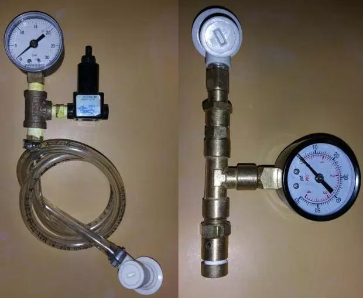

# 帶壓發酵與裝瓶

## 簡介

[https://www.facebook.com/groups/homebrew.tw/permalink/1221160357901270/](https://www.facebook.com/groups/homebrew.tw/permalink/1221160357901270/)

[http://brulosophy.com/2015/04/27/under-pressure-the-impact-of-higher-psi-fermentations-exbeeriment-results-2/](http://brulosophy.com/2015/04/27/under-pressure-the-impact-of-higher-psi-fermentations-exbeeriment-results-2/)

透過Keg搭配洩壓裝置，可以實現在壓力下發酵

   ＊＊＊＊＊＊＊＊＊＊＊＊＊＊＊＊＊＊＊＊＊＊＊＊＊＊＊＊＊＊＊＊＊＊＊＊＊＊＊＊

   ＊**＊＊警告：壓力設備可能有爆炸風險，為了避免上新聞，請務必做上多重安全設施＊＊**＊

   ＊＊＊          **本筆記僅供參考，DIY有風險，個人造業個人擔，我們不負任何責任**       ＊＊＊

   ＊＊＊＊＊＊＊＊＊＊＊＊＊＊＊＊＊＊＊＊＊＊＊＊＊＊＊＊＊＊＊＊＊＊＊＊＊＊＊＊

*   by一個炸過玻璃瓶又炸Keg的人的忠告

**優點**

*   可以高一點的溫度發酵而不會增加不好的味道（off flavor）
*   減少酯類及異醇的產生
*   緩和發酵，減少head space空間需求
*   芳香物質比較不會被帶走
*   用發酵產生的CO2自然充氣，不用再加糖或充氣
*   文章最後有提到用壓力發酵可能可以用ale的溫度來做lager的發酵，而且減少發酵的時間

**缺點**

*   酵母繁殖較少，不利回收。
*   可能會降低品質
*   可能引發黑暗原力（？）

## 討論

<u>[Vito Tai](https://www.facebook.com/vito.tai?fref=ufi)</u>

brulosophy.com的格主認為，即使不是採用密封的酒廠，以酒廠發酵桶的體積來看，下半層的酵母的壓力也大於家釀的壓力很多。目前我查到的一些資料來看，Ale的結果相差不會太大，但有幾種酵母對壓力有不良應（好像是saison～待確認）；lager則是另外一個故事，田大說有黑暗原力...有時間的話，可以看一下這個討論串，是我找到最多的討論：[http://www.homebrewtalk.com/showthread.php?t=44344](http://www.homebrewtalk.com/showthread.php?t=44344)

<u>[Vito Tai](https://www.facebook.com/vito.tai?fref=ufi)</u>

這篇就有比較，似乎差異不太。要說比較懶惰的方法，壓力發酵就是了；主發酵3~5天後（距最終FG還有0.04左右），把壓力調高到對應的體積數，發酵完成同時完成碳酸化，不用加糖加氣，快又省事。 [http://brulosophy.com/2015/04/27/under-pressure-the-impact-of-higher-psi-fermentations-exbeeriment-results-2/](http://brulosophy.com/2015/04/27/under-pressure-the-impact-of-higher-psi-fermentations-exbeeriment-results-2/) 

[Blackj Chao](https://www.facebook.com/blackj.chao?fref=ufi)

發酵每產生一莫耳酒精，會產生一莫耳CO2。一支330ml的啤酒以5%計算會有16.5g酒精也就是0.36莫耳，產生二氧化碳也是0.36莫耳，全部轉化為常溫常壓下的氣體大約8公升。一批釀20L的話則大約會產生480公升氣體。

我是不敢完全密封啦，有勇者想嘗試的話記得上來通報一下，大家好閃你家閃遠一點.....

再補充一下。一般玻璃酒瓶的碳酸化安全值據說是3.5倍體積，也就是一支330ml的啤酒大概可以填入330x3.5=1155ml的氣體CO2沒問題，回推可得裝瓶糖大約一瓶四克都還是安全的，再多就拼人品了。

## 設備

**DIY Spunding Valve**

[http://www.homebrewfinds.com/2011/02/build-spunding-valve.html](http://www.homebrewfinds.com/2011/02/build-spunding-valve.html)

*   控制碳酸化的壓力：1.可以加糖後用這個裝置，不用擔心加太多糖；2.修正過度碳酸化，調到想要的壓力值，插上去即可。3. 可以在發酵快結束、離目標FG很接近時用它，利用殘餘的糖來做碳酸化，聽說是一種符合德國啤酒純淨法的做法。
*   keg對keg傳送；把兩個keg的啤酒頭接在一起，來源keg接鋼瓶提供壓力，這個spunding valve插在目標keg，壓力調比鋼瓶壓力低一點，就可以很順暢地把啤酒轉到目標keg。

**洩壓閥relief valve**

[https://s.taobao.com/search?q=relief+valve](https://s.taobao.com/search?q=relief+valve)

**Mini keg的洩壓閥**

[http://goods.ruten.com.tw/item/show?21522596245160](http://goods.ruten.com.tw/item/show?21522596245160)

**帶壓裝瓶**

[http://www.homebrewtalk.com/showthread.php?t=24678](http://www.homebrewtalk.com/showthread.php?t=24678)