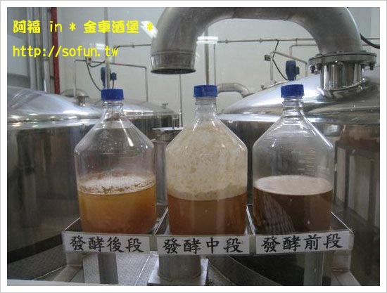
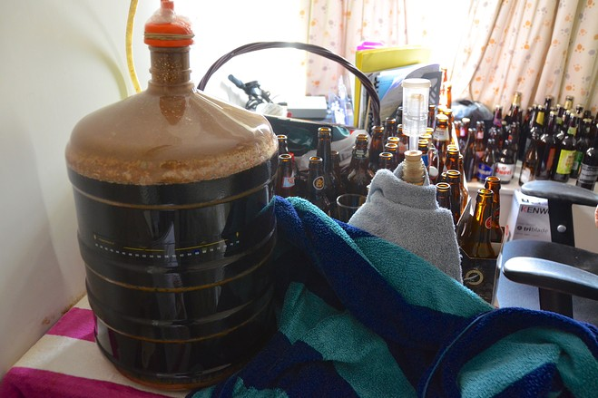
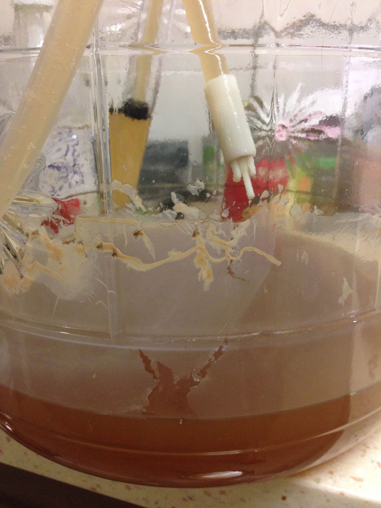
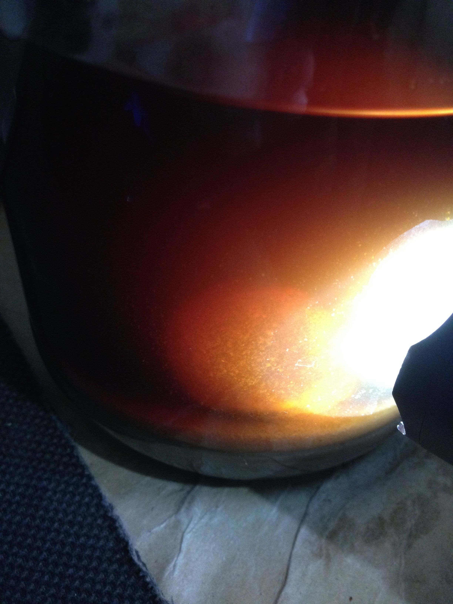

# 我的麥汁被感染了嗎

由於發酵時可能會產生大量氣泡，把酒中的麥渣、酒花渣、酵母泥什麼有的沒的拱到上方，累積在發酵桶邊緣、酒體表面、甚至噴發出去，所以畫面常常不會太好看，有很多新酒友會誤以為發霉或是染菌了，所以分享一些正常的發酵畫面給大家<s>笑笑</s>參考

大致上，我們總歸要面對一個現實：就算是酵母菌，也還是菌，工作起來不會太好看ＸＤ

**什麼是好的，什麼是壞了？**

有句話說

長了好菌叫發酵，長了壞菌叫腐敗

所以我這樣定義：

長了你要的菌叫釀造，長了你不要的菌叫失敗

但是，發酵往往不會是單一菌種工作。（甚至像米酒麴，本身就是綜合了酵母菌、黴菌等的混合菌種）

除非你開無塵室，不然多少會有些雜菌跑進去。

對於一般家釀來說，影響不大。在你的酵母下得夠多時，酵母會成為優勢菌種，把雜菌排擠掉，如果你的酒釀出來一個月內就乾掉了，都不會受到什麼影響

但對於酒廠來說，影響就大了。例如醋酸菌跟酵母菌的關係，往往是酵母菌先工作，把糖都轉成酒精，然後接下來換醋酸菌接手，把酒精轉換成醋酸。所以你釀好了之後喝感覺一切都很棒，結果放了三四個月再開一瓶，酸到你眼淚直流。對於自釀頂多咒罵兩句，但商業啤酒來說，這就是砸商譽的大事了。

另一方面來說，什麼是你要的菌呢？對我來說，我喜歡酸啤酒，所以可能會希望有乳酸菌參與作用，但是對其他人來說可能就會覺得WTF。所以對於我自己來說，自釀的成功，代表酒不錯喝，只要不會落賽，都還不失敗ＸＤ

**正常發酵**

**醋酸菌感染**

有一層膜是醋酸菌的特徵（順道一提，那層膜累積厚了就是飲料常用的椰果）

**水霉菌**

看到那顆圓球沒有？這基本上就ＧＧ惹 囧rz 

