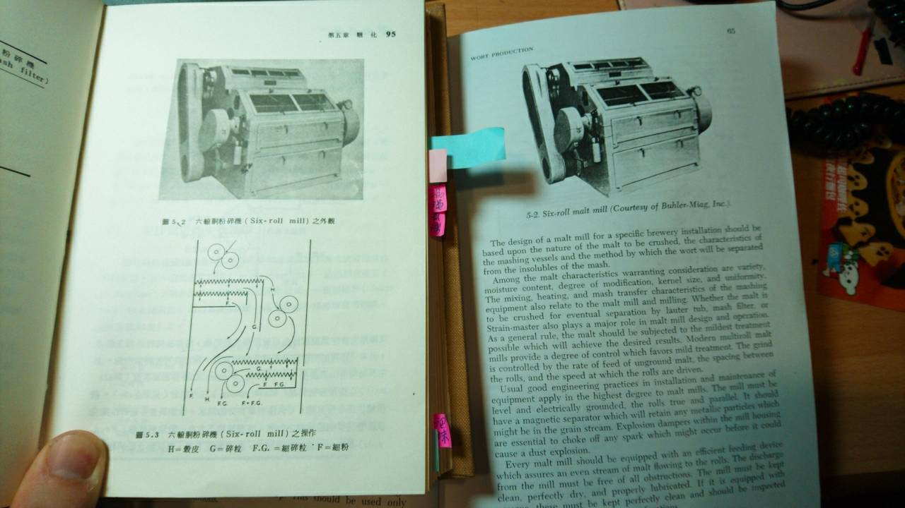
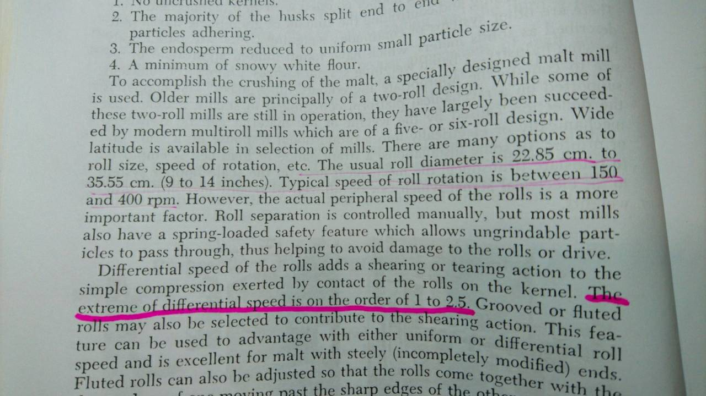
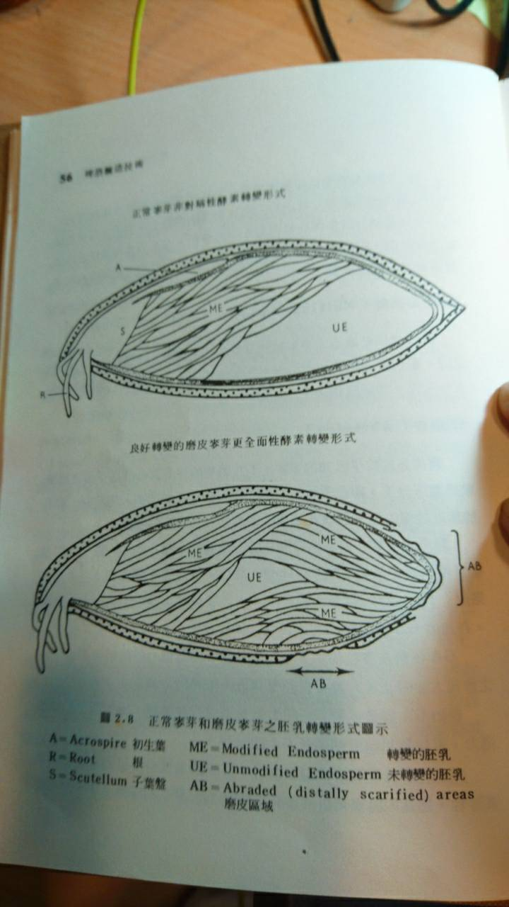
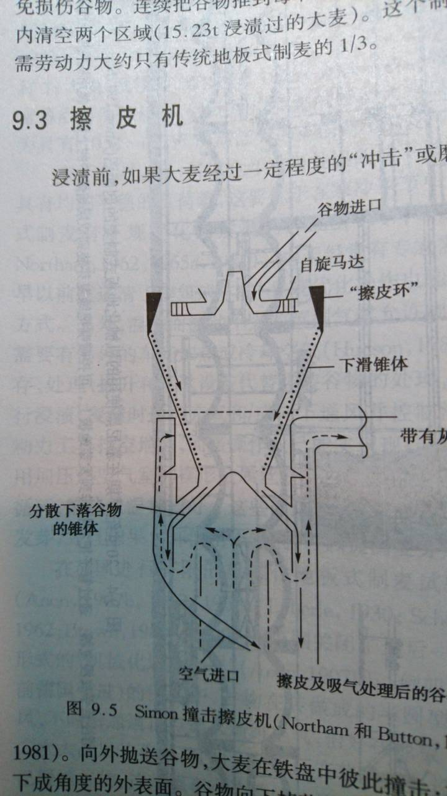

# 橘蘋巢自釀聚會筆記暫存區

感謝群內大大們無私的共享知識與經驗 <(\_ \_)>

## 酵母

### 釀酒酵母添加量（Pitch Rate）

概算

1. 乾酵母粉：主發酵麥汁重量的千分之一
2. 濃稠酵母泥：主發酵麥汁重量的百分之一
3. 發酵旺盛的發酵液：主發酵麥汁重量的十分之一

專業的則是用顯微鏡加上細胞計數盤數酵母的密度再去算要加多少的量

乾酵母就只好相信原廠的數據，不然就復水後用甲基藍染色看純活率順便數一下才知道正確的量

### 品質判斷

透過亞甲藍液染色搭配顯微鏡可以計算活酵母與死酵母的比例

### 自動化計算酵母數量

軟體是開源的ImageJ
https://imagej.nih.gov/ij/
計數外掛
https://imagej.nih.gov/ij/plugins/cell-counter.html

### 擴培

至於酵母擴培的擴大倍數，實驗室等級可以做到千倍，但一般玩家建議1:10比較保險

林大擴培營養包，一包對200cc，400cc適用於20L的批次

每階段擴培完畢，必須要把酵母從原來的培養基拿出來，使用過的培養基沒養分，還有一堆酵母的廢棄物會毒死酵母

把2公升擴培液收集到的酵母泥，放到1公升裡，他不可能再指數或倍數繁殖的.....只是負責吃你的麥汁而已

## 碾麥

### 專業做法

由於麥芽本身需要靠麥渣建立過濾層，所以麥殼最好保持完整（太細會造成堵塞），而胚乳部分則碾碎較佳（提高醣化利用率）

一般家用麥芽碾碎都是對棍，所以沒啥可調的地方，酒廠專業的可能是兩對或三對，分別處理 碾破（粗壓） 脫殼 碾碎（細壓）三個不同任務，盡量維持麥殼的完整，甚至能夠微調輸出的比例。

越大直徑的棍體可以降低麥子被碾壓時的反彈，不過價格也昂貴

* 碾破：用較粗的間距讓麥子破裂但不碎
* 脫殼：用兩棍的速度差，讓麥殼與胚乳分離
* 碾碎：用較細的間距取得最細的麥芽粉

商業用六棍機種範例，透過篩網分離穀皮、粗粒、細粒分別處理。
一般滾輪直徑22.85cm ～ 35.55cm轉速150-400RPM，
脫殼轉速差比例為1 ～ 2.5

實驗室機種影片，粒徑分離、細粉與麥殼脫離的超清晰

<https://youtu.be/LCurgBFvqwc>

### 家用

提高整體利用度，可以往這幾個方向嘗試

* 濕式碾麥，在麥殼上噴水減少碾壓時的破碎（也可以使用冷凝水）
* 購置三棍式碾麥機（碾破、碾碎，跟碾兩次有相當的效果）
* 兩階段碾麥，第一段粗一點碾破，第二段碾細（破碎過的麥芽比較不規則狀，比較不會滑不進去）

https://www.morebeer.com/products/barley-crusher-grain-malt-mill.html

## 製麥

為了良好修飾麥芽澱粉，需要磨皮來讓醣化酵素發揮到遠離胚芽的位置

## 配方設計

### 平衡

可以參考BJCP調整GU:BU Ratio

Nickolas：根據我的經驗 味道平不平衡看 BU:GU 比例就知道，這些都是研究不同酒廠的酒 歸納出來的比率

<http://beersmith.com/blog/2009/09/26/balancing-your-beer-with-the-bitterness-ratio/>

* American Amber: 0.619
* Bohemian Pilsner: 0.800
* Oktoberfest/Marzen: 0.449
* Traditional Bock: 0.346
* Blonde Ale: 0.467
* California Common: 0.735
* Ordinary Bitters: 0.833
* American Pale Ale: 0.714
* Brown Porter: 0.576
* Dry Irish Stout: 0.872
* English IPA: 0.800
* Weizen/Weissbier: 0.240
* Belgian Trippel: 0.375

### 通透

Nickolas：喝起來通透 有兩個地方可以注意

1. 水麥比超過 3
2. 煮沸的火力要夠大

配方大概只能做到這個程度，其他就要看釀酒的技藝了

### 泡沫

Nickolas：如果有加 CaraPils 基本上都會泡沫不錯漂亮了，加小麥一些些會再好一些些，不過高手在做應該都不用加都會很漂亮

### 厚度

Nickolas Chen：酒體輕重 通常都是麥芽種類多寡 啤酒花種類多寡 跟 輔料互相的味道疊在一起的感覺。重味道的東西用多自然酒體會重

我指的口感是 如果同一個配方 用多水去糖化跟少水的糖化，你會發現他有微微的不一樣，一個輕一些 一個厚一些

我的經驗是 3.3 糖化率會最好，但是 3 以下味道厚一些 但是糖化率會低

## 煮沸

Nickolas：一個小時可以煮掉 5公升，看你的設備與火力

你的目標 og 是 1.048 20公升的麥汁，如過還沒煮沸前收集到了 25公升，你的未煮沸前 og 應該是1.038

## 洗槽

溫度越高可以洗出越多醣，溫度跟單寧的關聯性尚未證實，有人表示最佳溫度是75度

冷水沒壞處，需要測試高溫是否會有不良效果

### pH調整

Nickolas：加磷酸或是乳酸，其他酸類不保證合用。要注意要買食品級的乳酸啊，一定要跟他們拿 msds 跟食品添加物許可證資料

啟肇：懶的話，前次釀的啤酒有剩的話加一瓶下去也行啦

標準是 5.2-5.6 之間，洗槽不用跟著酒種走，目的是控制單寧不析出

單寧本身是一種酸類，鹼性環境較易釋出

<https://zh.wikipedia.org/wiki/%E9%9E%A3%E8%B4%A8>

## 異常風味

### DMS

啟肇：啤酒裡有兩個來源，一個是大麥發芽過程產生前驅動SMM造成，就如你說的，在煮沸過程會揮發，另一個來源是酵母自己的代謝，蛋氨酸的代謝過程也會產生

所以還是要做DMS休止較佳

## 裝瓶

### 等壓裝瓶

目前有兩大類別的等壓裝瓶設備，核心概念都是藉由壓力均等來降低起泡的程度

* 泡沫飛馬
* Beer gun

泡沫飛馬使用流程：裝上瓶子、打開氣瓶使瓶內等壓、關氣瓶開酒閥、緩慢釋放氣體藉由壓力差讓酒液進入瓶內、快滿了關閉酒閥、卸下瓶子迅速上蓋

但由於轉移過程中的溫度差、壓力差、接觸到不同介質都還是會引發一些氣泡，所以轉移速度不能太

沒有延伸到瓶底的出酒管也引發了酒氧化的質疑

啟肇大哥：可以把桶內（白頭）與瓶內連接並接上氣瓶補氣，在相等壓力的情況下透過高度差來移動酒體，可以提高速度同時降低起泡

