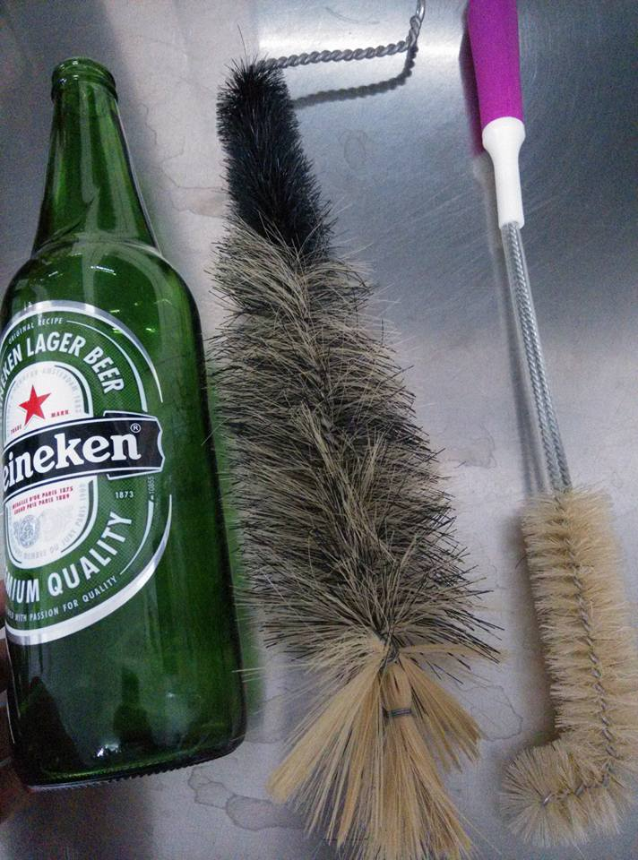

# 清潔方式比較

[https://www.facebook.com/groups/homebrew.tw/permalink/1229699623714010/](https://www.facebook.com/groups/homebrew.tw/permalink/1229699623714010/)

共同指南：

**<u>[知北遊](https://www.facebook.com/urban1210?fref=ufi)</u>** 難洗的瓶子就拋棄吧…乾淨的回收瓶會有的。

**PBW**

6g\L

本身是強鹼性（ph 10-11）

強而有力的清潔劑，如果覺得黴清不乾淨，加熱他（55度）

能重複使用 [http://www.homebrewtalk.com/showthread.php?t=64848](http://www.homebrewtalk.com/showthread.php?t=64848)

看起來可以泡一大桶來慢慢用

**鹼**

**[余建昌](https://www.facebook.com/jianchang.yu?fref=ufi)** 去化工行買片鹼（大包的氫氧化鈉）調pH12的溶液去浸泡幾小時後清洗，效果不錯

**[Jen Neng Kuo](https://www.facebook.com/people.kuo?fref=ufi)** 氫氧化鈉水溶液要加水稀釋到弱鹼性再倒

看起來控制酸鹼度就可以長期使用，但是風險性與環境影響較高

**過碳酸鈉**

**[Sam Kuo](https://www.facebook.com/profile.php?id=1188957224&fref=ufi)** 用「過碳酸鈉」還不錯用，化工行一大包很便宜，PBW的主成份

清洗記得要戴手套

會分解成雙氧水成份 溶液偏鹼

我都泡一整晚 整塊霉都浮到水面

過碳酸鈉泡不到pH12啦 他不是強鹼

何況一大鍋20L我也才放一湯匙左右

**[陳世偉](https://www.facebook.com/sw5chen?fref=ufi)** 我用特力屋的活氧漂白粉，成份是100%過碳酸鈉，不錯用，只要99元。[http://m.i-house.com.tw/product/detail/id/473342](http://l.facebook.com/l.php?u=http%3A%2F%2Fm.i-house.com.tw%2Fproduct%2Fdetail%2Fid%2F473342&h=iAQE5Sk3J)

會分解，使用前配置

**食品級二氧化氯**

**[Jckuo Kuo](https://www.facebook.com/profile.php?id=100004095652785&fref=ufi)** 食品級clo2泡即可，殺菌力好，但記得洗完後瓶身倒立。

會分解，使用前配置

可以作為消毒使用

**物理**

**[詹承昱](https://www.facebook.com/chanstravel?fref=ufi)** 您可以試試用刷子刷，我是都用刷子與洗碗精刷洗，再沖乾淨晾乾，裝瓶前在用二氧化氯消毒。用刷子刷感覺垢幾乎都刷得掉，但是比用泡的費事就是了

刷瓶底最好前端要彎一下
IKEA之類的地方有賣不錯的彎頭瓶刷

