# 無菌操作台 laminar flow

因為各種天時地利人和（感謝Jimmy Kung大大鼎力支持），所以土炮了人生第一台無菌操作台，完全沒想到自己會真的做了這玩意ＸＤ

**提醒：無菌操作台，主要適用於 酵母操作與實驗 中，大幅提高準確度，適用於有意進階研究釀酒的朋友。如果只是一般的釀酒流程，只要各階段都有做好，抑菌效果是足夠完成一批好酒的，不需要動用這種等級的設備。（註一）**

一開始只是單純養酵母各種失敗有點不爽（注二），想要做到更徹底的實驗，似乎得動用生物實驗室兩大神器：無菌操作台 跟 [滅菌釜](https://github.com/sakura26/ethanol/blob/master/%E6%BB%85%E8%8F%8C%E9%87%9C.md)，所以就開始到處亂翻找資料。網拍上的無菌操作台貴得跟鬼一樣（二手一台六萬還要自己找濾網），找濾網的過程中了解了無菌操作台的原理與種類，好像可以自己做做看價錢也勉強可以接受，加上貴人相助，在此留下紀錄希望能回饋廣大釀友。

畢竟我沒有受過正規訓練，如果有任何指教請不吝跟我說 <(_ _)>

注一：食品工業基本上都是抑菌而非滅菌（成本有差），釀酒過程當中也有多個檢核點可以確保一支酒不會ＧＧ：醣化溫度、煮花的煮沸、快速降溫避開細菌的活性區間、啤酒花的抑菌效果、優勢菌種、CO2對好氧菌的抑制、酵母對酒體的酸化、bottle conditioning等等。如果流程正確，基本上成功率是可以確保的，不然古人怎麼有辦法用陶甕跟土窖釀出傳承已久的各種酒類？ＸＤ

注二：後來問到好像也不算失敗，畢竟那批酵母釀酒也很正常，就是擴培S-04上清液會出現些許酸味（那時我用冷藏保存的麥汁擴培），困擾了我好久，後來使用林大提供的「酵母營養包」來做培養基解決了這個問題

滅菌釜的介紹請往這邊走 => [滅菌釜](https://github.com/sakura26/ethanol/blob/master/%E6%BB%85%E8%8F%8C%E9%87%9C.md)

## Why

大多數微生物操作與實驗都是單一或特定菌種，藉由擴培之類長到一定的量之後利用，我們釀酒擴培也不例外。問題在於，室內也有大量的微生物附著於灰塵中，灰塵隨時隨地都在飄，即便我們的培養液、玻璃瓶有徹底的消毒，當你打開蓋子投入酵母時，多少也會掉落一些進去（包含你的呼吸中也有大量雜菌），雜菌就一起進去擴培了。

噢當然，如果你投入的量相差懸殊那也無所謂，優勢菌種足以碾壓，但對於一些進階操作來說，例如你可能在分離純化某批成果很棒的野生酵母，拿到了一隻保存不當快死掉的液態酵母、從商業酒廠採來的特定酵母等等手上的菌數也不太足的情況下，這一點點的落菌就可能會讓你的擴培失敗，或是在培養幾代之後發生劣化。

而 無菌操作台，基本的任務就是「確保一個空間內是無菌的」，讓你可以在菌數相對不足的情況下，提高養出來的菌的品質。

## 操作

機台平時維護是清潔與消毒（75%酒精與紫外線消毒燈），維持乾淨（有養貓的要小心別讓貓窩進去了）

使用前注意濕度，HEPA等級以上的濾網有一個特性：濕度由低到高的時候反而會釋放之前抓住的灰塵 囧

紫外線有危險性，啟動紫外線定時器時務必讓人員避開，直視紫外線傷害視力有失明之虞，被紫外線照射肌膚會導致曬傷並有可能觸發癌症

使用前開啟15min紫外線消毒、開啟抽風扇15分鐘確保氣流穩定，操作時最好使用手套與口罩（人體是最大的污染源）

預先規劃物品配置動線，避免操作過程中的交互感染

把你的樣本外部充分消毒後放入機台進行操作，必要時75%酒精噴不手軟

瓶口消毒（？）

桌面請視為未消毒

使用後務必清潔，不要把東西堆置在其中

## 基本原理

基本上來說，無菌操作台，就是一個巨大的無塵清淨機。藉由高強度的濾網持續輸出潔淨無塵的空氣製造“氣壓場”，把可能帶有灰塵細菌的空氣逼出去，自然操作空間內就不會有落菌了

（這跟生物安全櫃不同：生物安全櫃會回收空氣避免有害物質跑出去，但無菌操作台是把氣體釋放到環境中，所以對人體有危險的物質不可以在無菌操作台中操作）

大致上的結構會是： 吸入外部空氣 -> 預過濾 -> 過濾 -> 上到下或層流送進操作區 -> 回收氣流(optional)

一般來說會使用HEAP等級或以上的無塵濾網，搭配一層前置濾網減少HEPA的損耗

空氣流速約為24~30m/min

由於無塵室跟無菌操作台有相當程度的相似，所以也引用一些無塵室的資訊如下：

分為：垂直層流、水平層流、亂流三種類型，優缺點如下

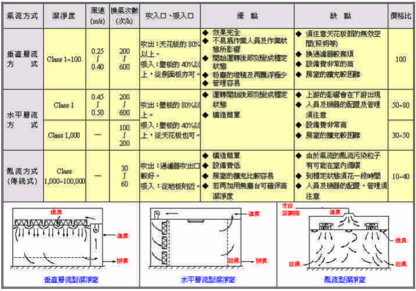

雖然[層流](https://zh.wikipedia.org/zh-tw/%E5%B1%82%E6%B5%81)好像很棒，但是因為我對層流不熟，還沒辦法驗證是否這個輸出是不是層流，所以先放一邊。

很多設計會有回風，一方面迴風可以把灰塵甩到下面去，另一方面過濾過的空氣總是比較乾淨，重複利用可以延長HEPA濾網的壽命，不過礙於土炮成本，只好割捨

## 材料與成本

總體來說一般土炮一套的元件購買起來大概會接近一萬，而這次主要元件有Jimmy Kung大鼎力支持所以實際支出大概只有三千不到

* HEPA等級或以上濾網 與 可以輸出足夠壓力的風扇 （假定FFU 1175*575）約為3000NTD不含運
* 不鏽鋼桌面（1.0厚度 沖孔2@p3=40%透氣率 60度角。展開：610*1210 四周含折四邊10-12mm）1650NTD不含運
* 塑膠布簾一卷（建立操作箱體） 約數百NTD
* 遮光布（阻擋紫外光）約100NTD
* 角鐵架（支撐FFU機體）估計一千多吧，這次用現成的地形
* 紫外線殺菌燈 14w燈管300燈架150(大概)
* 照明 燈管150燈架150NTD(大概)
* 紫外線燈用的定時器 329NTD
* 溫濕度計 200NTD
* 不織布過濾綿(太原路找的) 100NTD
* 電源線一條(水電行) 35NTD
* 強力磁鐵兩顆（吸住布簾用，文具店）40NTD
* 寬膠帶一卷

HEPA濾網含風機，可以購買淘寶上的工業無塵潔淨模組FFU，標準規格，同時價格便宜，也容易買到替換用的濾網。但要特別注意，如果從淘寶運回來，這玩意的重量是將近30kg的巨獸....

* <https://item.taobao.com/item.htm?spm=a1z10.1-c.w4004-17169344518.25.7e00e4ed1VMO2V&id=41604009229>
* 貨運可以找[一路發](https://www.elf.com.tw/)，運費大概2600NTD
* 大陸都220V，請先確認你有插頭或變壓器。這次我得到的是110V的版本所以只需要自己打接頭就好
* 大陸現在很流行拿FFU改成室內空氣清淨機（霾害啊），不過要注意這種工廠級的玩意還挺吵的..

不鏽鋼桌面打洞，以及桌面邊緣會有一些小縫，主要的目的是讓空氣吹下來之後可以流走，不會被桌面反射產生擾流把灰塵重新揚了起來。

* 這次我是找[信昌製網](http://www.shinchang-mi.com/index.aspx?u=shinchang&i=38) pinhung@yahoo.com.tw 

框體這次是用布簾的方式做的，買厚的透明塑膠桌布從FFU邊緣垂掛下來，距離底部保留5mm的空間，空隙用膠帶黏起。我知道這樣不是個好選擇，紫外線殺菌時會造成塑膠的快速劣化還會有異味，不過預算有限，等爛掉再來做不鏽鋼的

遮光布則是為了避免紫外線消毒時光線從正面照出去，由於我的機台位置放在客廳角落，會有人在附近活動，有必要擋一下，平常的時候布簾拉起來也可以避免貓跳上去。一樣塑膠不是適合的材料，不過既然手邊有就將就著用了，爛掉再說

為了支撐這台30kg的巨獸可以說是累出了我一身汗，我把本來堆放釀酒材料的角鐵架重新配置了，空出了一層空間，正好可以把這台FFU崁進去，取代了我本來使用已久的操作台。

紫外線燈管跟燈座我是找附近水電行代訂的，訂購前店家還一再的確認我知道這是什麼東西以及做什麼用的，畢竟這是危險物品之一需要謹慎操作。因為是水電行，所以出來的電線要自己配，幸好我有一些基本知識 :p 裝配好的紫外線殺菌燈採活動式，使用時放置於桌面上，不用時拿開

為了避免危險，紫外線燈直接買定時器，按一下就是15分鐘，可惜不會逼逼叫提醒時間到了

* <http://24h.pchome.com.tw/prod/DEAC6V-A90070MTB>

濕度計啊...由於市場上的濕度計基本上都不太準（排一排每隻指針都指向不一樣的位置還差很多...），隨便買一隻參考就好。想要準確可以買乾濕球溫度計

## 實作

原空間，這邊先把FFU本體放上去測試高度

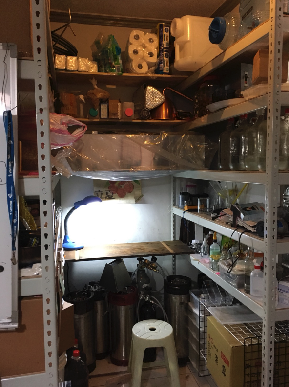

FFU本體，這台是110V交流電

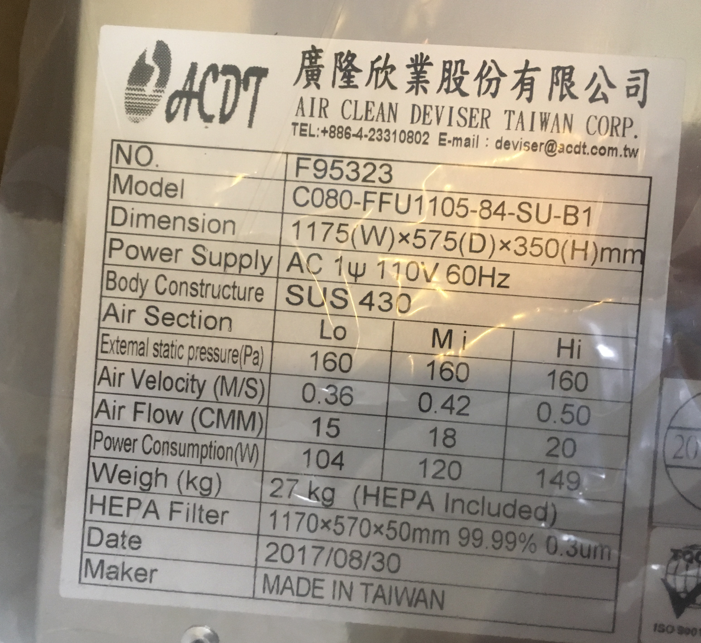

FFU本體上方是風扇入口，在這邊用膠布黏上不織布過濾綿，記得確保氣密性保持最佳過濾效果。如果風量會太大，在這邊貼膠帶減少入風面積

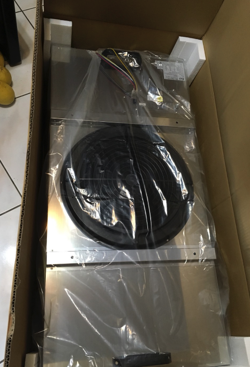

按照說明自行配置線路

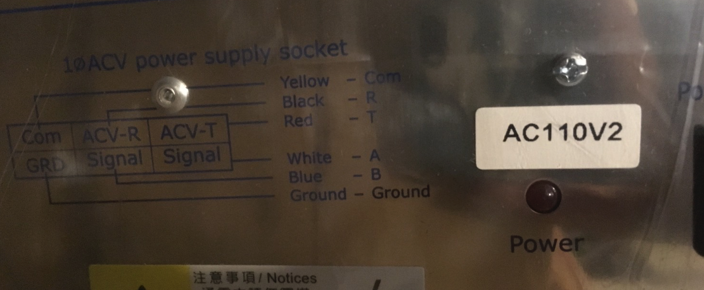
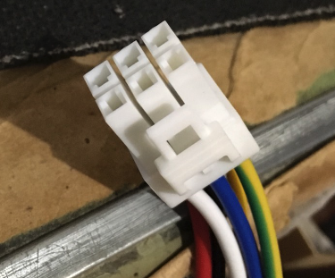

FFU濾網，這台是更高級的ULPA，注意方向性，別用手去摸。底下有一層保護用的塑膠布，使用前記得撕掉

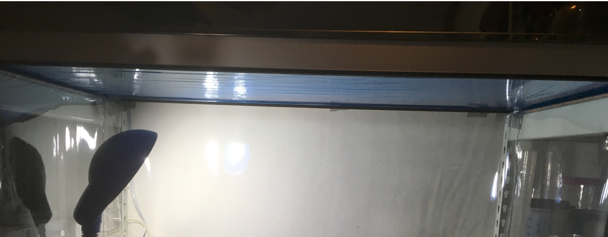

架到角鐵架上，因為沒算到Filter跟提把的高度所以吃了不少苦頭。

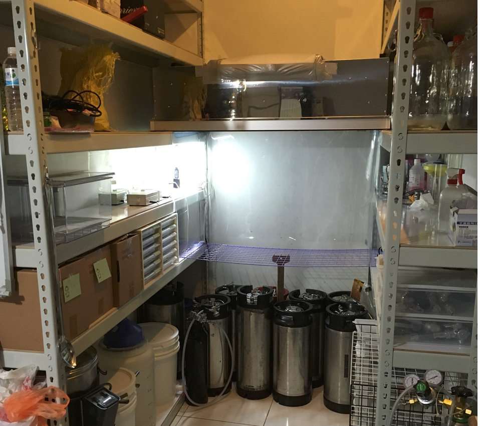

在周邊貼上透明塑膠桌墊，並且用膠布貼緊維持氣密（我知道這一段有點亂來...）

底下換上洞洞金屬桌面

用強力磁鐵把遮光簾幕固定上

插上電源，過電測試確認風壓

紫外線殺菌燈與定時器

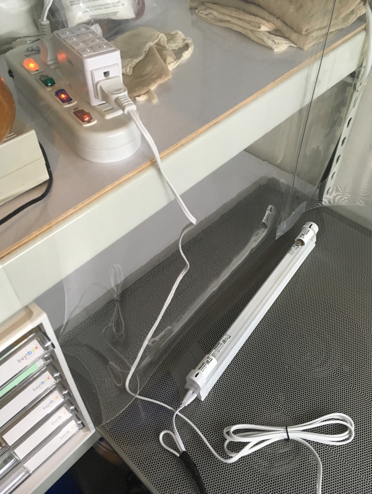

殺菌中(注意角落的藍光)

初次使用前用廚房紙巾沾酒精擦乾淨所有表面（但別去擦），75%酒精噴不用錢，FFU開啟運轉30分，然後紫外線殺菌15分

完全體

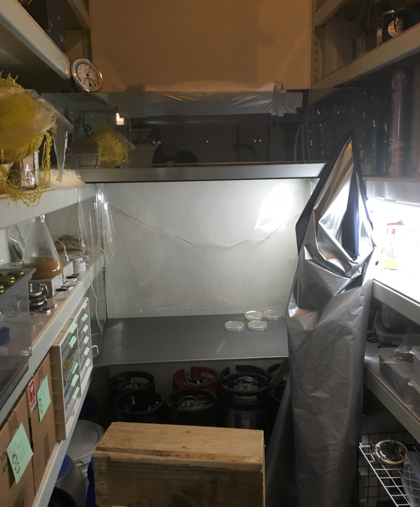

## 落菌測試

本次測試使用6個培養皿，分別放置於操作檯面的四個角落與上下。本次測試訂做的金屬板還沒送到，只好克難的用金屬網架支撐

操作前使用紫外線15min、FFU運轉15min、然後將培養皿開啟翻面放置15min後，蓋上翻回放置一週檢視結果

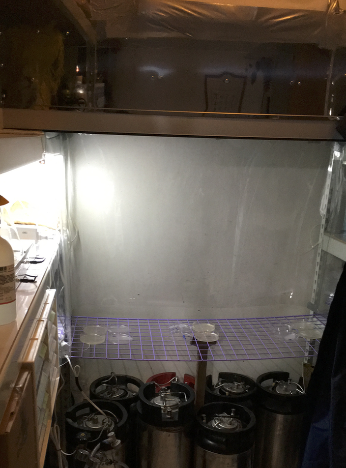

一週後，所有培養皿皆無菌落出現，驗證這台土炮的機器也挺有用處的ＸＤ

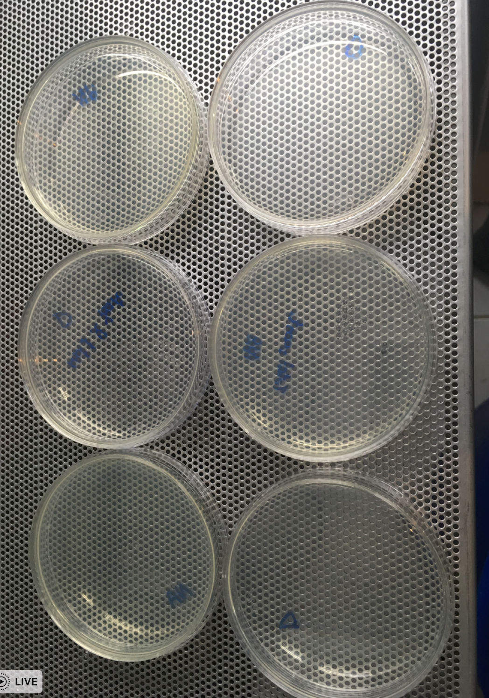

### 延伸測試

為了排除培養皿本身可能“不舉”的變因，所以同一批培養皿拿出來在以前常操作的地方一樣做15min的落菌測試

三天的結果：廚房（五個黴菌菌落，上）、院子（九個菌落，左）、無菌操作台外一公尺處（七個菌落，右）

## 結語

事實上這種非正規的做法，不建議用在正式的實驗環境中，然後你問我說價格也沒有真的便宜到哪去XD 不過這個實驗也證實，這樣專業的儀器也是做得到的。如果有意投入酵母研究，或釀酒狂熱份子，我想這是一個有趣的方向，分享給大家，也請專家們不吝給我意見以改進，感謝您的閱讀 <(_ _)>

## 參考資料

<http://benz.nchu.edu.tw/~tjfang/instruments/laminarflow.htm>

[操作守則](http://benz.nchu.edu.tw/~tjfang/instruments/laminarflow%201.doc)

[機台結構圖](http://benz.nchu.edu.tw/~tjfang/instruments/laminarflow%202.ppt)

[無塵室介紹與規範](http://eshare.stust.edu.tw/EshareFile/2010_5/2010_5_8fc3a802.pdf)