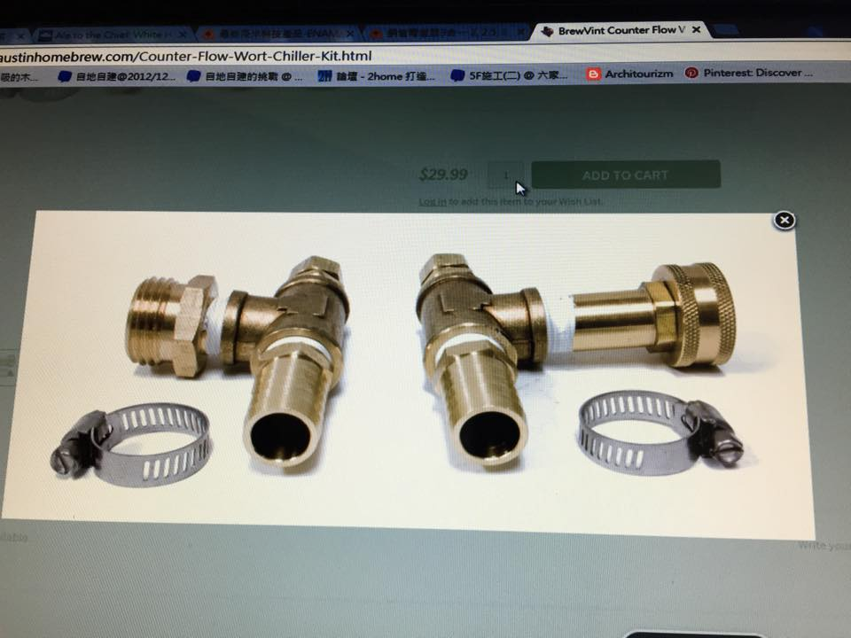

# 熱麥汁冷卻機制

## 機制比較

http://beersmith.com/blog/2014/07/10/immersion-plate-and-counterflow-chillers-for-home-brewed-beer/

*   整桶丟去冰水涼快

*   冷卻速度最慢，無法引發冷凝聚，但蓋上鍋蓋的情況不容易被感染

*   冷卻銅管，直接泡進麥汁降溫

*   15分鐘左右，但要開蓋子，目前還沒感染過。初期降溫很快，但是40度以下要等很久

*   出麥汁的時候降溫

*   可以不用等直接上，也沒有感染疑慮

## DIY

**作法參考**

[https://www.youtube.com/watch?v=DVf-lTFpR2c](https://www.youtube.com/watch?v=DVf-lTFpR2c)

討論串：[https://www.facebook.com/groups/homebrew.tw/permalink/1238353546181951/](https://www.facebook.com/groups/homebrew.tw/permalink/1238353546181951/)

**材料**

銅仁式銅管接頭(3分銅管3分外牙)、3分三通、六角外牙插心(3分外牙4分插心)、管束

## 現成成品

**Counterflow chiller**

[http://www.amazon.com/Super-Efficient-Counterflow-Wort-Chiller/dp/B004D50LO8](http://www.amazon.com/Super-Efficient-Counterflow-Wort-Chiller/dp/B004D50LO8)  86USD

[http://www.morebeer.com/products/wort-chiller-counterflow.html](http://www.morebeer.com/products/wort-chiller-counterflow.html)   200USD

[https://tw.taobao.com/item/15943522892.htm?abtest=_AB-LR492-LR501-LR517-LR895-PR492-PR501-PV517_2375-PV895_2462](https://tw.taobao.com/item/15943522892.htm?abtest=_AB-LR492-LR501-LR517-LR895-PR492-PR501-PV517_2375-PV895_2462) 310RMB

**Plate Chiller**

[http://www.amazon.com/Home-Brew-Ohio-FMT_SWPC-Shirron/dp/B00309LB56](http://www.amazon.com/Home-Brew-Ohio-FMT_SWPC-Shirron/dp/B00309LB56)   94.34USD

[http://www.morebeer.com/ct/?idx=14015748&i=6242&u=/products/shirron-plate-wort-chiller.html](http://www.morebeer.com/ct/?idx=14015748&i=6242&u=/products/shirron-plate-wort-chiller.html)  100USD

[http://www.morebeer.com/ct/?idx=14015748&i=28114&u=/products/wort-chiller-40-plate.html](http://www.morebeer.com/ct/?idx=14015748&i=28114&u=/products/wort-chiller-40-plate.html)   160USD

[https://tw.taobao.com/item/20270265537.htm?abtest=_AB-LR492-LR501-LR517-LR895-PR492-PR501-PV517_2375-PV895_2462](https://tw.taobao.com/item/20270265537.htm?abtest=_AB-LR492-LR501-LR517-LR895-PR492-PR501-PV517_2375-PV895_2462) 300RMB

[https://tw.taobao.com/item/39115481927.htm?abtest=_AB-LR492-LR501-LR517-LR895-PR492-PR501-PV517_2375-PV895_2462](https://tw.taobao.com/item/39115481927.htm?abtest=_AB-LR492-LR501-LR517-LR895-PR492-PR501-PV517_2375-PV895_2462) 255RMB

[https://item.taobao.com/item.htm?id=38722757973&toSite=main](https://item.taobao.com/item.htm?id=38722757973&toSite=main) 268RMB

[https://tw.taobao.com/item/39344725619.htm?abtest=_AB-LR492-LR501-LR517-LR895-PR492-PR501-PV517_2375-PV895_2462](https://tw.taobao.com/item/39344725619.htm?abtest=_AB-LR492-LR501-LR517-LR895-PR492-PR501-PV517_2375-PV895_2462) 10層145RMB

[https://item.taobao.com/item.htm?id=42196185263&toSite=main](https://item.taobao.com/item.htm?id=42196185263&toSite=main) 工廠級，看看就好